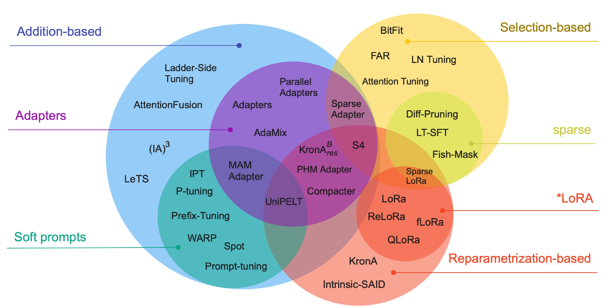
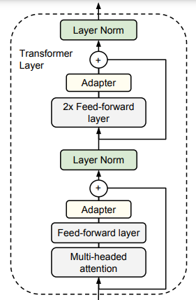
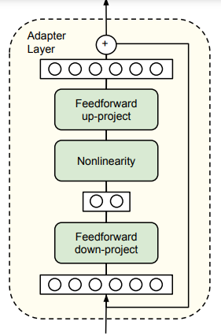
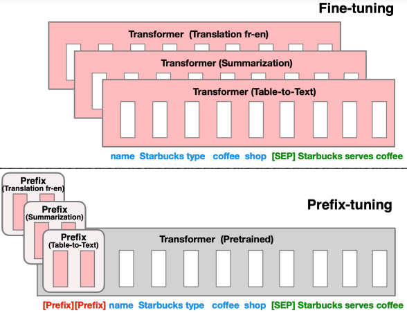
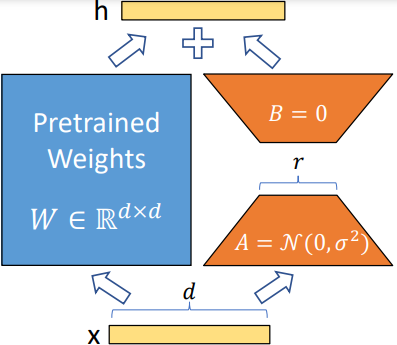
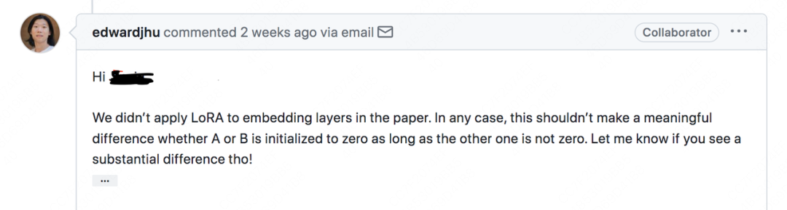

# 谈谈高效微调技术：LoRA

## 背景

我们在基础篇《大语言模型：通往通用人工智能之路》中提到**两阶段训练法**， 即**预训练**（Pre-Train)和**微调**(Fine Tune)。
在本章中，我们讲详细聊聊其中的SFT部分，聊聊如何高效的对模型进行微调。而站在2024年的时间节点上，其中最重要的技术就是LoRA(Low-Rank Adaptation), 故本文将着重讲述LoRA技术。

## 提出问题

微调的含义，就是把已经训练好的模型（PTM, Pre-Train Model)拿来，用特定的下游任务数据来继续训练这个PTM，使得模型在预训练权重上继续更新权重，直至满足下游任务性能标准。

### 全量参数微调

**全量参数微调**指的是，在下游任务的训练中，对预训练模型的每一个参数都做更新。

而随着大语言模型的越来越大，全量参数微调的成本也越来越昂贵了。以ChatGPT3.5 175B 这种级别的LLM为例，世界上，没有几家公司能够支付的起日常的训练费用，一次训练费用需要百万美元以上。哪怕是小两个数量级，我们拿6B的LLM为例，全量参数微调也是非常昂贵的。
2024年，单机8卡（入门级别的显卡A6000）为例。一次全量参数训练，需要近1000小时。而一个含有LLM的软件到达产品发布级别的质量，要经过十轮以上的微调。除此之外，模型全量微调还会损失多样性，存在灾难性遗忘的问题。因此，在2024年，业界已经越来越少的采用全量参数微调了。

因此，我们就提出要解决的问题——如何高效的进行模型微调。

## 解决问题

如何高效的进行模型微调，成了业界研究的重点，发展出了很多种办法，这些方法统称**参数高效微调**（PEFT, Parameter-Efficient Fine-Tuning）。

### 参数高效微调

参数高效微调是指微调少量或额外的模型参数，固定大部分预训练模型(LLM)参数，从而大大降低了计算和存储成本，同时，也能实现与全量参数微调相当的性能，可以更好地泛化到域外场景。

高效微调技术可以粗略分为以下三大类：增加额外参数(Additive), 选取一部分参数更新(Selective)、引入重参数化(Reparametrization-based)。而在增加额外参数这类方法中，又主要分为类适配器(Adapter-like)方法和软提示(Soft prompts)两个小类。
下图中，把各种PEFT方法按照上述分类做了一个总结。

目前，从效果来讲，增加额外参数(Additive)效果最好，LoRA也属于这一类中，如果从发展史来介绍各种代表性的算法，文章要写的很长。本文的重点是LoRA，所以笔者就介绍LoRA原论文里提及的两种算法，即Adapter-tuning和Prefix-tuning。

### Adapter-tuning

计算机领域有句俗语，当现有架构解决不了新问题的时候，就加一层。Adapter Tuning就是采用这种思路的参数高效的微调技术。其核心思想就是，在不改变预训练模型主体结构和大部分参数的前提下，通过在预训练模型的特定层中插入少量轻量级的Adapter模块，并仅调整这些模块的参数来使模型适应新的下游任务，从而实现高效的迁移学习.

#### Adpater-tuning 架构

* **Adapter模块的插入位置**：通常在Transformer模型中的每个多头注意力的投影之后以及第二个前馈层之后插入Adapter模块。例如在BERT模型中，会在每一层都添加这样的Adapter。如下图所示：
  
* **Adapter模块的结构**：Adapter模块一般包含一个降维层(down-project)、一个非线性激活层和一个升维层(up-project)，这种瓶颈结构可以限制参数量，同时能够捕获任务特定的特征。以自然语言处理中的文本分类任务为例，Adapter模块可以学习到不同类别文本在语义和特征表示上的差异。从数学的角度理解就是通过矩阵的降维来简化计算，从而达到限制参数训练量的目的。
  
* **训练过程** ：在训练时，预训练模型的原始参数被冻结，仅对新增的Adapter结构和层归一化层的参数进行微调，通过反向传播更新Adapter模块中的参数，使其能够适应特定的下游任务。

#### 针对多个下游任务的情况

我们以有两个不同的下游任务为例，例如，一个下游任务是文本分类，另一个是命名实体识别。当有两个下游任务时，为了能够使模型很好地适应这两个不同的任务，最好的做法是加入两个 Adapter。每个Adapter会学习到与相应下游任务相关的特定参数。第一个Adapter会调整预训练模型的参数以适应文本分类任务的特点，比如重点学习如何区分不同类别文本的特征；第二个Adapter则会针对命名实体识别任务进行参数调整，例如学习识别文本中不同实体类型的边界和类别。

这样，在进行推理阶段，当遇到属于某个下游任务的输入时，就可以激活相应的 Adapter 来处理该任务，从而达到对多个下游任务分别进行有效适配的目的。

#### 优势

* **参数高效** ：相比传统的全量微调方法，只需调整少量的参数，通常仅为预训。练模型参数的百分之几，大大降低了计算成本和存储需求。比如在对BERT模型进行Adapter Tuning时，每个任务仅添加了BERT模型参数的3.6%，而全量微调则需要训练整个BERT模型的参数。
* **知识保留** ：由于预训练模型的参数保持不变，能够保留预训练模型中的大部分知识，这对于需要利用预训练模型泛化能力的任务尤为重要，有助于模型在新任务上取得较好的性能。
* **任务独立** ：每个下游任务都可以使用独立的Adapter模块进行微调，不同任务之间不会相互干扰，便于实现多任务学习和持续学习。例如在同时进行文本分类和命名实体识别两个任务时，可以分别为它们添加不同的Adapter模块，各自独立地进行微调。
* **易于实现** ：Adapter模块可以方便地与现有的预训练模型框架集成，如Hugging Face的Transformers，使得实现和部署都相对简单快捷。

#### 不足

* **性能损失** ：尽管在大多数情况下能够接近甚至达到全量微调的性能，但在一些复杂任务上可能会存在一定的性能损失。
* **模型复杂度增加** ：随着任务数量的增加，模型中Adapter模块的数量也会增多，导致模型的整体复杂度上升，可能会对推理速度产生一定影响。
* **超参数调优** ：Adapter模块中的超参数，如瓶颈维度、非线性激活函数等，需要仔细调优才能获得最佳性能，这可能会增加实验的工作量。

### Prefix-tuning

Adpater-tuning出来后，实现了高效微调参数，但是大家普遍觉得这个解决方案太重了。特别是多个下游任务的时候，需要加载多个Adapter，在训练和推理两个阶段都有明显的性能下降。2021年，一种称为Prefix-tuning的轻量级解决方案出炉了。

#### Prefix-tuning架构

Prefix-tuning的架构图，如下图所示：

* ​**Prefix向量的添加​**​：Prefix-tuning 在预训练模型(如Transformer 架构)的输入层添加了可学习的前缀(Prefix)向量。以文本生成任务为例，对于输入文本序列，在序列开头插入这些Prefix向量。这些向量的维度与Transformer模型输入嵌入(input embedding)的维度相同。
* ​**参数更新机制**​：在训练过程中，只更新这些Prefix向量的参数，而预训练模型的大部分参数(如Transformer层的参数)保持冻结状态。通过优化Prefix向量的参数，模型能够学习到特定任务相关的信息，引导预训练模型生成符合任务要求的输出。
* ​**Prefix的作用方式**​：Prefix向量可以被看作是一种特殊的提示(prompt)，它为模型提供了任务相关的先验知识。例如，在机器翻译任务中，Prefix向量可以帮助模型理解源语言和目标语言之间的转换模式，引导模型生成正确的目标语言句子。

#### 优势

* **参数效率高**​：只需要更新少量的Prefix向量参数，大大减少了微调过程中的计算资源消耗和存储需求。
* ​**保留预训练知识**​：由于大部分预训练模型参数不变，能够较好地保留预训练模型学到的语言知识和语义表示，使模型在新任务上能够利用这些知识。

#### 不足

* ​**Prefix 设计的敏感性**​：Prefix向量的长度、初始化方式等因素可能会对模型性能产生较大影响，需要仔细设计和调整。
* ​**性能可能有限**​：在一些复杂的任务或者对模型性能要求极高的场景下，Prefix-tuning 可能无法达到完全微调所能实现的最佳性能。

## LoRA低秩适配

### PEFT想要解决的问题

在介绍LoRA之前，先简单总结一下上面提到的几个解决办法。

* **全参数微调**太贵;
* **Adapter Tuning**存在训练和推理延迟，
* **Prefix Tuning**难训且会减少原始训练数据中的有效文字长度​.

那是否有一种微调办法，能改善这些不足呢？我们不妨回到问题本身，

> 所谓的参数高效微调(PEFT)本质上就是通过训练少数非常重要的参数，达到或者接近全参数微调的效果。

那么问题又来了，上面提到了一个非常口语化的描述——“少数非常重要的参数”。又引入了两个问题：

1. 问题一：到底用多少来表示“少数”？
2. 问题二：什么才是“重要”的？

现在我们来尝试解答前面提到的两个问题。
问题一呢，相对比较好解答，没有太多的理论推导。按照成本考虑的话，一般要做到减少2个数量级才会有比较好的性价比。这也是工程界经常用近似值来模拟精确的值来达到简化计算的结果。

#### 一个简单的例子

求：$\sqrt{901,800,900}$的值。

$$
\begin{aligned}

& \because 901,800,900 \approx 900,000,000 \\
& \therefore \sqrt{901,800,900} \approx \sqrt{900,000,000} = 30,000

\end{aligned}
$$

上述这个例子就是直接用近似值$900,000,000$来代替精确值$901,800,900$，直接口算出这个题的近似答案。

现在我们来思考一下

> 问题二：什么才是“重要”的？

现在我们回到刚才这个简单的例子，我们尝试求解一下$\sqrt{901,800,900}$的精确值。参加过九年制义务教育的我们，很快就能找到求解方法——因式分解

$$
\sqrt{901,800,900} = \sqrt{(2 \times 3 \times 5 \times 7 \times 11 \times 13)^2} = 30,030
$$

我们仔细思考一下**因式分解**过程，其实这个方法就是找到对$901,800,900$而言，重要的几个数：$2,3,5,7,11,13$，即**质数**(Prime Number)。随便说一下，Prime在英语中，其实就有“重要的”这个意思。
Tips: 上述这个例子过于简单，大家借鉴一下思路。如果想深入理解如何找到“重要”的参数思想，笔者建议去学一下经典的PCA(Principal Component Analysis)算法。

基础篇中，笔者已经说明，机器学习其实就是调整矩阵参数的权重。结合一下上面这个例子，我们能不能找到类似于的办法解决。
问题就转变为，如何找到矩阵的“少数且重要的参数”。我们不禁会问，初等数学中的因式分解和质数的概念，在矩阵中有没有类似的概念呢？答案是，有的。矩阵的**秩**(Rank)和**奇异值分解**(SVD,Singular Value Decomposition)就是对应**质数**和**因式分解**的概念。

### 秩

先给出秩的定义

> 对于一个$m×n$矩阵$A$，其秩定义为A中最高阶非零子式的阶数，记作$R(A)=r$或$rank(A)=r$。这里，非零子式指的是从矩阵$A$中任取$k$行与$k$列$（k≤min(m,n)）$所构成的k阶行列式，且该行列式不为零。

再看几个例子，体会一下，什么是秩。

$$
A = \left[\begin{matrix}1 & 2 & 3 \\ 2 & 4 & 6 \\ 3 & 6 & 9  \end{matrix}\right]; 
B = \left[\begin{matrix}1 & 2 & 3 \\ 0 & 1 & 4 \\ 1 & 3 & 7  \end{matrix}\right];
C = \left[\begin{matrix}1 & 0 & 2 \\ 0 & 1 & 3 \\ 4 & 5 & 0  \end{matrix}\right];
$$

矩阵A，每一行都是第一行的倍数，因此，$rank(A)=1$。
矩阵B，第一行和第二行是线性无关的，而第三行可以表示为第一行和第二行的线性组合,即$Row3=Row1+Row2$, 因此，$rank(B)=2$。
矩阵C，没有一行（或一列）是其他行（或列）的线性组合。因此，$rank(C)=3$。

不难发现，​秩中隐含了对“信息量”的提示​。

### 奇异值分解

奇异值分解(SVD)是矩阵分解的一种形式，具有明确的数学定义。以下是对奇异值分解的数学定义：

奇异值分解是指将一个秩为r的实矩阵A（大小为m×n）分解为三个实矩阵乘积的形式：

$$
A = U \Sigma V^T
$$

其中：

* $U$是一个$m×m$的正交矩阵，其列向量称为左奇异向量。
* $V$是一个$n×n$的正交矩阵，其列向量称为右奇异向量。
* $\Sigma$是一个$m×n$的矩形对角矩阵（或称为对角块矩阵），称为奇异值矩阵。其对角线上的元素（或对角块）称为奇异值，且这些奇异值是非负的，并按照降序排列（尽管在数学定义中不强制要求降序排列，但在实际应用中通常会这样做以便于分析和处理）。

举个具体的例子，大家体会一下SVD。下面这个例子是针对矩阵$A$的奇异值分解$(A = U\Sigma V^T)$：

$$
\begin{aligned}
A & = U\Sigma V^T \\
\begin{bmatrix}1&2&3\\4&5&6\\7&8&9\end{bmatrix} 
& = 
\begin{bmatrix}-0.408&-0.707&0.569\\-0.577&0.000&-0.816\\-0.745&0.707&0.195\end{bmatrix} 
\begin{bmatrix}14.26&0&0\\0&1.5&0\\0&0&0.56\end{bmatrix} 
\begin{bmatrix}-0.237&-0.520&-0.803\\-0.689&-0.226&0.697\\0.685&-0.821&0.078\end{bmatrix} \\
& = 
\begin{bmatrix}-0.2148&-0.8872&0.4082\\-0.5206&-0.2496&-0.8165\\-0.8263&0.3880&0.4082\end{bmatrix}
\begin{bmatrix}16.8481&0&0\\0&1.0684&0\\0&0&0\end{bmatrix}
\begin{bmatrix}-0.4797&-0.5724&-0.6651\\-0.7767&-0.0757&0.6348\\-0.4082&0.8165&-0.4082\end{bmatrix}
\end{aligned}
$$

Tip: 矩阵的奇异值分解不唯一。

### 矩阵降维

介绍完秩和SVD之后，我们来继续讨论一下我们关心的问题，如何把一个庞大的矩阵，变成一个较小的矩阵，来达到简化运算的目的。这个思路就类似于，上面那个初级数学中找个接近的近似数来代替精确值的办法。
我们把这个问题，用具体的例子来表述一下。

$$
A = \left[\begin{matrix}1 & 0 & \cdots & 2 \\ 0 & 1 & \cdots & 3 \\ \vdots & \vdots & \ddots & \vdots \\ 4 & 5 & \cdots & 0  \end{matrix}\right]_{90,000 \times 1,000} 
\longrightarrow \qquad

A' = \left[\begin{matrix}1 & 0 & \cdots & 2 \\ 0 & 1 & \cdots & 3 \\ \vdots & \vdots & \ddots & \vdots \\ 4 & 5 & \cdots & 0  \end{matrix}\right]_{900 \times 10}
$$

我们需要用一个算法，找到A'，然后用A‘来代替A，从而极大的降低计算成本。这个过程，用洋气且专业的名字叫“降维”，即把矩阵的行和列，压缩一下（2个数量级及以上）。
现在继续上面这个3阶矩阵

$$
A = \begin{bmatrix}1&2&3\\4&5&6\\7&8&9\end{bmatrix} = 
\begin{bmatrix}-0.2148&-0.8872&0.4082\\-0.5206&-0.2496&-0.8165\\-0.8263&0.3880&0.4082\end{bmatrix}
\begin{bmatrix}16.8481&0&0\\0&1.0684&0\\0&0&0\end{bmatrix}
\begin{bmatrix}-0.4797&-0.5724&-0.6651\\-0.7767&-0.0757&0.6348\\-0.4082&0.8165&-0.4082\end{bmatrix}
$$

* **降维操作**：由于$\Sigma$中第三个奇异值为$0$，可以将其对应的列和行向量舍去，实现矩阵降维。保留前两个奇异值及其对应的向量，得到降维后的矩阵表示：

$$
\begin{aligned}
A_{approx} & =  U_{approx}\Sigma_{approx}V_{approx}^T \\ where \quad          
& U_{approx}=\begin{bmatrix}-0.2148&-0.8872\\-0.5206&-0.2496\\-0.8263&0.3880\end{bmatrix} \\
& \Sigma_{approx}=\begin{bmatrix}16.8481&0\\0&1.0684\end{bmatrix} \\
& V_{approx}^T=\begin{bmatrix}-0.4797&-0.5724\\-0.7767&-0.0757\end{bmatrix}
\end{aligned}
$$

* **降维效果**：
  计算$A_{approx}$, 可得$ A_{approx}=\begin{bmatrix}1.0485&2.0583&3.0681\\4.1334&5.1432&6.1530\\7.2183&8.2281&9.2379\end{bmatrix} $ ，与原矩阵$A=\begin{bmatrix}1&2&3\\4&5&6\\7&8&9\end{bmatrix}$相比，在一定程度上保留了原矩阵的主要信息，但维度从$3\times3$降到了$3\times2$与$2\times2$与$2\times3$的组合，实现了降维的目的。

在实际应用中，通常会根据奇异值的大小来决定保留多少维度。如果奇异值衰减得很快，只保留少数几个较大的奇异值及其对应的向量就可以很好地近似原矩阵，从而达到降维并减少数据量的效果。推广到一般情况，我们常常用SVD来做矩阵的行压缩和列压缩。

* **行压缩**：通过考虑$U$和$\Sigma$的前$k$个奇异值和对应的左奇异向量，可以将数据的每一列（特征）投影到一个低维空间，实现行数据的降维。
* **列压缩**：聚焦于$\Sigma$和$V$，通过选择$\Sigma$的前$k$个非零奇异值和$V$的前$k$列，可以将数据的每一行（样本）投影到低维空间，实现列数据的降维。

### 再谈全参数微调

我们再用上面的方法，把全参数微调表示出来。如下图所示，全参数微调其实就是把权重矩阵$W$训练成$W'$。

$$
W = \left[\begin{matrix}w_{11} & w_{12} & \cdots & w_{1d} \\ w_{21} & w_{22} & \cdots & w_{2d} \\ \vdots & \vdots & \ddots & \vdots \\ w_{d1} & w_{d2} & \cdots & w_{dd}  \end{matrix}\right]_{d \times d} 

\qquad \longrightarrow \qquad

W' = \left[\begin{matrix}w'_{11} & w'_{12} & \cdots & w'_{1d} \\ w'_{21} & w'_{22} & \cdots & w'_{2d} \\ \vdots & \vdots & \ddots & \vdots \\ w'_{d1} & w'_{d2} & \cdots & w'_{dd}  \end{matrix}\right]_{d \times d}
$$

现在，我们再做一个简单的数学转化：

$$
\Delta W = W'-W 

= \left[\begin{matrix}w'_{11} & w'_{12} & \cdots & w'_{1d} \\ w'_{21} & w'_{22} & \cdots & w'_{2d} \\ \vdots & \vdots & \ddots & \vdots \\ w'_{d1} & w'_{d2} & \cdots & w'_{dd}  \end{matrix}\right]_{d \times d} 
- \quad
 \left[\begin{matrix}w_{11} & w_{12} & \cdots & w_{1d} \\ w_{21} & w_{22} & \cdots & w_{2d} \\ \vdots & \vdots & \ddots & \vdots \\ w_{d1} & w_{d2} & \cdots & w_{dd}  \end{matrix}\right]_{d \times d} 
= \quad 
\left[\begin{matrix}\Delta w_{11} & \Delta w_{12} & \cdots & \Delta w_{1d} \\ \Delta w_{21} & \Delta w_{22} & \cdots & \Delta w_{2d} \\ \vdots & \vdots & \ddots & \vdots \\ \Delta w_{d1} & \Delta w_{d2} & \cdots & \Delta w_{dd}  \end{matrix}\right]_{d \times d}
$$

做了这个数学变化后，微调训练的问题，就转化为找到一个矩阵$\Delta W$, 然后可以简单的做一个加法来算出最终我们要算出来的$W'$，即$W' = W + \Delta W$。

#### 聚焦矩阵$\Delta W$

如果我们想训练出$\Delta W$，因为是$d \times d $维度的，代价不菲。参考前文提及到的数学基础知识，自然而然，我们就想到针对矩阵$\Delta W$降维。既然SVD分解这么有效，那我们直接对$\Delta W$做SVD，找到对应的低秩矩阵，不就大功告成了吗？
现实很骨感，我们无法做SVD，原因也很简单——能直接做SVD的前提是，我们需要知道确定的$\Delta W$。问题来了，如何得到确定的$\Delta W$呢？那就需要做一次全参数微调。而如果我们都做了全量微调，那还要低秩适配做什么呢？简直是，鸡生蛋还是蛋生鸡的问题啊！
Tips: 如果顺着上面这个思路，倒是很容易用这个SVD的办法来验证PEFT的方法是否有效。其实LoRA论文的作者就是用SVD来检验LoRA的有效性的。

既然上述方法行不通，那我们能不能直接对预训练权重，即$W$，做SVD呢，因为是确定的呀。答案也是否定的。从数学的角度来讲，我们是要得到$W'$，在等式$W'=W+ \Delta W$中，对$W$进行SVD分解，对求的$W‘$没有任何帮助。从训练逻辑的角度来说，微调的目的是给模型注入和下游任务相关的领域新知识，预训练模型（PTM，Pre-trained Model）的权重所表达的含义是**旧知识**，我们需要通过微调训练，让模型学会**新知识**，也不符合逻辑。

**既然通过数学方法直接做SVD行不通，那就让模型自己去学怎么做SVD吧！**，LoRA的作者提出了最终的解决策略是：把秩当成一个超参，再让模型自己去学低秩矩阵。这就是LoRA的核心思想。

现在，我们来看看LoRA作者是如何来设计让模型自己去做SVD，来得到一个$\Delta W$的吧。

### 详解LoRA

其实，我们不关心模型自己如何做类似于SVD的过程，我们只想要最终的结果，得到$\Delta W$。干脆，我们直接着手设计一个架构，得到$\Delta W$。我们需要满足下面2个基本需求。

1. **矩阵降维**：这个很好理解，是所有PEFT的基础，通过矩阵降维技术来简化计算，从而代替全参数训练。
2. **超参数收敛**：其实也很好理解，最终目的就是加速训练，参数收敛越快，训练总时长越短。

#### LoRA矩阵降维

这个必须要有，是所有PEFT的基础。LoRA的架构也很简单，就是针对$\Delta W$做了个矩阵降维的操作，再把降维的矩阵，最终升维成和原来$W$一样的维度。命名也很随意（笔者的直觉），降维的矩阵叫A，升维的矩阵叫B。
从数学上理解，全参数微调$d$维矩阵$\Delta W$，需要调整$d \times d$个参数。引入了r维度的矩阵A和B矩阵后，只需要调整调整$2 \times r \times d$个参数。当然，r要远小于d才能起到减少计算的目的。

#### LoRA超参数

既然是让模型自己训练，得要引入超参数，参考梯度下降SGD中的学习率$\eta$，超参数命名？随意一点，沿用大家的风格，用希腊字母，那就叫$\alpha$吧。
模型训练中，为了让Loss function快速收敛，需要引入个缩放因子(Scalling Factor)。别被这些个名词，收敛啊，缩放啊，唬住。说白了，就除以个数，让$\alpha$的值变小时，更快而已。命名？还是沿用随意风格吧，这次直接取英文缩写，最重要的单词Rank的r吧，够简单明了吧。
随便提一下，作者做实验的时候，r的取值，也很有理科生特有的浪漫，处处透露着“随意”。既然是搞计算机的，那就二进制吧。取1，2，4，8，64吧，哈哈。

写到这里的时候，笔者一直在疑惑，为啥直接除以一个整数啊? 为什么不参考注意力模型中的公式，除以一个$\sqrt{d}$啊。结果，笔者找到了rsLoRA这篇论文。唉，已经有人发论文了，毕竟这个也太容易想到了。

#### LoRA公式

好，我们现在就把上面这段话，写成公式吧，毕竟要发论文的，严肃点。

$$
W' = W + \Delta W = W + \frac{\alpha}{r}AB  \\ 
+ \Delta W_{q1} \\
\\
+ \Delta W_{v1} \\
$$

#### LoRA架构

再弄个图，毕竟是论文嘛。

#### 矩阵A和B的初始化

初始化问题还是比较重要的，初始化选的好的话，能加快模型的收敛。这里又透露出作者的随意，直接选了个最不容易犯错误的方案，采用“高斯分布”初始化A。B的初始化，怎么选呢？先回顾一下公式$W' = W + \Delta W$，我们最终目的是得到$W'$, 初始值必须是$W' = W + 0$，即$\Delta W$必须为0。换句话说，矩阵B的初始值没得选，只能是0。搞定，初始值总结如下：

* 低秩矩阵A：采用高斯初始化
* 低秩矩阵B：采用零初始化

行文至此，笔者突然想到一个问题，既然处处透露出随意，是不是可以把A，B的初始化换一下？感觉也没太大问题嘛，结果还真让我找到了。下文是LoRA的第一作者(Edward J Hu)关于这个问题的回复。

哈哈，就是这么的随意。真是中国人特有的浪漫啊！

至此，介绍完了LoRA基本原理和架构，开始要着手训练了。

#### 用LoRA来训练

站在2024年这个时间节点，时间上的LLM都采用的是Transformer架构，我们来看了一下Transformer架构吧，主要有Multi-Head Attention层和FFN层。
原论文里，作者直接针对Attention层，做LoRA。不过从原理上讲，FFN由多层感知机(MLP)组成，其本质是一系列的线性变换和非线性激活函数的组合，而LoRA的核心思想是通过低秩矩阵分解来近似原模型的参数更新，这种方法在理论上适用于任何可以表示为矩阵乘法形式的神经网络层，包括FFN中的线性层。也有一些论文和项目是有对FFN经行LoRA训练的，比如**LLaVA-MoE**和**LoRAMoE**。不过有个公认的结论，就是针对Attention层做LoRA训练，收益最大。实际项目中，笔者的团队，也只针对Attention层进行LoRA。
现在，我们来看一下Attention层，有哪些需要训练的矩阵，一共有4个，即$W_q, W_k, W_v,W_0$。其中，$W_0$就是PTM的原始矩阵，即上文提到的矩阵$W$。
问题来了，我们对这4个矩阵都做LoRA训练吗？不知道，理论上说，无法给出推导。那么，就动手试出来吧。
设计一个试验，把各种排列组合都试一遍，当然，还要加上缩放因子$r$，看结果那几个因子最重要。具体数据，就不一一讲解了，直接说结论：

> 根据LoRA论文的试验数据，作者认为采用${W_q, W_v, r=4}$这个组合，对于一般的NLP问题，效果最好。

从笔者的实际项目经验来说，我们一般会采用只训练${W_q, W_v}$，至于r的取值，还是要更加不同的数据集多试几次，以实际效果为准。对了，顺便提一句，那个类似于“穷举法”的试验，有个高级的名词：
**​消融实验（Ablation Experiment）​**：是一种用于研究模型中不同组件或特征贡献程度的实验方法。在一个复杂的机器学习模型中，通过去除（或 “消融”）某些部分，如特定的层、模块、特征或机制，然后比较原始模型和消融后的模型在性能指标（如准确率、召回率、F1 值、损失函数值等）上的差异，以此来分析被去除部分对模型整体性能的重要性。

#### 用LoRA来推理

在**推理过程**中，我们按照的公式$W' = W + \Delta W$，​我们只需要合并低秩矩阵和预训练权重，然后正常做forward推理即可。这样我们完全不会更改模型的架构，因此不会像Adapter Tuning一样产生推理上的延时​。具体过程如下只图所示：

按照LoRA论文的数据，作者把LoRA的推理速度和Adapter Tuning做了个对比，试验结果也是很明显的，LoRA快很多。

#### 写在最后

行文至此，基本上就LoRA就讲完了。本该说几句漂亮话，结束这篇文章。
不过，笔者脑子里突然冒出一个和LoRA相关的很重要的技术，我甚至不知道这个方法有没有专业名称，但是我认为这个技术将会是2025年的热点。
问题是这样的，在实际训练中，我们经常要用一个大语言模型，来对应很多种下游任务。如果只训练一个通用的LoRA，在处理不同的下游任务，效果不是特别好。经常会出现“按下葫芦浮起瓢”的现象。
在LLM跑马圈地的初期，业界的解决方案，是非常简单粗暴的。提供多个LLM，针对每个大类任务用一个LoRA。显然，这种方案会频繁的切换LLM，或者部署多个LLM实例。要么影响用户体验，要么非常费钱。
能不能只用一个LLM实例，通过切换不同的LoRA来达到同样的效果呢？答案是可以的。如下图所示:

在处理不同的下游任务时，可以动态加载不同的LoRA来达到最佳效果。从原理上讲，加载和卸载LoRA矩阵，对应矩阵加法和减法，开销很小。比起加载LLM来说，根本就不是一个数量级别的操作。从业界来看，硬件厂商的驱动已经开始或者即将开始支持这个实现了。普通用户将在2025年看到越来越多的app采用这种技术。

最后再提一嘴，LoRA论文最后一个章节(Understanding the Low-Rank Updates)最好花时间啃完。数学原理就是用SVD分解后，来验证LoRA的有效性，这也是一种用的非常普遍的数学验证方法。毕竟“知其然，知其所以然”，才能成为一个优秀的计算机从业人员。

好了，这次是真的讲完LoRA了。Enjoy it & 谢谢!

## 参考文献

1. [Scaling Down to Scale Up: A Guide to Parameter-Efficient Fine-Tuning](https://arxiv.org/pdf/2303.15647)
2. [Parameter-Efficient Transfer Learning for NLP](https://arxiv.org/pdf/1902.00751)
3. [Prefix-Tuning: Optimizing Continuous Prompts for Generation](https://arxiv.org/pdf/2101.00190)
4. [LORA: LOW-RANK ADAPTATION OF LARGE LANGUAGE MODELS](https://arxiv.org/pdf/2106.09685)
5. [A Rank Stabilization Scaling Factor for Fine-Tuning with LoRA](https://arxiv.org/pdf/2312.03732)
6. [大模型微调系列之：大模型低秩适配器LoRA](https://zhuanlan.zhihu.com/p/651951920)

