# 多模态大语言模型（Multimodal LLM）技术简介：聚焦视觉与语言处理。

## 前言：CNN还是Transformer？

回顾AI的发展史，从某种意义上说就是计算机对人脑的仿真，和人类进化史一样，人类先学会从视觉里学会认识事物，先诞生了绘画，然后是语言，最后是文字。现代AI技术的发展的历史轨迹也和人类进化史类似，先解决机器视觉（Visual）的问题，然后再解决自然语言（Language）处理。
新的问题来了，众所周知，解决Visual中问题，依赖于CNN。而解决NLP问题呢，都采用Transformer。从生物仿真学的角度来说，人脑解决视觉和语言问题，有且仅有一个器官。用科研的角度来说，当前AI用CNN来处理图像，用Transformer处理文本的解决方案，不够优美（elgant），甚至有点丑陋（Urgly）。其实，物理学在18世纪后叶也有类似的情况，传统力学用牛顿的一套公式，新兴的电学和磁学用的是另一套公式，最终麦克斯韦统一了这两套系统。自然而然，搞AI的这帮聪明脑袋中，就有很多人开始尝试用统一的方式去处理Visual和Language。

### 本章约定

在展开介绍这帮聪明脑袋的成果之前，先解释一下Visual和Language术语。在处理机器视觉（Visual）问题的时候，主要围绕这处理图片（Image）和视频（Video）这两方面工作。本文的重点是聚焦2D的图像（Image），原因也很简单，当前时间点（2025年底），AI处理Image问题，解决方案相对比较成熟。同时，处理的Video的问题也必须要深入理解如何处理Image的。回到传统的Language定义，包含声音（Voice）和文字（Text）两方面工作，LLM处理语音这类问题时，基本上先把语音转化为文本（ASR过程），LLM处理完，输出文本，最后转成语音（TTS过程）。所以，本文提到Language时，如果没有特别说明，就是指处理文本(Text)的过程。提到Visual时，不特殊说明都是二维图片（Image）处理。

## 多模态的技术基石

上文提到，很多人开始尝试用统一的方法处理Visual和Language。这里我们介绍一个非常有影响力的工作——ViT。

### ViT: 用Transformer统一处理VL问题。

ViT是2020年Google团队提出的将Transformer应用在图像分类的模型，虽然不是第一篇将Transformer应用在视觉任务的论文，但是因为其模型简单，高效且可扩展性强，成为了Transformer在CV领域应用的里程碑著作。其核心思路就是抛弃CNN，将2D图片处理成Token，送给Transformer模型来处理。这样，VL两类完全不同的数据就能用同一个Transformer模型。而实验结果表明，当拥有足够多的数据进行预训练的时候，ViT的表现就会超过CNN，突破Transformer缺少归纳偏置的限制，可以在下游任务中获得较好的迁移效果。

接下来，我们一起来看一下ViT是如何工作的。

#### ViT架构

我们先回顾一下Transformer结构，先把文本（Text）做Word Embedding，转化成Token，然后加上位置编码（Position Embedding）输入到MSA（Multi-head Self Attention)。问题来了，如何把二维的图片转化成一维的Token呢？其实这个问题在传统的计算机图形学里有现成的解决方案。我们按照BMP图片格式为例，100x100的图片大小。因为宽度和高度都是100像素，加上RGB三个通道，这个BMP格式的图片存储在计算机磁盘里，就转化成一维的方式了，即3（通道）x100（高度）x100（宽度）。
ViT也是借助这个思路，只是用像素点的分割力度太细了，改用16x16的小图片（Patch）作为最小单元。下图是ViT模型的总览图，图中Patch Embeddding部分就是描述了这个过程。

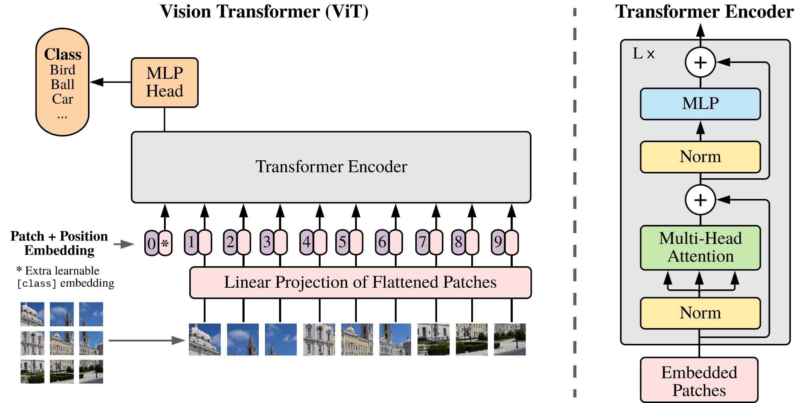

#### 图像分块（Patch Embedding）

举个例子详细说一下Patch Embedding过程。输入图片大小为224x224，将图片分为固定大小的patch，patch大小为16x16，则每张图像会生成224x224/16x16=196个patch，即输入序列长度为​196​，每个patch维度3x16x16=​768​，线性投射层的维度为768xN (N=768)，因此输入通过线性投射层之后的维度依然为196x768，即一共有196个token，每个token的维度是768。这里还需要加上一个特殊字符CLS，因此最终的Tokens数是197。下图详细展示了这个Patch Embedding的过程。

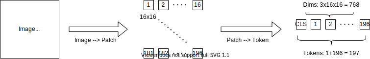

#### 位置编码（Position Embedding）

为了保留图像块的空间位置信息，ViT为每个图像块添加一个位置编码。位置编码是一个与Patch Embedding维度相同的向量，表示每个图像块的位置信息。而位置编码可以是可学习的参数，也可以是固定的编码。

* 可学习的位置编码: 直接初始化为可训练的参数，随着模型训练进行优化。
* 固定的位置编码: 使用正弦和余弦函数生成（类似于原始Transformer中的编码方式）。

Tips：在 ViT 的原始实现中，位置编码是可学习的。

最后，将位置编码与Patch Embedding相加，形成最终的输入序列。公式表示为：

$$
Z_0 = [E_{cls}; E_1 + P_1; E_2 + P_2; \dots; E_N + P_N] \\
$$

$$
E_{cls}: 特殊的分类标记[CLS]的Token。\\
E_i: 第 i 个图像块的嵌入。\\
P_i: 第i个图像块的位置编码。
$$

ViT后续的处理，和标准Transformer Encoder模型基本上是一致的。因为本文要讨论的内容比较多，关于ViT，只会介绍最核心的思想，如果读者想了解细节，建议直接读一下原始论文。

### VL模型迎来爆发期

2020年，伴随着ViT的横空出世，大家已经认识到多模态解决方案的大爆发时刻即将来临。短短的2，3年，多模态在VL这个赛道就卷出了结果。在开始介绍这场波澜壮阔的卷王赛道之前，我们先来聊聊AI这个领域如何做研究。一般人先想到的就是**模型架构**，这个是最核心的创新，比如NN和Transformer架构就属于这一类。还有一类就是**训练方法**，这一类的代表就是两阶段学习（PTM+SFT），强化学习和对比学习等。最后一类是关于**训练数据**的，这部分工作不难但是很费时间，对业界的贡献也是很显著的，典型的代表就Image领域的ImageNet和VL领域CoCo。本文主要围绕着新的**模型架构**和**训练方法**来介绍。下图是VL模型迭代年鉴，从2020年ViT开始，到2022年BeiTv3这个集大成者的模型出现。

本文将按照顺序讲解CLIP，ViLT，ALBEF，VLMo到BeiTv3这个五个模型。接下来，我们介绍另一个简单且高效的模型CLIP。

### CLIP：让模型同时理解图像和文字

在开始讨论CLIP前，我们先仔细想想围绕着处理两种模态——图像（Image）和文本（Text）有哪些任务？分别是：

* 检索任务(Retrieval, image <- -> text)
* 图像描述生成(Captioning, image -> text)
* 图像生成任务(Generation, text -> image)
* 视觉问答(Visual question answering, image+text -> text)
* 多模态分类(Multimodal classification, image+text -> label)
* 增强理解/生成任务(Better understanding/generation, image+text -> label/text)

如果仔细看一下这些任务，无一例外，都需要AI模型同时理解图片和文字（VL Understanding）。回想一下Transformer处理NLP的步骤，把Token映射到一个语义空间里，取概率最大的Token输出。前文提到2020年ViT已经成功的解决了第一个问题——舍弃CNN，用Transformer这个特征提取器统一处理Image和Text问题。那么现在第二个问题来了，需要用一个方法把Image和Text，通过跨模态学习，将图像和文本在统一的语义空间中表示，能够让AI模型同时理解Image和Text,即完成下图中的多模态融合层（Modality Interacton）的工作。

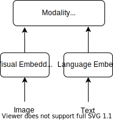

随便提一下，上图这个模型，两个腿（VE和TE层）很粗，头(MI层)比较小的，也称为**双塔模型(Dual Encoder)**，擅长处理VL Understanding问题。2021年，CLIP的出现，解决了这个问题。

#### CLIP架构

CLIP，全名Contrastive Language-Image Pre-training，OpenAI团队提出的一种图像+语言的多模态模型。其核心就是通过对比学习（Contrastive Learning），让图像和文字可以通过同一种方式表达它们的含义，这样AI模型就能直接判断一张图和一句话是否在说同一件事。你可以把整个训练过程理解为一个“图文匹配游戏”：每次给模型一组配对的图片和文字。
举个例子，一只躺在草地上的狗的图片和一句话“a photo of a dog”，这是一对正例，而这张图与不相关的句子，比如“An owl on the snow”，则构成负例。每一对正负例中的图和文都会被分别编码成相同维度的“向量”，然后模型会比较它们之间的距离：

* 对于正例，目标是让它们距离更近
* 对于负例，目标是让距离更远

经过大量这样的训练，使CLIP学会判断一张图和一句话是否表达相同含义的能力。对比学习的整个过程如下图所示：

在CLIP的训练过程中，模型会对成千上万对图像和文字进行匹配训练，让相关的图像和文字对的数值向量靠近，不相关的则相互远离。这样一来，CLIP可以理解文字和图片的含义并进行匹配，从而实现「看图识物」或「图文对比」的效果。下图展示了CLIP模型的核心工作原理和应用流程。

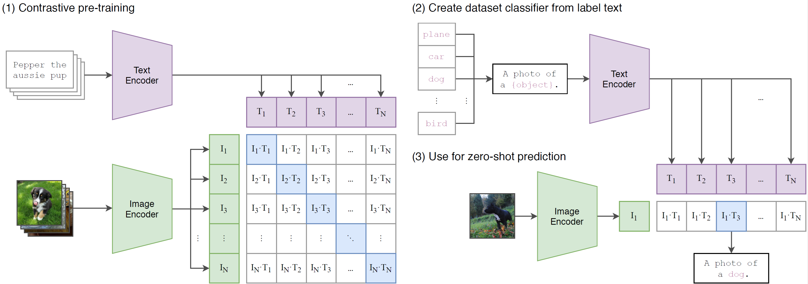

整个过程分为三个主要步骤：

1. 对比学习预训练
   图中所示，文本编码器(Text Encoder)将每个文本转换为嵌入$T_1,T_2,...,T_N$​，图像编码器(Image Encoder)则将每个图像转换为相应的嵌入$I_1,I_2,...,I_N$。然后，模型通过对比学习来优化图像和文本的嵌入，使得正确的图文对的相似性最高，即对角线$I_1T_1, I_2T_2,...,I_NT_N$。
2. 基于文本标签创建分类器
   这一步把分类标签改为描述性的句子，例如把dog转换为a photo of dog。通过消融实验，这个简单的转化能提高不少准确率。
3. 零样本预测
   这一步就是做预测了，即CLIP用于做Zero-shot的分类任务了。输入一张图片dog，图像编码器将其向量化，然后把这个dog图片的向量和所有文本向量进行对比，找到与这个图片向量最接近的文本向量，从而实现Zero-shot分类。

CLIP原理非常简单，很容易想到。在OpenAI团队做这个之前，就有人做一样的事情，但是效果远远没有CLIP好。其核心原因就是OpenAI喜欢大力出奇迹，又发挥了一把Scalling Law的威力。最后提一句，CLIP把Text和Image对比学习的办法，简称为ITC（Image-Text Constrastive），这个简称在后续章节中还会用到。

#### 一问：怎么样的多模态模型结构才是理想的架构？

CLIP架构的潜在问题

我们再回顾下图中CLIP架构，CLIP的VE和TE用的都是Transformer，而融合层（MI）只是一个简单的点乘操作（consine相似度）。从模型结构来讲，就是VE层和TE层，要比MI层复杂的多，即

$$
VE = TE > MI
$$

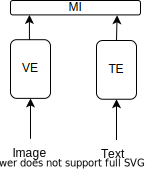

这样的结构，在处理文档普遍检索/匹配任务问题的时候，工作的很好。但是在处理其他问题，比如VQA的时候，效果就一般了，其根源就在于MI层太简单了。后续的模型发展经历也正是对MI有了很深入的改进。在介绍这些复杂模型前，我们还需要解决一些历史遗留问题，就是上面“双塔模型”中的VE层。而这部分改进工作是由ViLT来完成的，这个模型也是ViT同一个团队出品的。

### ViLT：用Transformer统一Visual Embedding层

ViLT(Vision-and-Language Transformer)是一种多模态模型，旨在通过Transformer架构统一视觉和语言的嵌入层。由ViT团队提出，主要特点是去掉了传统视觉任务中的卷积操作和区域特征提取器，直接将图像和文本输入到Transformer中进行联合建模。
回到文章最初提到的**双塔模型**部分的VE（Visual Embedding）部分，2021年前，VL预训练比较依赖图像特征提起，比如，区域监督（如目标检测）与卷积架构（如ResNet）。这样造成Visual Embedding效率很低，模型在这部分花了大量的时间。ViLT的做法简单粗暴，直接用patch embedding代替区域监督和卷积的工作。结果模型速度飞快，准确率比起传统方法下降一点，还能接收。结果详见下图：

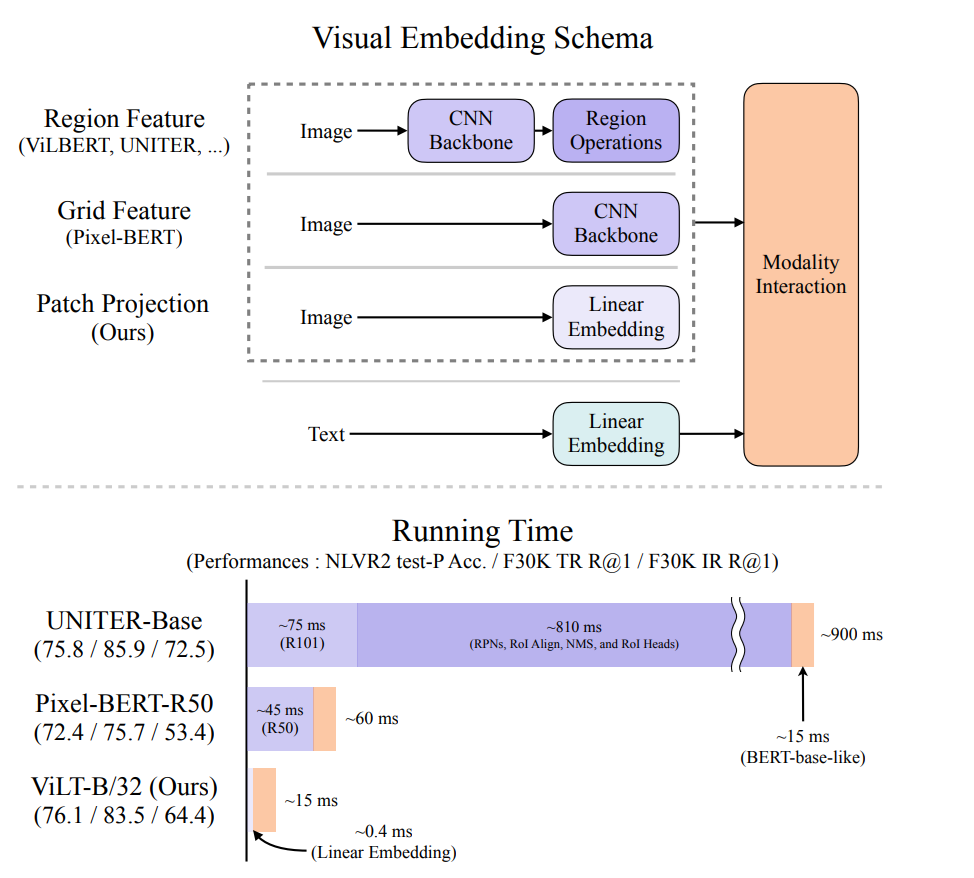

来看一下ViLT的架构图，左下是典型的Lang/Text Embedding, 右下是Visual Embedding。MI层，用的是传统的Transformer Encoder。对比CLIP的MI层，显然ViLT要复杂的多。这种MI层用上Transformer Encoder架构的模型，看上去头重脚轻的，也称之为**单塔模型(Fusion Encoder)**。
接着，聊一下最上层的ITM（Image Text Matching）和MLM（Masked Language Modeling）方法。ITM方法就是对图像文本对（Image-Text Pair）做预测，如果图片和文字描述一致，就返回True。MLM就是BERT模型里采用方法一样，俗称“完型填空”。有兴趣的读者，请读一下《大语言模型：通往通用人工智能之路》，这里就不做过多的陈述了。

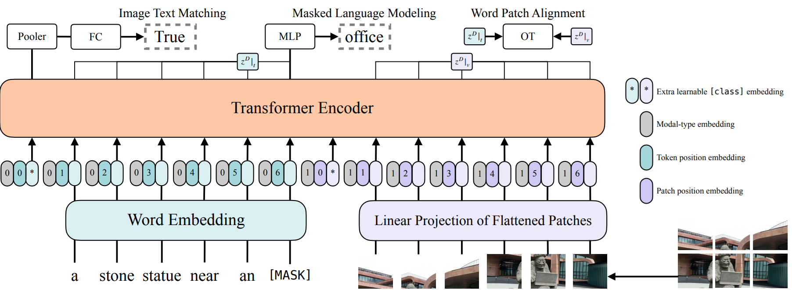

#### 二问：怎么样的多模态模型结构才是理想的架构？

常见的多模态模型

在ViLT论文里，有张图非常有名，就是把多模态模型分成四类。如下图所示：
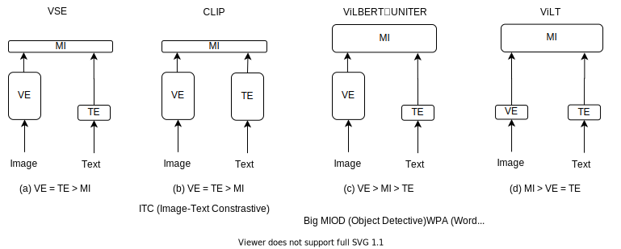

我们在上一个CLIP章节里，讨论了一下CLIP对应的双塔模型，就是上图中的图(b)。CLIP的缺点就是MI层太小了，应付不了复杂的VL问题，但是其中的ITC很好用且高效。

不管是ViLT还是CLIP，从技术上来说，都不复杂，只是把别的领域用的好的方法应用到VL这个领域。接下来要介绍的模型就开始啃硬骨头了，开始真正意义上去更改模型架构以达成较好的效果。再来看ViLT对应的图(d)，采用了Transformer encoder结构的MI层，VE和TE做的非常简单，总体效果就推理速度来说挺好。但是其他方面，比如训练时间耗时，特定任务的性能不够高。同时，ITM和MLM被ViLT论文里的消融实验证明是有效的方法。最后，我们来看一下ViLBERT和UNITER模型为代表的图(c),最终效果是不错的。证明双塔结构中，$VE>MI>TE$这样的模型结构是最好的。然后，为了处理OD，引入的WPA，在推理阶段性能成问题。那么问题来了，

> 怎么样的多模态模型结构才是理想的架构？

基于上面的分析，很容易得出结论。如下图所示：
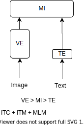

1. 应该是类似图(c)的架构，即$VE>MI>TE$
2. 要有ITC+ITM+MLM。

至此，ALBeF的架构简直呼之欲出了。接下来，我们正式开始介绍ALBeF。

### ALBeF

ALBeF（Align before Fuse），由 Salesforce Research提出，是一个多模态模型，专注于先对齐然后融合视觉和语言信息，以提升多模态任务的性能。ALBeF的主要特点是在多模态融合之前，分别对视觉和语言信息进行高效的对齐，从而实现更精确和深入的跨模态理解。这种方法在多种视觉-语言任务上表现出色，如图像标注、视觉问答和跨模态检索。
ALBeF有两个创新点，

1. **Align before Fuse**：提出新的模型架构。
2. **Momentum Distillation**：动量蒸馏，这个方法是关于数据清洗的，引入了一个蒸馏模型(momentun model)来给网上爬下来的数据做标注，该方法类似于自训练模式。

本文聚焦在模型架构的讲解，对动量蒸馏感兴趣的读者建议看原论文。随便提一下，可以把ALBeF的动量蒸馏结合BLIP模型中的CapFilter一起看，收获会更大。

#### ALBeF架构

下图是ALBeF的架构图

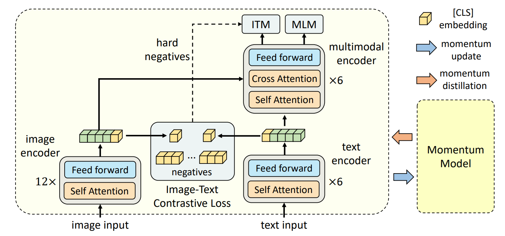

一起来看一下这张图，VE模块是个12层的encoder，TE模块是6层的。在MI层虽然也是6层的，但是encoder内部比Embedding层要复杂一些。符合我们上个章节提到的$VE > MI > TE$这个描述。同时，在架构图里也能找到ITC，ITM和MLM这些算法。
Tips：ALBeF的例子告诉我们，很多创新不是一蹴而就的，要善于总结别人的成果。

我们一起来分析一下模型架构，先看一下VE层，如上图左下角所示，给定一张图片，根据ViT的做法，打成patch，然后通过patch embedding送给ViT，这是一个非常标准12层的ViT。输入的图像是256x256，那么Image Encoder输出的黄绿色部分，就是一个257x768的向量。再来看一下TE和MI层，如果把TE和MI看成一个整体，其实就是一个BERT的Transformer，只不过一劈为二，前六层做TE，后六层做MI。

#### AlBeF的目标函数

接下来，我们来具体讲解ALBeF的三个目标函数——ITC，ITM和MLM。

##### ITC

首先讲一下ITC Loss，回想一下CLIP章节讲过的对比学习大体流程。只要你能定义一个正样本对（Positive Sample Pair），接着定义很多负样本对，然后我们就可以去做对比学习了。训练的目标就是让正样本对的距离越来越近，让征服样本对之间的距离越来越远。按照这个思路，首先我们要做的就是先提取各个样本的全局特侦，然后在这个特征之间去做Embedding Space上的距离拉近和拉远的操作。
回到架构图左下角的VE层，图片I先通过ViT后，得到一个257x768的向量，把其中CLS Token当作这个图片向量的全局特征，即768x1的向量。接着看VE层，文本T经过BERT前六层的Tokenization后，得到一系列768维的特征，我们也把CLS Token拿出来作为文本的全局特征，即768x1的向量。接下来的操作是直接Copy MoCo这个论文的，即先做downsample和normalization，就把768x1变成了256x1的向量。这个时候，正样本对的集合就构造好了。至于如何构造负样本集合，其实负样本都存在一个长度为65536的Queue里，这个Queue是由Momentum Model产生的。这个时候，正负样本都有了，就可以对这个模型进行第一阶段的对比学习了，这个过程就是论文里说的Align before Fuse中的Align过程。也就是说在做多模态融合（即MI层）之前就把图像特征和文本特征通过ITC Loss做对比学习了，让图像和文本特征尽可能的拉近距离，尽可能的在同一个Embedding Space里。

##### ITM

接下来我们来看一下架构图的上部分，即融合层。我们先来讨论一下Image-Text Matching。ITM其实很简单，就是给定一个图片I和一个文本T，在经过MI层之后，会有一个特征向量，在这个特征之后加上一个FC层做二分类（输出Ture/False），来判断输入的图片I和文本T是否为一对。我们知道判断正样本对可能还有点难度，判断负样本对是非常简单的任务，实际操作中发现，这个ITM的Loss function太简单了，很快ITM的准确度提升的非常快，在预训练过程中，ITM的Loss就收敛了。要想效果好，我们得增加正负样本对数据集的训练难度。
接着，我们来看一下ALBeF是怎么做的吧。ALBeF就采用了最常用的做法hard negatives的技术。具体来说，通过某种方式去选择最难的负样本，即选择最接近于正样本的那个负样本。我们看一下架构图中的ITM，还有个虚线从ITC指向ITM。
它就把这张图片和同一个batch（ALBeF的batchsize为512）里所有的文本都算一遍cosine similarity，然后悬着一个除了自己之外相似度最高的文本作为负样本。也就是说其实这个图像和作为负样本的文本是非常相识的，甚至都可以拿来做正样本用。想象一下，如果负样本都是这么难的数据，对ITM的Loss来说就非常有挑战了，这样训练出来的ITM就能更好的判断哪一个是真正的图像文本对了。

##### MLM

最后我们来讲MLM，就是BERT里的“完型填空”。在ALBeF中，MLM就是把原来的一个句子T，随机masked掉几个token变成T‘，然后把原先图片I和缺失几个token的文本T’，送给MI融合后，通过MLM来做预测，目标就是让模型把masked掉的几个token预测正确。对比传统的NLP中的MLM，还是有点不一样的。这里MLM其实也借助了图像这边的信息，来预测哪个token被masked掉。

最后，有个细节需要讨论一下。ITC和ITM的输入都是原始图片和文字，即（I，T）。MLM的输入确实原始的图片和masked掉的文本，即（I，T'）。这就意味着，AlBeF模型在准备这两组数据的时候，做了2次前向传播（forward）。其实ViLT也是做多次前向传播。这也是多模态模型训练时间比传统单模态长的原因之一。

总结一下，ALBeF的不论在训练速度上，还是在推理速度上，通用性和性能表现上都是非常的亮眼，在2021年，多模态邻域起到了一个承上启下的作用。

#### 再论多模态模型架构

以下是多模态领域双塔模型（Dual Encoder）与单塔融合模型（Fusion Encoder）的典型代表，附核心特点与适用场景，便于快速区分与选型：

##### 双塔模型（Dual Encoder）

核心特点：视觉与文本各自独立编码，仅在特征层对齐，推理高效，适合检索类任务。
优点：对多模态中的检索任务非常高效。
缺点：由于MI层太简单，在复杂任务，比如VQA等无法做到效果最好。

| 模型            | 核心架构                                | 关键特性            | 适用场景      |
| ------------- | ----------------------------------- | --------------- | --------- |
| CLIP（OpenAI）  | 图像ViT+文本Transformer双编码器，对比学习对齐 | 零样本迁移强，特征可预计算存储 | 图文互检、图像分类 |
| ALIGN（Google） | 图像ResNet/ViT+文本BERT，弱监督对比学习     | 依赖大规模噪声图文对，数据驱动 | 大规模图文检索   |
| BriVL（智源）     | 视觉塔+文本塔，对比学习与动量蒸馏                 | 中文图文对齐优化，检索性能优  | 中文场景图文互检  |

##### 单塔融合模型（Fusion Encoder）

核心特点：视觉与文本在同一编码器内深度交互（交叉注意力），融合能力强，适合复杂理解与生成任务。
优点：在做VL复杂任务，比如VL Classification，即VR/VE/VQA任务，效果最好。
缺点：在做检索任务时，推理速度非常慢。

| 模型        | 核心架构                                           | 关键特性               | 适用场景          |
| --------- | ---------------------------------------------- | ------------------ | ------------- |
| VL-BERT | 单Transformer编码器，图像区域特征与文本Token拼接，交叉注意力融合   | 早期单塔标杆，依赖目标检测区域特征  | VQA、图文匹配      |
| UNITER    | 单Transformer，图像网格 / 区域特征与文本统一编码，多任务预训练        | 模态交互充分，下游任务泛化性好    | 视觉推理、图文分类     |
| ViLT      | 无卷积单Transformer，图像Patch与文本Token统一处理，无区域监督 | 极简架构，速度快，摒弃卷积与目标检测 | 轻量化图文理解       |
| ALBEF     | 单融合编码器+动量蒸馏，预训练阶段对齐与融合结合                     | 对齐与融合协同，性能与效率平衡    | 图文检索、VQA、图像描述 |
| BLIP      | 单融合编码器-解码器，自举预训练（Bootstrapping）              | 兼顾理解与生成，适配多任务      | 图像描述、视觉对话     |

既然单塔模型和双塔模型有着各自的优缺点和适用范围，一个很直接的想法，我能不能把这些放在同一个框架里呢？在做推理的时候，根据具体的下游任务，动态的选择单塔或者双塔模型。接下来要介绍的VLMo模型，提出了一种新的模型架构：MoME(Mixture of Modality Expert)实现了这个想法。

### VLMo

VLMo（Vision-Language pretrained Model）是微软亚洲研究院于 2021 年提出的统一视觉 - 语言预训练模型，核心是用 MoME（Mixture-of-Modality-Experts）Transformer 架构，在单一模型内同时支持双塔检索与单塔融合两种模式，兼顾效率与深度交互能力，适配检索、VQA、图文理解等多类任务。主要创新点有2个：

1. 用**统一架构**实现双编码器与融合编码器的无缝切换，无需为不同任务单独训练模型。引入​**MoME机制**​，在Transformer块内动态激活模态专家，平衡单模态编码与跨模态融合。
2. 采用​**分阶段预训练(Stagewise Pre-training Strategy)** ​，充分利用单模态与多模态数据，提升泛化与效率。

简言之，就是这个自注意力层时所有模态共享的，但是在这个Feed Forward层是不一样的，每个模态就会对应自己不同的Expert，即负责视觉的Vision Expert，负责文本的Language Expert和负责多模态的Multi-model Expert。这样在训练的时候，哪个模态的数据来了，我就训练哪个模态的Expert。然后在推理阶段，也能根据输入的数据，去决定该使用什么样的模型结构。这样就非常优雅的解决了我们在上一章节末提到的单塔和双塔模型面临的难题。接下来，我们先一起来看一下VLMo的架构。

#### VLMo架构

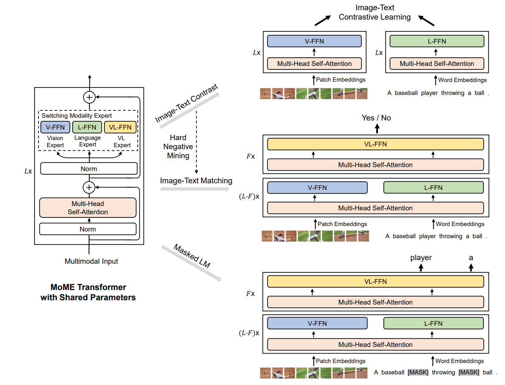

首先，我们来看VLMo的核心部分，上图的左边MoME Transformer with Shared Parameters部分。这是一个Transformer encoder结构，但是VLMo对标准的encoder做了改动——改了FFN这一层。不像标准Transformer encoder只有一层FFN，MoME改成了3个。根据不同的模态，MoME会切换不同的FFN，即Vision FFN，Language FFN和Vision-Language FFN，就是虚线模块里说的Switching Modality Expert。
这里有个比较有意思的点，3个FFN是不共享参数权重的，但是之前的MSA层是共享权重的。也就是说，不论你是图像，文本还是图+文，任何token sequence进来，MSA这一层都是一样处理的，通通都是shared weights的。从这个角度来说，也再次证明Transformer的self-attention是非常通用的架构。
接着我们来看中间部分，VLMo也用了ITC，ITM和MLM，也从ALBeF模型借鉴了Hard Negative Mining的方法。具体做法我们在上一个章节已经详细阐述了，这里就不重复了。
在训练阶段，如果是做ITC，直接就变成了CLIP模型。对应的就是右上角部分。针对图像，先做patch embedding，进去后，就是一个ViT做VE，FFN用的是Vision FFN。针对文本部分，就是个标准的Transformer encoder。一个标准的CLIP双塔模型。如果做ITM和MLM，就是一个单塔融合模型。这里要特别指出的右侧3个图中的MSA（Multi-head Self Attention）层都是一样的，shared weights的。原论文的训练时，取值是：$L=12; F=2$。

接下来，我们介绍VLMo的另一个创新点，就是分阶段预训练策略。

#### 分阶段预训练(Stagewise Pre-training Strategy)

先说一下背景，在2021年，多模态邻域的公开数据集其实不像Unimodality里的公开数据集丰富的。作者想利用这些大量的图片和文本去做预训练，使得模型有更好的初始化。我们一起来看看整个训练过程，如下图所示：

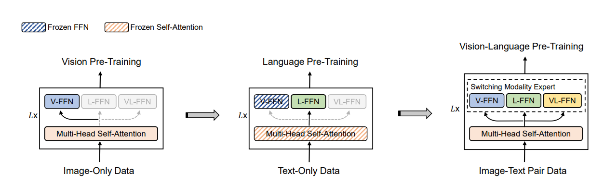

如图所示，先做了Vision Pre-Training，然后去做Language Pre-Training，最后才去做Vision-Language Pre-Training。在第一阶段Vision Pre-Training的时候，肯定是Unsupervised的，其实用了他们团队在BEiT论文里的方法Mask Image Modeling。在第二阶段Language Pre-Training的时候，用的就是传统的Masked Language Modeling。在第三阶段Vision-Language Pre-Training的时候，用的就是ITC+ITM+MLM三个目标函数
另一个需要注意的一点，在训练过程中，MSA和FFN在各个阶段哪些是冻住(Frozen）的，哪些是放开的。在第一阶段，因为是刚刚开始训练，都是放开的。到了第二阶段，做文本预训练时，就不同了，L-FFN打开，把V-FFN和MSA层都冻住了。V-FFN是Vision Expert，冻住很好理解，毕竟这一阶段是训练文本嘛。值得注意的就是MSA冻住了，在第一阶段这个MSA训练数据可是Image Only啊，只在视觉Token sequence上训练好的一个自注意力模型，居然能直接用在文本上，都不需要fine tune就能做文本的“完型填空”，结果证明就是工作的很好。我当时看到这个的时候就想，如果反过来用文本训练MSA，然后直接用在Vision任务上行不行。查了一圈文档，还真有人这么做。结论是：只能是Vision训练好的MSA能直接用在Language任务上，反之则效果不好。到了第三阶段，就是我们想要的多模态融合了，就把所有都打开，让融合效果达到最好。

#### 三问：怎么样的多模态模型结构才是理想的架构？

现在聊一下VLMo的缺点，VLMo架构在解决了Dual Encoder和Fusion Encoder的问题之后，也引入了一些新的问题。简言之，就是太复杂了。

1. 训练复杂度较高：分阶段预训练策略和动态路由机制增加了训练过程的复杂性和时间成本。模态专家模块的设计和动态路由机制的选择需要大量实验验证，增加了开发难度。
2. 对大规模数据的依赖：需要大量的单模态和多模态数据进行预训练，数据质量对模型性能影响较大。对多模态融合也有依赖，模型性能在很大程度上依赖于多模态融合的效果，可能在模态间对齐较差的数据上表现不佳。
3. 模型架构复杂：有多个目标函数，比如ITC+ITM+MLM，造成多次Feed Forward，训练慢。多个Loss function还有个问题就是调参很难，往往多个目标函数间的参数是相互影响的，有些还是互斥的，往往是压下葫芦起了瓢。

如果，让我们动手改着VLMo架构，该怎么做？分析一下上面提到的3点，其实1和3是一样的，需要改模型架构。2的话，需要在多模态数据方面有所突破，也就是说数据不是越多越好，还需要提高数据质量。本文主要聚焦模型架构，其实多模态数据方法论也有很大的进展。从CLIP的self-learning到ALBeF的Momentum Distillation，再到BLIP模型的CapFilter，使得多模态数据越来越丰富，数据质量也越来越好。有兴趣的读者，仔细读一下刚刚提到的这些论文。
回到改动模型这个话题，切入点其实很明显了，缺点3就已经指出来了，ITC+ITM+MLM这3个目标函数一起用，太复杂了。理想状态就是用一个目标函数来代替。同时，我们还希望这个理想模型在做完Pre-Training之后，推理阶段能应付所有下游任务，每个任务表现都很好。而输入端呢，既要能处理单独的图片和文本，也要能处理图片文本对。对于“怎么样的多模态模型结构才是理想的架构？”这个问题，我们给出了答案，如下图所示：

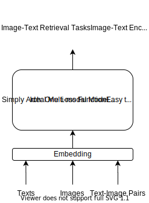

接下来，我们一起来看看这帮聪明的脑袋是如何实现这个理想框架的。

### BEiT-3

BEiT-3（BEIT Pretraining for All Vision and Vision-Language Tasks），作为一种通用多模态基础模型，通过单一架构处理视觉、语言和视觉-语言任务，代表了多模态模型的大融合趋势，其在多种视觉和视觉-语言任务上实现了最先进的迁移性能。

BEiT-3 通过其多向 Transformer 架构和创新的预训练方法，在多模态学习中实现了显著的进步。它不仅在视觉任务上展现出强大的性能，也在视觉-语言任务中表现出色，表明了这种融合视觉和语言预训练方法的巨大潜力和应用广度。BeitV3 的成功预示着多模态模型在处理更复杂、更细粒度跨模态任务中的巨大潜力。

#### BEiT-3 架构

相较于之前的模型，BEiT-3要简单的多，如下图所示：

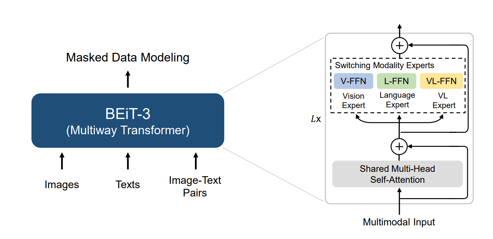

先看输入和输出，和我们上一章节讨论的理想模型是一样的，即一个模型全部搞定。再看左侧模型部分，有个新名词Multiway Transformer，其实就是VLMo模型的MoME。同一个团队出品的，只是改了名字而已。上个章节里还提到ITC+ITM+MLM的方法太复杂，这里直接用了一个方法MDM（Masked Data Modeling），其实就是MLM方法。因为这边既支持Text也支持Image，所以把MLM中的L（Language）改成D（Data），即改名叫MDM。架构介绍完了，就这么简单，多模态VL模型的集大成者。
Tips：读书的时候，老师经常说，要把一本书先读“厚”，然后再读“薄”。VL大模型的发展，完美的诠释了这个过程。

既然这么简单的架构就能成为VL模型的集大成者，为什么在BEiT-3前，别的团队就没有想到呢？那我们现在就开始拨开BEiT-3的神秘面纱，一起讨论BEiT-3的创新点。

#### BEiT-3 Multiway Transformer

我们先来介绍一下BEiT-3是如何做到应对各类不同的下游任务。按照我们上一章节讨论的理想模型，最理想的情况就是一个输出处理所有场景，可惜还做不到。BEiT-3做了个折中方案，引入了开关机制，用户可以根据下游任务来打开开关，处理对应的下游任务。BEiT-3把下游任务分成了五类，同时对应五路推理模型：
(a) 传统视觉任务，比如图像分类/图像分割/对象检测。对应的模型就是Vision Encoder
(b) 传统的NLP任务。对应的模型就是Language Encoder
(c) VL类任务，比如VQA/VR等。对应的模型就是Fusion Encoder
(d) 图像文本检索类任务。对应的模型就是Dual Encoder
(e) 图像文本生成类任务，比如图生文。对应的模型就是Image-to-Text Generation

大家对着下面这张图看一下。打个比方，装修房子，铺电线的时候，入户一个总开关，每个房间都有独立的开关。如果人在卧室，可以只开卧室的灯。

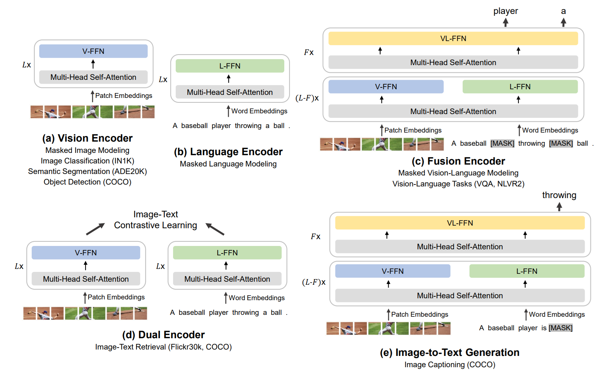

用不同的开关处理不同的下游任务，这个是很容易想到的。难的是如何预训练这个模型，做到只预训练一次，然后通过不同的开关处理各类下游任务。20多年前，Java就是通过“Write Once, Run Anywhere.”的口号取得巨大的成功的。

#### BEiT-3 预训练

其实BEiT-3最值得学习的地方就是预训练的思路。我们先讨论一下模型训练，主要就是2个方面。

1. 模型训练方法，比如有监督微调(SFT)，强化学习(RL)等；
2. 训练数据

对于训练方法，我们讨论的比较多，暂时按下不表。我们先看一下数据，对于模型来说，数据质量越高越好，数据规模越大越好。这个问题其实是相互矛盾的，质量越高，就需要人工标记。这样的采用人工标注的方式，规模一定受限。在CNN时代（以处理图像为主），业界流行的方式就是采用人工标注来产生数据，诞生了很多很有影响力的数据集，比如ImageNet。但是，到了NLP阶段，特别是LLM流行起来后，Scalling Law成为很多模型的不二选择。这样数据规模就成了瓶颈。摆在业界面前的难题就是需要在数据规模和数据质量中间取一个平衡点。这样，自监督学习(Self-survised Learning)就孕育而生了，说白了，思路也很简单——让机器代替人来对数据做标注。
用自监督学习解决了训练规模的问题后，离激活Scalling Law又迈进一步。BEiT-3还需要在模型训练方法论有所创新。上个章节提到VLMo的一个痛点就是ITC+ITM+MLM的联合训练太难了，不利于激活Scalling Law。现在我们就来看BEiT-3是如何简化这个Loss function。一般来说，简化原来的方法，要么提出一种全新的方法代替原方法，要么在原来基础上做减法，而BEiT-3采用了后一种方法。
只要分析一下ITC+ITM，其实这两种方法还相互依赖，中间还穿插着一个hard negitive sampling。在反观NLP领域，也没有相对应的方法，换句话说，ITC+ITM也不大适合纯文字的领域。这样就剩下来MLM了，第一感觉，可行！再回头看看ITC+ITM工作的比较好的地方，就是处理输入类型为Text-Image Pair这类数据。如果我们能用MLM的方法，能处理Text-Image Pair类型数据，那么就可以放心大胆的抛弃ITC+ITM了。接着，我们来看一下BEiT团队是如何解决这个问题的。

#### BEiT-3的多模态掩码建模（MDM）

BEiT团队处理这个问题的思路堪称革命性的，也是最值得学习的地方。BEiT-3的核心是通过 “图像即外语（Imglish）” 理念，以统一的**多模态掩码建模（MDM，Masked Data Modeling）** 任务替代ITC+ITM，再配合Multiway Transformer架构，实现单任务驱动的图文对统一建模，彻底抛弃传统多目标联合训练范式。

##### MDM处理Text-Image Pair的完整流程

BEiT-3将图文对视为 “平行句（Parallel Sentences）”，用统一的掩码-预测流程完成建模，核心分四步：

1. **输入统一Token化**
   
   * 图像：用BEiT-2的离散tokenizer将图像切分为16×16patch，转化为视觉token（Imglish），与文本token 同空间表示。
   * 文本：用SentencePiece分词器生成文本token。
   * 图文对拼接：以``和`<Text>`分隔符拼接视觉token序列与文本token序列，形成单条混合token序列，无独立视觉/文本编码器。
2. **统一掩码策略**
   
   * 随机掩码40%的视觉token块与15%的文本token（遵循BERT的80-10-10掩码规则），掩码同时覆盖单模态与跨模态边界token，强制模型学习全局上下文关联。
   * 图文对中的掩码不区分模态，统一视为待恢复的 “缺失 token”，无需区分视觉 / 文本掩码类型。
3. **Multiway Transformer 深度交互**
   采用多路专家（MoME）架构，每层含视觉专家、语言专家，顶层3层额外加入视觉-语言融合专家，共享自注意力层，按模态动态激活对应专家，实现跨模态信息深度融合而非简单拼接。
   
   * 自注意力机制让视觉与文本token双向互看，解决ITC仅全局对齐、无细粒度交互的问题。
   * 融合专家强化图文token的跨模态依赖建模，替代ITM的匹配判断逻辑。
4. **MDM 单损失优化**
   模型仅用交叉熵损失训练，目标是恢复所有被掩码的视觉/文本token，无需ITC的对比损失和ITM的匹配损失。该损失迫使模型同时学习：
   
   * 视觉局部与全局结构（如物体形态、场景布局）。
   * 文本语义与句法。
   * 图文间的细粒度对应（如 “红色苹果” 与图像中红色果实区域的关联）。

下图将我们上一个章节讨论的理想MLLM架构和这一章节讨论的BEiT-3模型实现的对照图。

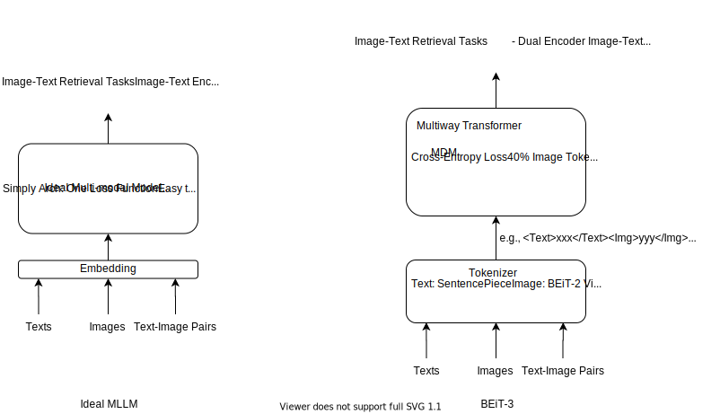

## 参考文献

1. [AN IMAGE IS WORTH 16X16 WORDS: TRANSFORMERS FOR IMAGE RECOGNITION AT SCALE](https://arxiv.org/pdf/2010.11929)
2. [Learning Transferable Visual Models From Natural Language Supervision](https://arxiv.org/pdf/2103.00020)
3. [ViLT: Vision-and-Language Transformer Without Convolution or Region Supervision](https://arxiv.org/pdf/2102.03334)
4. [一文搞懂多模态：BeiT-3之前的14个多模态+4个周边原理解读](https://zhuanlan.zhihu.com/p/633946545)
5. [Align before Fuse: Vision and Language Representation Learning with Momentum Distillation](https://arxiv.org/pdf/2107.07651)
6. [VLMo: Unified Vision-Language Pre-Training with Mixture-of-Modality-Experts](https://arxiv.org/pdf/2111.02358)
7. [Image as a Foreign Language: BEIT Pretraining for All Vision and Vision-Language Tasks](https://arxiv.org/pdf/2208.10442)
8. [多模态论文串讲·上【论文精读】]https://www.youtube.com/watch?v=6pzBOQAXUB8
9. [多模态论文串讲·下【论文精读】]https://www.youtube.com/watch?v=S1le41J76lQ

