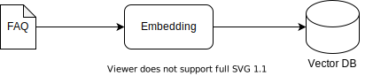
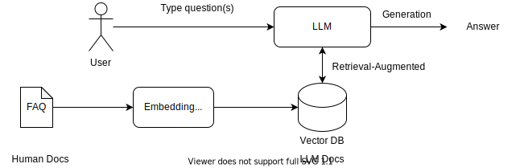
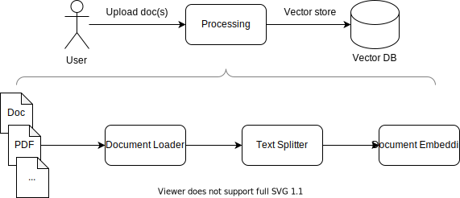
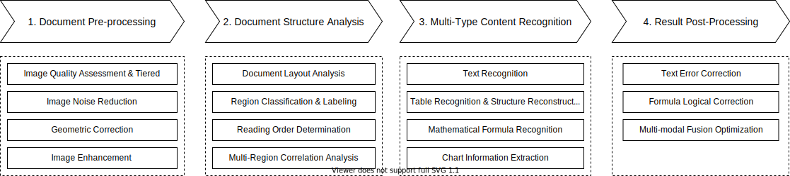
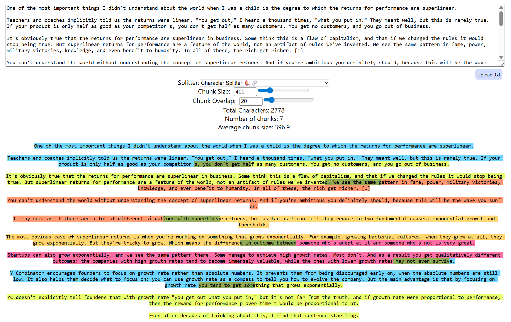
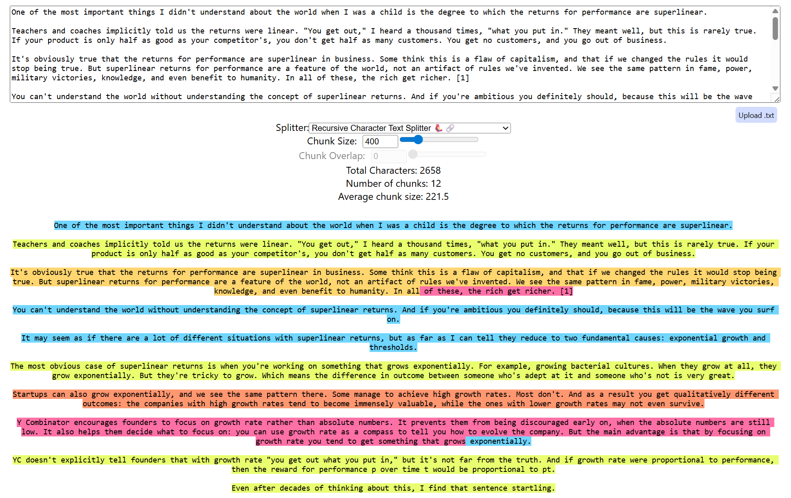

# 深入RAG：构造知识库

## 前言

这篇技术文章，笔者第一次用了“深入”这个词。此时的心情，类似于工作了十几年的资深技术人员，在简历里写了“精通某某技术”的感觉。学的越深，知道的越多，越不敢用这些修饰词。之所以，用上“深入”这个词。是觉得，在2025年当下，以及接下来的2~3年内，RAG对业界会有非常深远的影响，而一大堆聪明人不停的对这个技术进行迭代，使之焕发新春。对读者而言，希望务必搞懂RAG，打牢基础。

## 何为RAG

### 提出问题

先抛开定义，我们先看看我们在运用LLM解决实际问题时，遇到了哪些”痛点“。
我们以最常见的AI智能客服（AI Chatbot）为例，最初的问题是对人类自然语言的理解不够好，后来随着LLM技术的发展，特别是BERT的大规模应用，已经很好的解决了这个问题（即NLU问题）。接着，新的问题出现了，生成式LLM开始一本正经的胡说八道了，即产生了“幻觉”问题。如何解决这个“一本正经的胡说八道”问题呢？

### 解决问题

我们回到人类的场景，很多正式场合，比如外交部答记者问现场直播，是不允许发言人说错话的。这个时候，外交部发言人的手头往往都会有一份书面的文档，上面预先准备了大量的问题。发言人在回答记者问题时，需要先看一下手头的文件，然后回答记者的问题。用一个图来表示这个过程，如下图所示：

现在我们把这个过程模拟到LLM技术中，来解决幻觉问题，即用LLM来代替人脑。

其实，这就是RAG技术，其定义如下：
**RAG(Retrieval-Augmented Generation)** 是一种结合信息检索（Retrieval）和生成（Generation）的技术架构，主要用于构建智能问答系统或知识增强型生成任务。它通过检索外部知识库中的相关信息来增强生成模型的能力，从而提高生成结果的准确性和知识覆盖范围。

仔细观察上图，我们很容易得知RAG包含两个核心流程，一个是增强检索（Retrieval-Augmented)，另一个是生成(Generation)。现在，我们开始动手构造一个简单的RAG系统。

## 构造简单的RAG系统

在打造RAG系统之前，需要先解决一个问题——如何构造文档？回到外交部发言人的例子，在正式开发布会前，需要花大量的精力准备记者们的提问，也就是准备常见问题的答案集（FAQ）。同样的，在计算机系统里，我们也需要准备让LLM能读得懂的FAQ文档。也就是帮LLM准备FAQ文档，这一过程一般是人事先准备的，所以这个文档也是人类可读的。想让计算机理解人类的文档，就是必须要用数学来表示文档。这里，我们用向量来表示文档，即将文档向量化（Embedding）。如果读者想了解其中缘由，建议阅读笔者之前的文章《词表达发展史》。而业界把处理好的文档储存在向量数据库中，下图描述了这个过程。

这样一个简单的RAG系统就构造好了，如下图所示。

在真实世界中，运行的商业RAG系统要远远比这个复杂。接下来，我们就逐步改造这个简单的RAG系统，达到商业级别的架构。RAG as a Service

## 构造知识库系统

### 离线流程：知识入库

在真实的RAG系统中，我们不会hard code FAQ文档，而是让用户自己上传文档，也就是说，将大规模的知识库（Knowledge Base）存储到向量数据库中，这个过程叫做**知识入库**。下图描述了这一过程。

新的问题又来了，每个LLM都有一个最大Token的限制（2025年流行的LLM最大Token数一般是几千到几万。），而一篇小说，至少10万字，远远超过LLM最大Token数的限制。而文档又有各种格式，同时含有目录，表格，图片等，所以，我们需要先进行文档解析，再文档切片，然后将文档切片向量化，最后将切片的向量记录插入到向量数据库中。下图简单的阐述了这个过程。

接下来，我们将分别讨论文档解析，文档分片和文档向量化存储这三个过程。

#### 文档解析

文档解析，顾名思义，就是将各种数据源及其格式（如txt，doc，pdf，json等格式）解析成统一格式。最简单的统一格式就是纯文本。根据笔者的实际工程经验，至少在2025年，绝大多数场景下，这项工作LLM没有技术优势。
因为本文着重介绍AI相关的技术，对传统的文件解析，就一笔带过了，建议有兴趣的读者看一下[LangChain Document Loaders](https://python.langchain.com/docs/how_to/#document-loaders)文档。
想要介绍AI模型如何在文档解析部分的运用，就要用到一些复杂的场景。这里，我们挑一个“硬骨头”例子来啃。一个含有文字+图片+表格/图表的PDF文档，这类文档常见于财报，商业研究和学术论文等。为了挑战难度，直接采用“扫描版”的PDF文件。
针对这一类文档，哪些单纯依赖规则的，传统的解析库是无法实现这一目标的，目前主持这些功能的多为基于深度学习的开源库等。处理这类文档，要经过下面四个步骤：**预处理，结构解析，多类型内容识别，文档后处理及优化**。下图是一个处理复杂文档的总览图：

接下来，我们对几个步骤做一个简要的介绍。

1. 文档预处理
   预处理的第一步是评估图像质量，根据质量等级采取不同的处理策略：

* 高质量图像（分辨率≥300DPI，清晰无噪声）：直接进入结构解析阶段
* 中等质量图像（200DPI<分辨率<300DPI，轻微噪声或倾斜）：进行基本的噪声消除和几何校正
* 低质量图像（分辨率<200DPI，严重噪声、模糊或倾斜）：进行超分辨率重建、去模糊、复杂噪声消除等处理

2. 文档结构解析
   **文档布局分析(Document Layout Analysis)** 是理解文档结构的关键步骤，现在流行的布局检测（Layout Detection）都是基于LLM的，比如微软的LayoutLMv3模型。一些流行的OCR集成开源软件，比如MinerU，还对LayoutLMv3做了微调，还用了传统的YOLO模型。将PDF文档各个区域，比如文本，表格，公式，图表，图像及注释等做分类和标记，以便于后续用不同的模型来对这些区域做OCR。这个过程就是**区域分类与标记(Region Classification & Labeling)**。
   **确定文档区域的阅读顺序(Reading Order Determination)** 是保证输出内容逻辑连贯的重要步骤，就是对离散的文本段落进行排序和拼接。最后还要使用LM从语义上分析各区域内容的上下文关系，确定关联强度，这一过程就是**多区域关联分析(Multi-Region Correlation Analysis)**。
3. 多类型内容识别
   内容识别是OCR系统的核心功能，需要针对不同语言和字体提供高精度识别。主要针对文字，表格和图表的识别。
   **文字识别(Text Recognition)**，技术很成熟了，就不多费口舌了。中文的话，PaddleOCR就不错。其他语言的话，可以考虑Tesseract。
   **表格识别(Table Recognition)**，当前技术比较有挑战性，需要识别表格格式和表格中的内容，并且将图像中的表格转化为HTML/Markdown/LaTeX等格式。目前有两种解决思路，一种是直接上一个大模型，一步到位输出转化好的格式。另一种是分解为2个模型，一个负责文字部分，一个负责表格识别和重建表格结构。在2025年，就实际效果来说，第二种思路好一点。但是，笔者觉得第一种思路是未来的方向。
   **公式识别(Fomula Recognition)**，技术成熟度介于两者之间，打印体的公式识别率已经很高了，当然手写的公式要差一点。其实公式OCR难点在公式检测和分割，建议训练一个专门YOLO去完成这部分工作。
   **图表信息提取(Chart Information Extraction)**，这部分技术，除了对标准的柱状图（Bar Chart），折线图（Line Chart）和饼图（Pie Chart）识别，马马虎虎能用。其他图表的识别准确率离产品化，还有点距离。在现在产品中，一般把这些统计图，直接当作普通图片处理，不做内容识别和重建。
4. 文档后处理及优化
   在最终文档输出前，要做一些优化，比如文本纠错，表格结构优化，公式逻辑修正等。这部分比较杂，原理不难，有兴趣的读者，自己相应找一些材料看一下即可。也有不少软件把这部分修正(Correction)功能分散放在前面的步骤中。

#### 文档分片

在RAG系统中，**文档分片（Document Chunking）** 是连接 “文档存储” 与 “高效检索” 的关键环节。其核心目标是将冗长、结构复杂的原始文档（如 PDF、长文、报告等）拆解为大小适中、语义完整的文本片段（Chunk），既保证检索时能精准匹配用户query的核心信息，又避免因片段过碎导致语义丢失。大致有5种方式分片策略：

1. 固定长度分片(Fixed-size Chunking)
2. 语义分片(Semantic  Chunking)
3. 递归分片(Recursive Chunking)
4. 基于文档结构分片(Document Structure-based Chunking)
5. 基于LLM分片(LLM-based Chunking)

从实用性的角度来说，笔者介绍其中的两种，即固定长度分片和递归分片技术。

##### 固定长度分片

**固定长度分片技术(Fixed-size Chunking)** 是最基础、最早期的文档拆分方法。它通过设定固定的长度阈值（如字符数或Token数），将原始文档切割为大小相对统一的片段（Chunk），是理解更复杂分片策略的基础。其中，有两个关键参数需要掌握：

1. **固定长度阈值（Chunk Size）**，核心参数，决定每个片段的最大长度。需匹配检索模型和大模型的输入限制。
2. **重叠长度（Chunk Overlap）**，* 可选参数，用于缓解 “切割点语义割裂” 问题，确保相邻片段在切割边界处有内容重叠，避免关键信息被 “一分为二”。通常设置为阈值的 10%-20%。

介绍个可视化工具[ChunkViz](https://chunkviz.up.railway.app/#/)，读者可以试一下这个工具，体会一下固定长度分片技术。

固定长度分片技术优点就是简单，高效。算法时间复杂度为O(0)。在非结构化短文本场景（如聊天记录等）很适用。但是，缺点也非常明显，最突出的就是语义割裂严重。对结构化文档（比如带标题的文档）也不够友好。从2025年来，业界逐步采用递归分片技术了。

##### 递归分片

递归分片是一种​**自上而下（Top-down）的分层拆分方法**​：以完整文档为初始节点，按照预设的 “语义分隔符优先级” 逐层切割文本，若切割后的片段仍超过设定的最大长度阈值，则对该片段重复执行切割逻辑，直至所有最终片段均满足长度要求且语义相对完整。
简单来说，它模拟了人类阅读长文档的逻辑 —— 先看章节（大语义块），再看段落（中语义块），最后看句子（小语义块），不会粗暴地从某个句子中间截断。
其中，有几个关键参数需要掌握：

1. 最大片段长度阈值（Max Chunk Size）
2. 最小片段长度阈值（Min Chunk Size）
3. 重叠长度（Chunk Overlap）
4. 分隔符优先级列表（Separator List）

前三个参数和固定长度分片没区别，重点放在理解Separator List上。这个参数的核心作用是决定片段的 “语义边界贴合度”。具体的说，根据自然语言的语义层级，预先定义一组 “切割锚点”（分隔符），并按 “语义颗粒度从大到小” 排序。不同类型的文档可定制不同的分隔符列表，常见的通用优先级，从高到低，如下（以英文为例，中文可类比）：

* 文档级分隔符：分页符（`\f`）、章节标题分隔（如`##`、`###`）
* 段落级分隔符：空行（`\n\n`）、段落标记
* 句子级分隔符：句点（`.`）、感叹号（`!`）、问号（`?`）
* 短语级分隔符：分号（`;`）、逗号（`,`）
* 字符级分隔符：空格（最后兜底，避免无法切割）

同样的，我们也在[ChunkViz](https://chunkviz.up.railway.app/#/)试一下递归切片技术。读者可以将下面这张图的结果和固定长度切片的结果对照一下，体会一下不同。

传统分片策略（如固定字符数分片、固定段落分片）存在明显局限，递归分片则针对性解决了这些问题：

| 评估维度                 | 传统固定长度分片                         | 递归分片技术                                |
| -------------------------- | ------------------------------------------ | --------------------------------------------- |
| **语义完整性**     | 易从句子、短语中间截断，导致片段语义破碎 | 优先按自然语义边界切割，最大程度保留语义    |
| **适配性**         | 对不同结构（如论文、小说、报告）适配性差 | 通过动态分隔符适配多种文档结构              |
| **检索精准度**     | 可能将相关信息拆入不同片段，导致漏检     | 相关信息集中在同一语义块，检索召回更精准    |
| **长文档处理能力** | 长文档中深层语义易被割裂                 | 分层拆分，兼顾 “宏观结构” 与 “微观细节” |

尽管递归分片是当前最优策略之一，但仍存在局限性，依赖分隔符质量，若文档格式不规范（如无空行、标题混乱），分隔符可能失效，导致切割效果下降。仅依赖 “表面分隔符”，无法识别 “隐性语义关联”（如跨段落的同一主题）。
综上所述，文档递归分片技术通过 “分层切割 + 语义优先” 的逻辑，完美平衡了 RAG 系统中 “片段长度合规性” 与 “语义完整性” 的核心矛盾，是处理长文档、复杂结构文档的 “标配技术”。其本质是将 “机械切割” 升级为 “智能适配”，通过定制分隔符与调优参数，可最大限度提升后续检索环节的召回精度，最终支撑大模型生成更准确、更具逻辑性的回答。在实际应用中，需结合具体文档场景（如学术、法律、企业报告）定制策略，并搭配结构解析、语义嵌入等技术进一步优化效果。

#### 文档向量化存储

文档完成分片后，就需要转化成计算机能理解的数学语言。这里就要用到文本嵌入模型（Text Embedding Models）了，其核心思想是将文本（如单词、句子、段落或文档）转换为低维稠密向量（嵌入向量）的模型。这些向量能够捕获文本的语义信息，使得语义相似的文本在向量空间中具有较近的距离。业界有很多Text Embedding Model，就实际效果来说，在2025年，笔者推荐BGE（中文）和BCEmbedding（中英文）。在RAG系统里，一般会有把这些向量存在专门的Vector DB来管理。
Tips：如果读者想要了解背后的原理，建议读一下笔者的《词表达发展史》和《详谈Skip-gram》这两篇文章。

### 在线流程：检索增强问答

## 参考文献

[1] [olmOCR: Unlocking Trillions of Tokens in PDFs with Vision Language Models](https://arxiv.org/)
pdf/2502.18443
[2] [Survey on Question Answering over Visually Rich Documents: Methods, Challenges, and Trends](https://arxiv.org/pdf/2501.02235)
[3] [KITAB-Bench: A Comprehensive Multi-Domain Benchmark for Arabic OCR and Document
Understanding](https://arxiv.org/pdf/2502.14949)
[4] [基于生成式人工智能的图档博资源的集中开发与应用创新](https://d.wanfangdata.com.cn/periodical/sxda202402035)
[5] [DocParseNet: Advanced Semantic Segmentation and OCR Embeddings for Efficient Scanned
Document Annotation](https://arxiv.org/pdf/2406.17591)
[6] [Neural Natural Language Processing for Long Texts: A Survey on Classification and Summarization](https://arxiv.org/pdf/2305.16259)
[7] [Optimizing Nepali PDF Extraction: A Comparative Study of Parser and OCR Technologies](https://arxiv.org/pdf/2407.04577)
[8] [ICDAR 2023 Competition on Robust Layout Segmentation in Corporate Documents](https://arxiv.org/pdf/2305.14962)
[9] [人工智能技术在企业档案管理中的应用场景、模式创新与未来展望 Application Scenarios,Model
Innovation,and Future Prospects of Artificial Intelligence Technology in Enterprise Archive
Management](http://m.qikan.cqvip.com/Article/ArticleDetail?id=7112780334)
[10] [PdfTable: A Unified Toolkit for Deep Learning-Based Table Extraction](https://arxiv.org/pdf/2409.05125)
[11] [ChatGPT赋能档案知识服务:逻辑理路及应用场景 The Empowerment of ChatGPT to Archival Knowledge Services:Logical Reasoning and Application Scenari](http://m.qikan.cqvip.com/Article/ArticleDetail?id=7112805555)
[12] [OCR Hinders RAG: Evaluating the Cascading Impact of OCR on Retrieval-Augmented Generation](https://arxiv.org/pdf/2412.02592)
[13] [OCR行业2025年趋势-腾讯云开发者社区-腾讯云](https://cloud.tencent.cn/developer/article/2490200)
[14] [OCR 技术的未来:从文字识别到智能文档理解_语义_信息_推理](https://m.sohu.com/a/883886832_122044713/)

