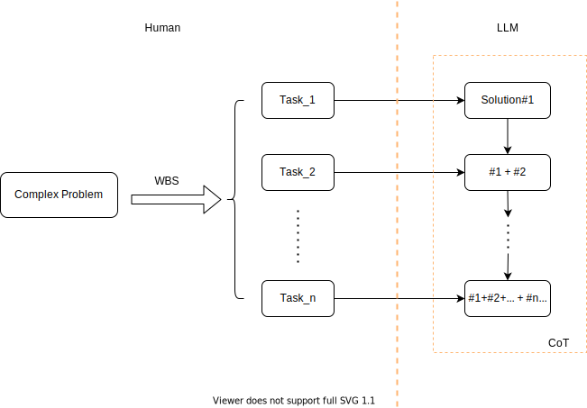
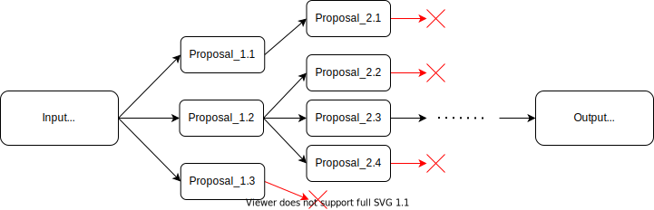
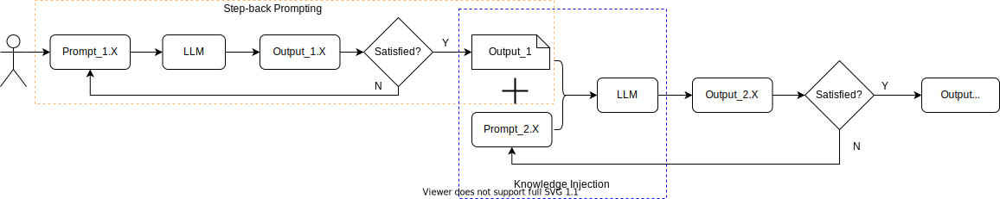

# 聊聊提示词工程

当ChatGPT破圈后，越来越多的人涌入了AI赛道，这使得AI培训课程火了起来。在最初的一年里，绝大多少的AI课程内容都是围绕着提示词工程（Prompt Engineering）。这现象像极上世纪90年代初，当PC开始普及时，人们开始学习如何使用操作系统（Windows），如何输入办公（Office）等。
作为一个技术出身的人，笔者也从来没有想过自己会以提示词工程为内容写一篇技术专题。最初觉得提示词好需要花时间学？后来实际工作需要，发现好的提示词对生产力的提升是显而易见的，故沉下心来好好看看相关的技术文章。结果那是被网上的技术文章看的眼花缭乱，太多的框架和建议了，我记性又差，现在回想起来真是一段非常不好的学习经历。
最后决定自己写一篇吧，类似于读书心得。那么既然决定要写，就要写一些适合技术人员看的Prompt Engineering。因此，本文将从程序员的视角来聊Prompt。

## 什么是提示词工程

抛开枯燥的定义，我们先来看看人类是如何寻求答案/解决问题这个过程。这个过程可以抽象成一个简单的图，如下图所示。


这是一个典型的输入，处理，输出的过程。那么我们如何将这个过程，用数学语言来表达呢？在数学上，含有输入/处理/输出这个过程的，现成的工具就是函数，如下图所示。


既然能用数学表达，那么我们就能用代码将这个问题实现，过程如下图所示。


在这个过程中，程序员的工作，就是把数学表达式/逻辑，用代码表示出来，从而求得答案。但是这个过程中，遇到了一些问题，比如图像识别等抽象的工作很难用一组数学表达式来表示。幸运的是，我们找到了办法，用神经网络NN来解决这类问题，我们也进入以LLM为代表的AI时代，这个问题就可以用下图来表示。


这里出现了提示词(Prompt)，如图所示，Prompt就是LLM的输入，以自然语言表示。而提示词工程的最终目标就是如何提高提示词的实际效果。

在基础篇《》中，笔者提到一个解决问题的思路，在遇到工程问题时，参考别的领域中类似问题的解决思路，然后复制到本领域中。学习上，这个跨学科的思路，也可以借鉴。对程序员来说，最熟悉的就是写代码。那么我们就以如何写一个函数为例，来学习提示词工程。
如下图所示，在成熟项目里，写一个合格的函数，有下面5个典型的步骤。


1. **准备阶段**， 在这个阶段，程序员一般会配置软件的运行环境，debug环境等。
2. **设计阶段**， 这个阶段，定义函数做具体完成的任务，包括接口定义，函数名称，返回值等。
3. **实现阶段**， 这个阶段，就是按照设计阶段的任务，做具体的实现，代码需要符合团队的代码规范(Code Style Spec.)，软件漏洞扫描等。
4. **重构阶段**， 这个阶段不是必须的，在成熟的软件团队中，会对每一个提交的代码(Pull Request)做审核(Review)。
5. **测试阶段**， 这个阶段就是单元测试，大型项目中，Unit test必须和代码一起提交，以保证最基本的代码质量。

提示词工程的学习，笔者也把提示词工程分为这5个阶段，接下来我们将逐一介绍。不过，在介绍提示词工程前，先来解决一个问题：提示词工程为什么有用？有什么理论依据吗？

## 提示词工程：原理

用一句话来阐述提示词工程的原理，就是让提示词尽量和人类对LLM做训练时的训练数据接近。

在基础篇《大语言模型：通往通用人工智能之路》里，笔者以OpenAI的GPT线索详细介绍LLM的发展历程。简单的复述一下发展经历及对于提示词工程的意义。

1. GPT-1： 成功的把Transfermation这个特征提取器引入模型，用上了两阶段训练的方法，这个版本的GPT本质上还是分类模型。从提示词的角度讲，GPT-1对提示词工程没有特殊贡献。
2. GPT-2：用上了自监督学习。其设计思路就是结构化SFT的训练数据，核心结构就是，**指令**(目标任务) + **示例**(目标示例)。从提示词的角度讲，引入了Zero-Shot prompt（只有指令）和Few-shot prompt（指令+示例）。对我们的提示，就是在使用LLM过程中，提示词要尽量多的提供示例。
3. GPT-3： 用了更大的参数模型和更多的数据，产生了“涌现”的现象。观察到了思维链(CoT)的能力。我们也常常把CoT的技巧用在提示词工程上。
4. GPT-3.5： 这个就是ChatGPT，主要就是把GPT-3和人类对齐。在提示语上，我们也常常给LLM设立各种不同的“人设”。

接下来，我们开始学习提示词工程。

## 提示词工程：准备阶段

大语言模型（LLM）都提供了多种配置选项，用于控制其输出内容。有效的提示词工程需要针对具体任务优化这些配置。输出配置主要分为两类，一类是输出长度(Output Length)，一类是采样控制(Sampling Control)

### 输出长度

顾名思义，这一配置就是设置是LLM生成的token数量。生成更多tokens需要LLM进行更多计算，这会导致能耗增加、响应速度可能变慢，且成本更高。减少LLM的输出长度并不会使模型在输出风格或文本表达上更简洁，它只会让模型在达到长度限制后停止预测更多tokens。输出长度限制对于某些LLM提示技术尤为重要，例如ReAct技术——在这类场景中，LLM可能会在生成所需响应后继续输出无用的tokens。

### 采样控制

大语言模型并非直接预测单个token，而是预测下一个可能出现的token的概率。具体的讲，LLM先把词汇表中的每个 token都会被分配一个概率。随后，LLM会基于这些token概率进行采样，以确定下一个输出的token。
其中温度(Temperature)、Top-K和Top-P是最常用的配置参数，它们决定了LLM如何基于概率来选择单个输出token。

#### 温度(Temperature)

温度用于控制token选择过程中的随机性。较低的温度适用于需要确定性响应的提示词场景，而较高的温度则能带来更多样化或意想不到的结果。温度为0时(即贪婪解码)，输出具有确定性：LLM总会选择概率最高的token。温度越高，输出越随机。下面是关于温度的数学描述，想深入这一问题的读者，对着公式再体会一下温度的含义：用于控制token选择过程中的随机性。

**温度**是通过调整softmax函数来控制token概率分布的平滑度的参数。其数学公式如下：

对于模型预测的原始logits $ z_1, z_2, …, z_n$（其中n是词汇表大小），应用温度T后的概率P分布为：

$$
P(i) = \frac{\exp(\frac{z_i}{T})}{\sum_{j=1}^{n} \exp(\frac{z_j}{T})}
$$

其中：

* $z_i$是第 $i$个token的原始预测得分(logit)。
* $T$是温度参数，必须大于0, 在LLM配置中，建议取值范围在0~1之间。
* $exp$ 表示自然指数函数。

温度对概率分布的影响：

* $T→0$​（趋近于 0）：
  * 概率分布变得非常 “尖锐”，模型几乎总是选择概率最高的token（即贪婪解码）。
  * 极端情况下（$T=0$），直接选择最大logit对应的token(实际实现中通常用$T=0.01$近似）。
* ​$T=1$​：
  * 等同于标准softmax函数，不改变原始预测的相对概率。
* ​$T→\infty$​（趋近于无穷大）：
* 概率分布变得均匀，所有token被选中的概率几乎相等，输出完全随机。

#### Top-K与Top-P

Top-K和Top-P是大语言模型中用于限制下一个预测token 范围的两种采样设置，它们会从预测概率较高的token中筛选候选。与温度类似，这些采样设置也会影响生成文本的随机性和多样性。

* ​**Top-K**​：从模型的预测分布中选择概率最高的前K个token。Top-K值越高，模型输出越具创造性和多样性；Top-K值越低，输出越稳定、更贴近事实。
* ​**Top-P**​：选择累计概率不超过某个阈值的token集合。P的取值范围为0（贪婪解码）到1（包含词汇表中所有 token）。

举个例子，如下表所示，一个完整的词表中，共有10个token。

| **Token**  | $z_1$ | $z_2$ | $z_3$ | $z_4$ | $z_5$ | $z_6$ | $z_7$ | $z_8$ | $z_9$ | $z_{10}$ |
| ----- | ----- | ----- | ----- | ----- | ----- | ----- | ----- | ----- | ----- | ----- |
| **logits**  | 0.15 | 0.10 | 0.05 | 0.20 | 0.21 | 0.11 | 0.09 | 0.04 | 0.07 | 0.08 |

若设置Top-K=3，则选出的Token集合是$\{z_5, z_4, z_1\}$
若设置Top-P=0.7，则选出的Token集合是$\{z_5, z_4, z_1，z_6\}$。具体计算逻辑是先按照Logits从高到低排序，然后按照顺序计算累计的logits，$0.21 + 0.20 + 0.15 + 0.11 = 0.67 < 0.7 $

Tips: 具体项目中，到底是选择Top-K还是Top-P，没有定论。最佳方式是试出来。即对两种方法(或两者结合)进行实验，观察哪种方式能得到预期结果。

#### 综合配置

Temperature、Top-K、Top-P以及生成token数量的选择取决于具体应用场景和预期结果，且这些设置之间会相互影响。如果同时配置这三个参数，那么会对模型输出有什么具体影响呢？想回答这个问题，我们就需要了解LLM的Transformer实现了。想进一步深入的读者，可以直接看HuggingFace的Transformer源码。这里，笔者简单的说一下结论。Top-K和Top-P在做Softmax之前，所以比起Temperature参数，LLM会先优先计算Top-K和Top-P。而Top-K和Top-P之间是AND的关系。即结果集需要同时满足Top-K和Top-P的筛选条件。

1. 若模型同时支持温度、Top-K和Top-P，则下一个预测 token 的候选范围需同时满足Top-K和Top-P的筛选条件，之后再通过温度从这些候选token中采样。
2. 若仅支持 Top-K 或 Top-P，则仅基于该单一设置筛选候选 token。
3. 若模型不支持温度调节，则会从满足 Top-K 和 / 或 Top-P 条件的 token 中随机选择下一个预测 token。

#### 参考配置

当某一采样配置参数处于极端值时，该参数可能会抵消其他配置的作用或使其他配置变得无关紧要：

* 若将温度设为0，Top-K和Top-P会变得无关 —— 概率最高的token会直接成为下一个预测 token。若将温度设为极高值（超过 1，通常达到 10 以上），温度的作用会失效，此时会从通过Top-K和Top-P筛选的token中随机采样下一个预测token。
* 若将Top-K设为1，温度和Top-P会变得无关 —— 只有一个token能通过Top-K筛选，该token即为下一个预测token。若将Top-K设为极高值（如等于模型词汇表的大小），则所有具有非零概率的token都能通过Top-K筛选，此时该设置相当于无效。
* 若将Top-P设为0（或极小值），大多数LLM采样机制会仅考虑概率最高的token满足Top-P条件，导致温度和Top-K变得无关。若将Top-P设为1，则所有具有非零概率的token都能通过Top-P筛选，此时该设置相当于无效。

作为通用的初始配置，建议温度设为0.2、Top-P设为0.95、Top-K设为30，通常能得到相对连贯的结果，既有一定创造性又不会过于发散。如果你需要特别有创造性的结果，可以尝试从温度设为0.9、Top-P设为0.99、Top-K设为40，开始调试。而如果你希望结果的创造性更低（更稳定），可以从温度设为0.1、Top-P设为0.9、Top-K设为20开始尝试。最后，如果你的任务存在唯一正确答案（例如解答数学题），建议从温度0开始配置。

## 提示词工程：设计阶段

现在让我们代入程序员视角，设计一个函数/API，让别人来调用，需要做什么。首先要识别调用者，即谁来使用这个函数。在实际工作中，我们常用Use Case图。接着，在你的设计文档，至少对以下3点要有清晰的说明：

1. ​**解释意图**​：说明函数 “为什么存在”，完成什么具体任务。
2. ​**指导使用**​：明确参数含义、返回值格式及潜在异常，一般还会有示例。
3. ​**提示边界**​：指出特殊输入（如空值、负数）的处理方式。

其实，这三点对提示工程来说，也是非常好的建议（最佳实践）。

1. **简单就是美**： 提示词指令要简明,清晰和易于理解。**指令**明确规定响应的期望格式、风格或内容。它指导模型 “应该做什么” 或 “应该生成什么”。举个例子

* ​优化前：
  我现在正在纽约游玩，想了解一些好地方。我带着两个 3 岁的孩子。假期里我们应该去哪里？
* 优化后​：
  请扮演游客的旅行向导，推荐纽约曼哈顿适合带 3 岁孩子游玩的好去处。

2. **说清模样，多给样板**：在提示词中提供具体细节（通过系统提示或情境提示）能帮助模型聚焦于相关信息，提高整体输出的准确性。最重要的最佳实践是在提示词中加入（单样本/少样本）示例。

* ​优化前：
  生成一篇关于视频游戏主机的博客文章。
* ​优化前：
  生成一篇关于五大视频游戏主机的博客文章，篇幅为3个段落。文章需兼具信息量与吸引力，且采用对话式风格撰写。请参考示例：
  xxxxx(略)

3. **无以规矩不成方圆**： 对于LLM期望的输出格式要具体。在提示词中明确要求特定的长度或者输出格式。比如，请以json格式输出；或者改写文章时，让文章字数控制在800字以内等。

Tips： 优先使用指令而非限制条件。如果可能，请使用积极的指令：与其告诉模型不要做什么，不如直接告诉它应该做什么。因为在LLM预训练阶段，积极（Positive）的数据集数量要远远大于消极（Negative）的数据集。

现在回归主线任务，一起来讨论提示词工程。插一句话，本文讨论的提示词工程的任务，特指复杂且困难的任务。道理很简单，简单任务，一两句提示词就能得到答案的，根本就配不上“工程”二字。
提示词工程的设计阶段，其实思路也差不多。先给LLM立个人设(System prompting)，然后告诉LLM具体要做什么事情(Contextual prompting)，最后规定输出的格式和风格(Role prompting)。我们先搞清楚这三个概念。

* **System Prompting**: 为LLM设定整体背景和目标。它定义了模型应执行任务的 “全局框架”，例如进行语言翻译、对评论进行分类等。
* **Contextual Prompting**: 提供与当前对话或任务相关的具体细节或背景信息。它帮助模型理解问题的细微差别，并据此调整响应内容。
* **Role Prompting**: 为LLM分配特定的角色或身份。这能帮助模型生成与所分配角色及其相关知识、行为一致的响应。

三者之间可能存在大量重叠。例如，一个为系统分配角色的提示，也包含了上下文信息。不过，每种提示的核心目的略有不同：

* ​**System Prompting**​：定义模型的基本能力和核心目标。
* ​**Contextual Prompting**​：提供即时的、特定于任务的信息以引导响应。它与当前任务或输入高度相关，具有动态性。
* ​**Role Prompting**​：塑造模型的输出风格和语气。它为响应增加了特定性和个性维度。

区分系统指令标识、情境(也叫上下文)提示和角色标识，可为设计具有明确意图的提示提供框架，支持灵活组合，并使分析每种提示类型对语言模型输出的影响变得更简单。
这里，比较容易混淆的时System Prompting和Role Prompting。我们直接以[OpenAI Chat Completions API](https://platform.openai.com/docs/api-reference/chat)为例, 来说说两者的区别。
在 ChatCompletion API 中，使用以下角色标识区分消息类型：

* ​**system**​：设置AI助手的整体行为和任务目标。
* ​**user**​：用户输入的内容。
* ​**assistant**​：模型生成的回复。

```json
[   
{"role": "system", "content": "你是一个乐于助人、富有创造力、准确且无害的人工智能助手。"},   
{"role": "user", "content": "你好！你能为我做些什么？"},   
{"role": "assistant", "content": "我能回答问题、生成文本、总结信息，以及做更多事情！今天我能为你提供什么帮助呢？"} 
]
```

这里system role更像一个全局设置，类似于代码中的全局变量，除非被覆盖，将对整个对话过程持续影响。而user role像一个局部变量，只船体用户的具体需求/交互指令。两者的核心区别如下表所示。

|        | role: "system"`             | role: "user"`               |
| ---------------------- | ---------------------------------- | ---------------------------------- |
| **本质**       | 模型的「行为规则设定」           | 用户的「具体需求输入」           |
| **作用对象**   | 约束模型的底层逻辑和风格         | 触发模型的具体响应内容           |
| **出现时机**   | 通常在对话开始时一次性设定       | 随对话进程动态输入（可多次发送） |
| **用户可见性** | 一般隐藏（模型内部参考）         | 完全可见（用户主动输入的内容）   |
| **示例内容**   | “你是数学老师，解题步骤要详细” | “帮我解这道方程：2x + 5 = 15”  |

## 提示词工程：实现阶段

想象一下，我们在实际工作学习中遇到难题，该怎么办？针对问题的难易程度，分为两类。

* 一类是“有答案的问题”，我们可以请教身边的“老法师”，也可以从互联网/书籍/论文里找到答案。
* 另一类就是“没有答案的问题”，这类问题比较棘手，需要大家一起商量/讨论（Brain Storming），然后依据讨论的在多个方案中，着手去说试验（PoC验证），最后解决问题。

提示词工程本质上也是一样，通过和AI合作，一起去寻得问题的解决办法，即答案。

### 有答案的问题

针对第一类“有答案”的问题，使用LLM的目的是减轻人类的工作量。如果我们自己就是“老法师”，我们就可以在人脑中把复杂问题拆解成小问题，俗称“任务分解”（WBS）。然后，把这些小任务一个一个给到LLM来解决。整个过程类似于一条思考链路，如下图所示，专业术语叫“思维链”（Chain of Thought）。

当然，如果你不是“老法师”，你可以直接让LLM做“老法师”，即先让AI直接帮你做任务分解（WBS），然后求得最终答案。
举个例子：
[role:User]
当我 3 岁时，我的伴侣年龄是我的 3 倍。现在我 20 岁了，我的伴侣多少岁？如果要求解这个问题，请先帮我分解推理步骤。
[role:Assistent]
推理步骤分解：

1. ​**确定 “过去” 的年龄关系**​：
   当你3岁时，伴侣的年龄是你的3倍，因此伴侣当时的年龄 = 3岁×3 =​ **9岁**​。
2. ​**计算年龄差**​：
   两人的年龄差是固定不变的，当时的年龄差 = 伴侣年龄-你的年龄 = 9岁-3岁 = ​**6岁**​（即伴侣比你大6岁）。
3. ​**计算 “现在” 的伴侣年龄**​：
   现在你20岁，由于年龄差始终是6岁，伴侣现在的年龄 = 你的现在年龄+年龄差 = 20岁+6岁 = ​**26岁**​。
   答案：你的伴侣现在26岁。

如下图所示，Input部分就是上面这个例子中的Prompt。Output部分就是最终解决方案。


Tips:现在流行的带思维链的LLM，会把思考过程(图中的Step)以文字的方式表达出来，本文限于篇幅，省略思考部分文字。

### 没有答案的问题

现在，我们开始着手解决利用LLM来解决“没有答案的问题”。现实中，如果你碰到这个问题会这么样？一般的做法是，召集一群“老法师”，然后大家集思广益，罗列出各种值得一试的方法。接着安排人手，比如工程师/科研人员等，对经过“老法师们”筛选过的每一种方法都试一下，通常这个过程叫做“技术验证阶段”。等有了结果后，“老法师们”针对这些试验结果后，继续讨论以列出下一步的方法。循环这个过程，最终求得问题的答案。其实，这就是科研的一般过程和日常工作。
那么，我们如何利用AI来做这个事情呢？这里的关键就是让AI来扮演“老法师”和“技术验证人员”这个两个角色，如果能熟练掌握AI工具，将极大的加快复杂问题求解的过程。接下来，我们让AI分别扮演“老法师”和“技术验证人员”

#### 让AI扮演“老法师”

现在，我们先把老法师集思广益的过程用图表示出来。


这个过程，在提示词工程中有个专门的术语，叫做**思维树(Tree of Thought, ToT）**。思维树是对思维链提示法的扩展，它允许LLM同时探索多条不同的推理路径，而非仅遵循单一的线性思维链。这种方法使思维树特别适用于需要探索过程的复杂任务。它通过构建 “思维树” 来运作：树中的每个“思维节点”代表一段连贯的语言序列，作为解决问题的中间步骤。模型可以从树的不同节点出发，通过分支扩展探索不同的推理路径。想深入的读者，可以读一读原论文[《Large Language Model Guided Tree-of-Thought》](https://arxiv.org/pdf/2305.08291)

#### 让AI扮演“技术验证人员”

这里我们就要用上提示词工程中的**ReAct(Reason & Act)**方法了。ReAct Prompting允许LLM结合自然语言推理与外部工具（如搜索引擎、代码解释器等）来解决复杂任务，使模型能够执行特定操作（例如调用外部 API 获取信息），这是迈向构建AI智能体(Agent)的重要一步。
ReAct模仿人类在现实世界中的思考方式:通过语言推理并采取行动获取信息。在多个领域的测试中，ReAct的表现优于其他提示工程方法。缺点就是该方法相较于其他方法，要复杂一些。

ReAct的工作原理是将推理和行动结合为一个“思考-行动”循环：

1. LLM 首先对问题进行推理，生成行动计划；
2. 执行计划中的行动并观察结果；
3. 根据观察结果更新推理，生成新的行动计划；
4. 重复上述过程，直到问题解决。
   实际使用过程中，我们需要写代码来实现。下面这个例子来自于Google的《Prompt Engineering》一文。

```python
from langchain.agents import load_tools 
from langchain.agents import initialize_agent 
from langchain.agents import AgentType 
from langchain.llms import VertexAI  
prompt = "How many kids do the band members of Metallica have?" 
llm = VertexAI(temperature=0.1) 
tools = load_tools(["serpapi"], llm=llm) 
agent = initialize_agent(tools, llm, agent=AgentType.ZERO_SHOT_REACT_DESCRIPTION, verbose=True) 
agent.run(prompt)
```

执行结果，如下：

```
> Entering new AgentExecutor chain... 
Metallica has 4 members. 
Action: Search 
Action Input: How many kids does James Hetfield have? 
Observation: three children 
Thought: 1/4 Metallica band members have 3 children 
Action: Search 
Action Input: How many kids does Lars Ulrich have? 
Observation: 3 
Thought: 2/4 Metallica band members have 6 children 
Action: Search 
Action Input: How many kids does Kirk Hammett have? 
Observation: Hammett has been married to his second wife Lani since 1998. They have two sons, Angel (b. September 29, 2006) and Vincenzo (b. June 28, 2008). 
Thought: 3/4 Metallica band members have 8 children 
Action: Search 
Action Input: How many kids does Robert Trujillo have? 
Observation: 2 
Thought: 4/4 Metallica band members have 10 children 
Final Answer: 10
```

实际应用ReAct时，需要注意持续发送之前的提示/响应（并适当修剪冗余内容），同时用合适的示例/指令配置模型。

在实际工作中，笔者很少用ToT和ReAct方法。理论上，这两个方法效果很好。实际上，太繁琐。特别是ReAct，还要写代码调用Agent，就这一点把很多非码农挡在门外了。

#### 让AI+人来扮演“老法师”和“技术验证人员”

笔者在工作学习中，经常采用的是**回溯提示法（Step-back Prompting）**。一种通过引导大语言模型（LLM）先思考与具体任务相关的一般性问题，再将该问题的答案作为输入用于后续具体任务提示，从而提升模型表现的技术。这种“回溯”步骤能让模型在尝试解决具体问题前，激活相关的背景知识和推理过程。
类似于RAG，先用Step-back prompting让LLM扮演“老法师”，然后人为的把得到的知识做记录和筛选，整理出来标准答案/预备知识，再次作为Prompt的一部分（即知识注入），给到LLM做下一步的推理，直到得到最终结果。
下图是一个最简单的流程，演示了如何用Step-back prompting，从**知识反刍**到**知识注入**到**获取知识**这一流程。


### 提示词框架

作为程序员，我们在大项目里写代码的时候，需要注意一些代码规范(Code Style)。这些规范可以最大程度的提醒程序员避免错误，以提高生产效率。而成熟的软件团队，都有一些结合自己团队特点的代码规范。
其实，在提示词工程中也有类似的办法，称之为**提示词框架**。有兴趣的读者可以，自行去网上搜索一下，就会发现业界有很多中提示词框架，你可以结合自己的实际需求选择提示词框架。
这里介绍一个笔者自己用的比较多的提示词框架，**CRISPE Prompt Framework**。CRISPE是首字母的缩写，分别代表以下含义：
​**CR**​：Capacity and Role（能力与角色）：这是你给大模型​立下的人设，即**能力与角色**​。
​**I**​：Insight（洞悉；领悟）：这是你为大模型**背景信息**。
​**S**​：Statement（表述；声明）：你希望大模型具体​**指令**​。
​**P**​：Personality（人格；性格）：你希望大模型​**输出风格**​。
​**E**​：Experiment（尝试；实践）：你给大模型所做的​**输出范围**​。

举个例子，让LLM担任心理医生这样的场景，我们就可以按照CRISPE框架书写提示词。

​**能力与角色**​：你现在是一个心理医生。
​**背景信息**​：最近有个患者遭遇了人生重大事故{​**设置变量**​}，内心十分抗拒与外人交流。
​**指令**​：请帮忙写一个心理疏导方案。
​**输出风格**​：方案内容一定要具备专业性和亲和力。
​**输出范围**​：方案中一定要穿插人物对话，模拟情境，出具5套不同方案。

Tips：这里有个{**设置变量**}，我们后面章节会介绍。

### 善用工具

#### 让AI生成提示词

如果你是一个程序员，一定接触过Github Copilot或者Cursor一样的代码生成工具，一旦你用过这些工具，基本上就回不去了，会一直用下去。那么提示词工程里有没有类似的工具呢？答案是有的。我用的比较多的是PromptPilot和PromptPerfect。

#### 借鉴别人的Prompt

​**PromptLayer**​：被称为Prompt界的Git，其设计理念类似于Git，主要为工程团队和PM协作提供服务。它可以记录每一次Prompt的修改，形成可审计的变更历史，每个Prompt版本都能进行Diff对比，还能与模型响应绑定以及进行历史趋势分析。

## 提示词工程：调优和测试阶段

写代码到了调优和测试阶段，意味着你的代码能跑通了，基本功能已经实现了。提示词工程也类似，到了这个阶段就是对提示词进行优化了。因此，这部分内容更像是最佳实践的分享了。

### 重构：让提示词保持“好味道”

Hard code --> Use variables in prompts
Refractoring --> Experiment with input formats and writing styles; experiment with output formats
Code review --> Experiment together with other prompt engineers
Perfromance tunning --> Document the warious prompt attempts；CoT Best practices

### 测试：让提示词更加“健壮”

Unit testing --> self-consistency


## 总结

最佳实践的总结

## 参考文献

1. [Prompt Engineering](https://www.gptaiflow.com/assets/files/2025-01-18-pdf-1-TechAI-Goolge-whitepaper_Prompt%20Engineering_v4-af36dcc7a49bb7269a58b1c9b89a8ae1.pdf)
2. [Large Language Model Guided Tree-of-Thought](https://arxiv.org/pdf/2305.08291)
3. [REACT: SYNERGIZING REASONING AND ACTING IN LANGUAGE MODELS](https://arxiv.org/pdf/2210.03629)
4. [TAKE A STEP BACK: EVOKING REASONING VIA ABSTRACTION IN LARGE LANGUAGE MODELS](https://openreview.net/pdf?id=3bq3jsvcQ1)
5. [丰富的CRISPE Prompt Framework](https://cloud.baidu.com/doc/WENXINWORKSHOP/s/3lommshv8)

