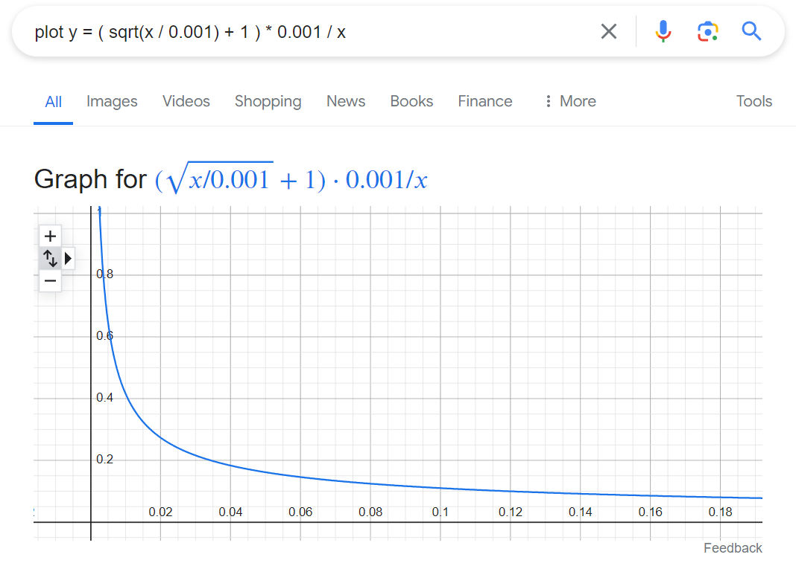

# 详谈Skip-gram

前文介绍WordEmbedding时留下了一个坑，即CBOW和Skip-gram算法。
这两个算法正好是个逆过程，实际效果来说，Skip-gram要好一些。因此，本文里将详细探讨Skip-gram算法。

## 写在前面

学生时代，每次读论文时，我都会跳过Introduction/Background部分，直接看Solution部分。随着年纪的增长，开始注重阅读这部分内容，即提出问题部分。而在学习Solution部分时，更加注重论文作者为什么会想到这个办法来解决问题。实话实说，用这种方式读论文，效率非常低，就笔者自己来说，看论文的速度以及比不上学生时代十分之一了。但是，依旧乐此不疲……

书接上文，闲话少叙。

## 提出问题：如何用数学表示语义信息

我们上文提到一个关于词向量的结论，基于分布式假说思想，就把语义表达的问题就简化了，即学习词之间的搭配关系。

> 词向量模型就是学习词(Tokens)之间的搭配关系

## 解决问题

### 一个具体的例子

我们用一个例子来说明。

已知：现在有四个词（Token），分别是$a,b,c,d$。现在我们要表达下面这个搭配关系：

求：$\{a,b\}$，$\{b,c\}$，以及$\{c,d\}$有搭配关系

解：我们用`Y`表示:有搭配关系；用`N`表示:没有搭配关系。
我们就可以用下面这个二维的表格来求解。

|   | a   | b   | c   | d   |
|---|-----|-----|-----|-----|
| a | N/A | Y   | N   | N   |
| b | Y   | N/A | N   | N   |
| c | N   | Y   | N/A | Y   |
| d | N   | N   | Y   | N/A |

现实的世界往往比这个更加复杂，比如我们需要表达这样的语义：

* a和b最像，a和c次之，a和d最不像。

如何用数学来表达这样的概念呢？这里，我们就要引入概率这个数学工具了。现在我们将上述的语义转化为概率。

$$
P_{(a,b)} = 0.6 \\
P_{(a,c)} = 0.3 \\
P_{(a,d)} = 0.1 \\
Where \sum_{i}^{\{b,c,d\}} P_{(a,i)} = 1
$$

我们也用概率方式，把(b,c)和(c,d)关系也表示出来。这样上面的二维表格，就可以表示为：

|   | a   | b   | c   | d   |
|---|-----|-----|-----|-----|
| a | N/A | 0.6 | 0.3 | 0.1 |
| b | 0.6 | N/A | 0.1 | 0.3 |
| c | 0.3 | 0.1 | N/A | 0.6 |
| d | 0.1 | 0.3 | 0.6 | N/A |

接下来我们把上述例子推广的更加一般的情况，专业术语叫“泛化”。

### 更加一般的例子

先回顾一下BoW的工作流程，如下：

第一步：分词，即将原始的文本，改成计算机统一能处理的最小单位Token的集合。
第二步：统计各Token在文本中出现的频率，得到基于频率的词汇表。
第三步：参考第二步得到基于频率的词汇表，将第一步得到Tokens表示后的文本，用向量化表示出来。

其中，第二部提到了一个非常重要的概念——词汇表(Vocabulary Table)。我们用的Tokens是可以用有限个词，表述出来的。如果结合到上述二维表格，换句话说，是可以用有限的行和列表示出来的。假设，词汇表里面有n个词，上面的二维表格就可以表示为，如下图：

|       | $W_1$           | $W_2$           | ... | $W_n$           |
|-------|-----------------|-----------------|-----|-----------------|
| $W_1$ | N/A             | $P_{(w_1,w_2)}$ | ... | $P_{(w_1,w_n)}$ |
| $W_2$ | $P_{(w_1,w_2)}$ | N/A             | ... | $P_{(w_2,w_n)}$ |
| ...   | ...             | ...             | ... | ...             |
| $W_n$ | $P_{(w_1,w_n)}$ | $P_{(w_2,w_n)}$ | ... | N/A             |

Tips：以开源的词汇表[vocab.txt](https://huggingface.co/google-bert/bert-base-cased/blob/main/vocab.txt) 为例，一共有28,998个词，此时n就等于28，998。

至此，我们就解决用数学表示语义的问题。

### 如何用计算机技术来解决这个问题

当我们解决了语义表示的问题后，该如何算出概率值呢？在BoW模型中，是基于频率来计算概率值。全局上，必须维护这一张表格。如果要表示$W_i$和$W_j$的关系，只需要查表，取到$P_{(w_i,w_j)}$的值即可。使用上，非常方便。但是，有个致命的缺点，就是无法表示“一词多义”。换句话说，$W_i$和$W_j$的关系一定等于$P_{(w_i,w_j)}$的值。
“一词多义”的问题，我们后面再讨论，现在先解决如何在计算机里面表示二维表格的问题。
我们先取$W_1$行或者列，用数学来表示，就是下面这个矩阵。

$$
W_1 =\left[\begin{matrix}
      0 \\
      P_{(w_1,w_2)} \\
      P_{(w_1,w_3)} \\
      ... \\
      P_{(w_1,w_n)}
      \end{matrix}\right] \\
    
其中， \sum_{i=1}^{n} P_{(w_1,w_i)} = 1
$$

上面这个表示法，隐含的意思就是$W_1$和词汇表里其他词所蕴含的语义。而这个结构，对应计算机里的数据结构就是一维数组，即向量。这样，我们就把一个人类的语言（Word），通过分词（Tokenizer）转换为词（Token），然后转换为了向量（Vector），这个过程被形象的成为“Word to Vector”。

我们还是以上面这个$W_1$为例，来详细描述“Word to Vector”的过程，如下图所示：

因为最终输出是一个概率值，且总和为1，我们很容易想到用Softmax函数。同时，我们把$W_1$用独热码做一个编码，上面这个过程就变成了下图：

现在实现Word2Vec的整体流程，我们还剩下最后一步，找到一个数学模型（即，用函数来描述）。一般来说，数学模型就是一个或者一组数学公式。因为现实世界过于复杂，找到一组精确的数学公式来描述，非常难。随着人工智能邻域的神经网络技术发展，我们一般直接训练一个神经网络来对应。所以上图，笔者就直接用神经网络（NN）来代替函数（Function）了。接下来，我们就动手设计一个NN模型。

### 动手设计神经网络模型

我们来看看，这个数学模型要做什么事情。这个NN需要把输入$W_1$和词汇表中的其他词，即$W_2,W_3,...,W_n$，的搭配关系表述出来。
我们来看一下这个模型需要哪些功能：

**模型设计目标**：

- 主要目标是学习词向量，即把词映射到向量空间中的点，使得具有相似含义或上下文的词在向量空间中的位置相近。
- 这个目标并不需要复杂的网络结构或深层的隐藏层来达成，因为主要的任务是进行词汇间的相似性比较，而不是进行复杂的模式识别或特征提取。
- 尽量减少模型的参数量，提高训练效率。
- 因为输入为独热码，存在大量的稀疏矩阵，需要这个模型能降维，且不需要非线性变换，即不需要激活函数。

综上，该模型只需要1层隐藏层就足够了，这既是因为模型的设计目标相对简单，也是因为单层隐藏层已经能够在保证性能的同时提高训练效率。基于上述设计，我们得到了模型架构，如下图所示：

其中，输入层和输出层都是N维的，即词汇表长度。隐藏层为K维，表示有K个特征值。通俗的讲，就是我们比较$W_i$和$W_j$是否相似，我们取了k个点去比较，用来量化$W_i$和$W_j$的相似度。
Tips:为了便于理解，后面的例子中，我们直接给N和K取值：

$$
N = 10,000 \\
K = 300
$$

#### 简化计算的小技巧

我们以上面这个例子为例，输入层是10，000维，隐藏层是300维。按照正常逻辑，从输入层到隐藏层，就需要做一次矩阵乘法。详细技术如下：

$$
\vec{a}=\left[\begin{matrix}1\\0\\0\\...\\0 \end{matrix}\right], \vec{b}=\left[\begin{matrix}w_1 & w_2 & ... & w_{300} \end{matrix}\right] \\

\vec{a} \times \vec{b} = 1 \times w_1 + 0\times w_2 + ... + 0\times w_{300} = w_1
$$

从上述推导过程我们发现，由于$\vec{a}$是稀疏矩阵，在做矩阵乘法时，即$\vec{a} \times \vec{b} $的过程占用了大量的计算资源，结果却是只是得到一个$w_1$。
如何简化计算呢？非常简单，我们把矩阵乘法，直接变成查找，即先找到$\vec{a}$中非0元素的位置i（因为独热码，只有一个为1）。然后查找$\vec{b}$中，位置为i的权重$w_i$。这样就避免了耗时的矩阵乘法运算。

### 训练网络模型

上文讲到，这个网络模型的核心部分，其实就是那个隐藏层（300维），我们需要用训练数据，得到这个隐藏层300个参数的权重。如何给这300个参数赋权重呢？在上一篇《词表达考古史》中提到，在Word2Vec的模型中，常用的有两种方法，一个是CBOW(给定上下文，预测中心词)，另一个就是Skip-Gram(给定中心词，预测上下文)。在实际工作中，Skip-Gram的效果要好于CBOW，所以笔者这里只讲介绍Skip-Gram。

#### 准备训练数据

传统办法就是选择监督学习，每一个训练数据都需要做标记（Labeling）。如果能采用无监督学习，这将极大的减少.我们的训练工作。我们一起来看一下，Word2Vec是怎么做的吧。

例子：训练语料”The quick brown fox jumps over the lazy dog.“，选择中心词(Input Word)为”fox“，如何用Skip-gram生成上下文呢？

首先，我们需要定义什么是上下文，用最简单粗暴的方式，就是选一个长度一致的上下文窗口，在这个窗口内所有的词，都认为是中心词的上下文。这个思路就是copy TCP中的滑动窗口的算法。需要定义2个参数，即skip_window和num_skips参数。

* `skip_window`：表示从当前input word的一侧（左边或右边）选取词的数量。若设置`skip_window=2`，我们获得窗口中的词（包含Input Word）最大值为5。以上面这句话为例，设置`skip_window=2`,那么我们最终获得窗口中的词为 ['quick', 'brown'，'fox', 'jumps', 'over']。
* `num_skips`：表示从整个窗口中选取多少个不同的词作为我们的output word。还是以上面这句话为例，设置`𝑠𝑘𝑖𝑝_𝑤𝑖𝑛𝑑𝑜𝑤=2，𝑛𝑢𝑚_𝑠𝑘𝑖𝑝𝑠=2`时，我们将会得到两组(input word, output word)形式的训练数据，即 ('fox', 'quick')和('fox', 'brown')。

我们设置$skip\_window=2$，将获得下表中的训练语料。

| Source Text                                        | Input Word  | Span + Input Word                | Training Samples                                           |
|----------------------------------------------------|-------------|----------------------------------|------------------------------------------------------------|
| ***The*** quick brown fox jumps over the lazy dog. | ***The***   | ***The*** quick brown            | (the, quick); (the, brown)                                 |
| The ***quick*** brown fox jumps over the lazy dog. | ***quick*** | The ***quick***  brown fox       | (quick, the); (quick, brown); (quick, fox)                 |
| The quick ***brown*** fox jumps over the lazy dog. | ***brown*** | The quick ***brown*** fox jumps  | (brown, the); (brown, quick); (brown, fox); (brown, jumps) |
| The quick brown ***fox*** jumps over the lazy dog. | ***fox***   | quick brown ***fox*** jumps over | (fox, quick); (fox, brown); (fox, jumps); (fox, over)      |
| The quick brown fox ***jumps*** over the lazy dog. | ***jumps*** | brown fox ***jumps*** over the   | (jumps, brown); (jumps, fox); (jumps, over); (jumps, the)  |
| The quick brown fox jumps ***over*** the lazy dog. | ***over***  | fox jumps ***over***  the lazy   | (over, fox); (over, jumps); (over, the); (over, lazy)      |
| The quick brown fox jumps over ***the*** lazy dog. | ***the***   | jumps over ***the***  lazy dog   | (the, jumps); (the, over); (the, lazy); (the, dog)         |

在论文《Distributed Representations of Words and Phrases and their Compositionality》，Word2Vec作者提出以下两个创新点：

1. 对高频词进行二次抽样以减少训练样本的数量。
2. 使用他们称为“负采样”的技术修改优化目标，这使得每个训练样本仅更新模型权重的一小部分。
   值得注意的是，对高频词进行下采样和应用负采样不仅减轻了训练过程的计算负担，还提高了生成的词向量的质量。

### 二次抽样高频词（Subsampling Frequent Words）

还是以上面表格为例，对于`the`这种常用高频单词，这样的处理方式会存在下面两个问题：

1. 当我们得到成对的单词训练样本时，("fox", "the") 这样的训练样本并不会给我们提供关于“fox”更多的语义信息，因为作为英语中最高频的“the”在每个单词的上下文中几乎都会出现。
2. 由于在文本中“the”这样的常用词出现概率很大，因此我们将会有大量的（”the“，...）这样的训练样本，而这些样本数量远远超过了我们学习“the”这个词向量所需的训练样本数。

Word2Vec通过“二次抽样”模式来解决这种高频词问题。

> "二次抽样"的基本思想：对于我们在训练原始文本中遇到的每一个单词，它们都有一定概率被我们从文本中删掉，而这个被删除的概率与单词的频率有关。

如果我们设置窗口大小`span=4`（即`skip\_window=2`)，并且从我们的文本中“二次抽样”到`the`(即删除所有的`the`)，那么会有下面的结果：

1. 由于我们删除了文本中所有的`the`，那么在我们的训练样本中，`the`这个词永远也不会出现在我们的上下文窗口中。
2. 当`the`作为input word时，我们的训练样本数至少会减少`span`个。具体请常考表格第一行（2个，特殊情况）和最后一行（4个，一般情况）。

用这个方法就能帮助我们解决了高频词带来的问题。

#### 采样率

word2vec的C代码实现了一个方程，用于计算保留词汇表中给定单词的概率。

其中，$w_i$表示单词，而$z(w_i)$表示该单词在语料库总单词数中所占的比例。例如，如果单词“peanut”在包含10亿个单词的语料库中出现1,000次，那么`z(‘peanut’) = 1E-6（即0.000001）`。

代码中还有一个名为`sample`的参数，它控制子采样的程度，默认值为0.001。`sample`的值越小，单词被保留的可能性就越低。

$P(w_i)$是保留该单词的概率：

$$
\begin{aligned}
P(w_i) & = (\sqrt{\frac{z(w_i)}{sample}} + 1) \cdot \frac{sample}{z(w_i)} \\
       & = (\sqrt{\frac{z(w_i)}{0.001}} + 1) \cdot \frac{0.001}{z(w_i)}
\end{aligned}
$$

我们用Google把上面这个公式画出来（`sample=0.001`），如下图所示

若读者有兴趣，可以对应Google画的的这个图，找到对应`sample=0.001`时，纵坐标$P(w_i)$和横坐标$z(w_i)$的关系。

### 负采样（Negative Sampling）

我们先给出负采样的解释。

> 负采样（Negative Sampling）通过让每个训练样本只修改一小部分权重（而不是全部）来解决这个问题。

从定义而知，负采样是解决模型训练时的问题，采用用修改小部分数据来代替修改全部的参数。这样做的好处就是极大的简化训练模型是的计算量。我们来看一下，负采样具体是如何做的。

先来回顾一下，上文的例子。我们以fox为Input Word，就得到4组训练样本（Training Sample）。

| Source Text                                        | Training Samples (Input Word, Output Word)            |
|----------------------------------------------------|-------------------------------------------------------|
| The quick brown ***fox*** jumps over the lazy dog. | (fox, quick); (fox, brown); (fox, jumps); (fox, over) |

我们采用(fox, quick)为训练样本，正确的输出是一个独热码（最终通过Softmax转成概率值），即Input Word（fox）对于Output Word(quick)的神经元为1，其他都是0；我们得到这个向量就是1个1，9999个0；如果按照这种做法，我们模型需要更新权重参数的个数为：

$$
300 \times 10,000 = 3,000,000
$$

Tips：这里，我们称1的叫“正样本(Positive Sample)”, 为0的叫“负样本(Negative Sample)”

现在，我们来开始优化这个算法。显然，1个1，9999个0就是让人很不爽的地方。负采样，也就是对这部分动心思。简言之，用少数几个0来代替9999个0。如果，我们用5作为负采样（即5个0来代替9999个0），加上1个正样本。就只用改变输出层6个神经元即可。这样的话，每次更新权重参数的个数为：

$$
6 \times 300 = 1,800
$$

相对于3百万的权重来说，相当于只计算了0.06%的权重，这样计算效率就大幅度提高。这就是负采样(Negative Sampling)的核心思想。

那么，我们如何定negative words（即，上面例子中的5）这个值呢？我们使用“一元模型词分布（unigram distribution）”来选择“negative words”。一个单词被选作negative sample的概率跟它出现的频次有关，出现频次越高的单词越容易被选作negative words。
例如，假设你的整个训练语料库是一个词列表，而你通过从列表中随机选择来挑选5个负样本。在这种情况下，选择“quick”这个词的概率等于“quick”在语料库中出现的次数除以语料库中总词频的次数。这可以用以下公式表示：

$$
P(w_i) = \frac{f(w_i)}{\sum_{j=0}^{n}\left(f(w_j) \right) }
$$

作者在他们的论文中指出，他们尝试了这个公式的多种变体，表现最好的是将词频提高到3/4次幂:

$$
P(w_i) = \frac{  {f(w_i)}^{3/4}  }{\sum_{j=0}^{n}\left(  {f(w_j)}^{3/4} \right) }
$$

在C代码中实现这种选择方式的方式很有趣。他们有一个包含1亿个元素的大型数组（他们称之为一元词表）。他们将词汇表中每个词的索引多次填充到这个表中，并且一个词的索引在表中出现的次数由$P(w_i) \times table\_size$给出(即**负采样概率** * 1亿 = **单词在表中出现的次数**)。

然后，为了实际选择一个负样本，你只需生成一个介于0到1亿之间的随机整数，并使用表中该索引处的词。由于高概率词在表中出现的次数更多，因此你更有可能选择这些词。一个单词的负采样概率越大，那么它在这个表中出现的次数就越多，它被选中的概率就越大。

至此，Word2Vec中的Skip-gram模型就讲完了。

## 参考文献

[Distributed Representations of Words and Phrases and their Compositionality](https://arxiv.org/pdf/1310.4546)

[Word2Vec Tutorial - The Skip-Gram Model](https://mccormickml.com/2016/04/19/word2vec-tutorial-the-skip-gram-model/)

[Word2Vec Tutorial Part 2 - Negative Sampling](https://mccormickml.com/2017/01/11/word2vec-tutorial-part-2-negative-sampling/)

