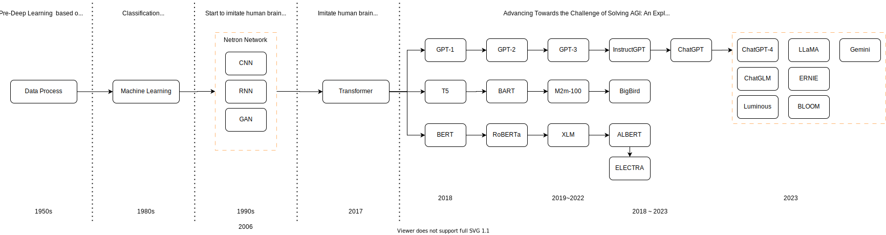
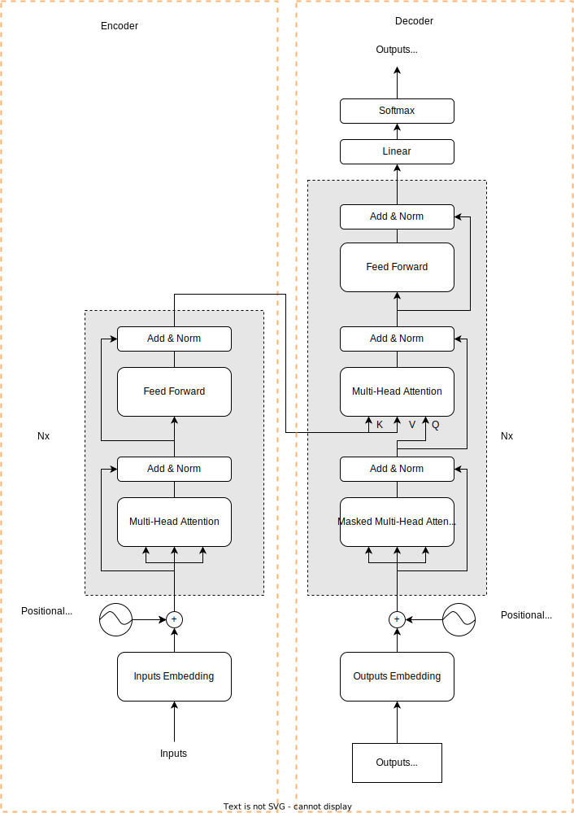
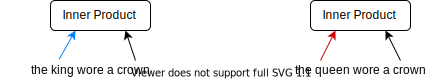
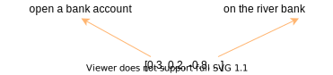
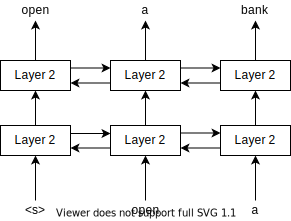
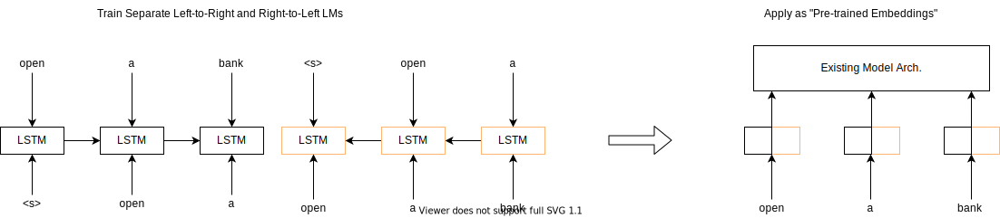
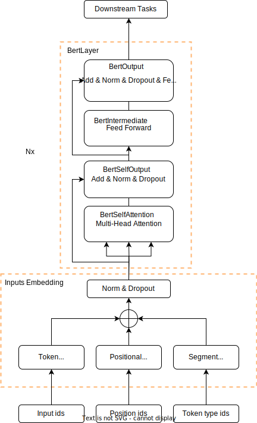
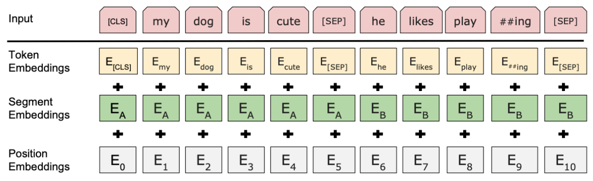

# 大语言模型：通往通用人工智能之路

在开始讲解大语言模型前，我们还需要补充一点基础的机器学习的相关知识。

## 若干重要的机器学习概念

机器学习非常擅长以下三个任务：

* 回归(regression）
* 分类(classification)
* 聚类(clustering)

### 回归

简单的说，回归就是处理**连续数据**，如**时间序列数据**时使用的技术。
例子：过去几天的股价数据，如下表所示：

| 日期  | 股价   |
| ----- | ------ |
| 昨天  | ￥1000 |
| 2天前 | ￥1100 |
| 3天前 | ￥1070 |

从这样的数据中学习它的趋势，求出“明天的股价会变成多少？”的方法就是**回归**。

### 分类

检查邮件的内容，然后判断它是不是垃圾邮件，就是一个典型的分类问题。

例子：根据邮件内容，以及这封邮件是否属于垃圾邮件这些数据来进行学习。

| 邮件内容                                   | 是否为垃圾邮件 |
| ------------------------------------------ | -------------- |
| 辛苦啦！下个周日我们去玩吧.....            | No             |
| 加我为好友吧。这里有我的照片哟！http://... | Yes            |
| 恭喜您赢得夏威夷旅游大奖...                | Yes            |

在开始学习之前，我们必须像上述这张表这样，先手动标记邮件是否为垃圾邮件。这样打标签的工作，需要人工介入。

### 聚类

聚类(也称“多分类”)与分类相似，又有不同。
例子：假设在100名学生的学校进行摸底考试，然后根据考试成绩把100名学生分成几组，根据分组结果，我们能得出某组偏重理科、某组偏重文科这样有意义的结论。

| 学生编号 | 英语分数 | 数学分数 | 语文分数 | 物理分数 |
| -------- | -------- | -------- | -------- | -------- |
| A-1      | 100      | 98       | 89       | 96       |
| A-2      | 77       | 98       | 69       | 98       |
| A-3      | 99       | 56       | 99       | 61       |

Tips: 分类（Classification）和聚类（Clustering）的区别

**分类**是一种**监督学习**任务，其目标是预测给定输入数据的标签。在分类任务中，我们有一个标记的训练集，其中每个样本都有一个预定义的类别。我们的目标是训练一个模型，该模型能够根据输入数据的特征预测其类别。例如，我们可能有一个电子邮件数据集，我们的任务是预测每封电子邮件是否为垃圾邮件。

相比之下，**聚类**是一种**无监督学习**任务，其目标是发现输入数据中的自然分组，而无需任何预先定义的标签。在聚类任务中，我们的目标是根据输入数据的相似性将其分组。例如，我们可能有一个博客文章的数据集，我们的任务是将相似的文章分组，以便我们可以更容易地找到相关的内容。

总的来说，分类和聚类的主要区别在于是否有预定义的标签。分类任务需要预定义的标签，而聚类任务则不需要。

### 重新思考回归和分类问题

在机器学习中，回归问题和分类问题是两种主要的任务类型，它们各自解决不同的问题。回归问题是预测一个连续的输出值，例如预测股价。而分类问题是预测一个离散的输出值，例如判断一封电子邮件是否为垃圾邮件。
Tips: 这里，我们把二分类问题和多分类问题，统称为分类问题。
既然是处理连续和离散的问题，就是一个非常经典的数学问题。如果在丢失一些精度的情况下，连续问题是可以转化为离散的问题来处理的。上世纪70到80年代，轰轰烈烈的模拟电路往数字电路转变，背后的数学原理就是拉普拉斯变换。而我们在处理NLP的时候，用了几乎一样的思路。

> 通常来说，我们把几乎所有问题都最终转变成**分类问题**。即，在NLP邻域的许多场景中模型最后所做的基本上都是一个**分类任务**。

### 机器学习种类

机器学习的种类繁多，有各种维度的分类。本文大致会涉及以下几种，先给出简介。后文还有更详细的讨论。

1. **监督学习**：提供给算法的包含所需解决方案的训练数据，成为标签或标记。
2. **非监督学习**：训练数据都是未经标记的，算法会在没有指导的情况下自动学习。
3. **半监督学习**：有些算法可以处理部分标记的训练数据，通常是大量未标记的数据和少量标记的数据。
4. **自监督学习**：通过输入数据的某种形式自动生成标签，然后使用这些标签进行学习。这使得模型能够从大量的未标记数据中学习，同时也能利用监督学习的优点。它可以被看作是无监督学习和监督学习的结合。
5. **强化学习**：学习系统能够观测环境，做出选择，执行操作并获得回报，或者是以负面回报的形式获得惩罚。

## 通用人工智能

> 计算机科学是应用数学最强的分支。既然是应用类学科，学习起来就是有通用的套路。一言以蔽之，提出问题，然后解决问题。

在《大语言模型：革命前夜》里，我们已经介绍了Transformer模型，而时间节点也来到了2017年。我们站在2017年这个时间节点，看看人工智能解决了哪些问题，又有哪些问题亟待解决。

传统的人工智能在许多领域都取得了显著的成就：

1. **自然语言处理**：在自然语言处理方面取得了显著的进步，包括机器翻译、情感分析、文本生成等。
2. **计算机视觉**：在图像识别、目标检测、人脸识别等领域，传统人工智能已经达到了很高的精度。
3. **推荐系统**：在推荐系统中也发挥了重要作用，如电影推荐、音乐推荐等。
4. **游戏**：在游戏领域也取得了一些重要的成就，如围棋AI AlphaGo击败了世界冠军。

然而，传统人工智能也存在一些问题亟待解决：

1. **泛化能力**：传统人工智能通常只能在特定任务上表现良好，但在面对新的、未知的任务时，其性能可能会大打折扣。
2. **解释性**：许多传统人工智能模型，尤其是深度学习模型，其决策过程往往难以理解和解释。
3. **数据依赖**：传统人工智能通常需要大量的标注数据进行训练，这在许多情况下是不现实的。

总的来说，尽管传统人工智能在许多领域都取得了显著的成就，但它仍然面临着一些重要的挑战。这一阶段的传统人工智能，我们称之为“弱人工智能”（也称“窄人工智能”）。针对遇到的上述问题，大家自然而然地把目标设立在建立一个强人工智能，业界称之为通用人工智能（AGI）。理想的通用人工智能具备以下几个主要优点：

1. **广泛的应用领域**：AGI能够处理各种类型的任务，而不仅仅是特定的、预先定义的任务。这使得AGI可以在各种不同的领域中发挥作用，包括医疗、教育、科研和创意等。
2. **自我学习和适应能力**：AGI具有自我学习和适应新环境的能力。这意味着AGI可以通过经验学习，不断改进自己的性能，并适应各种未知的情况。
3. **独立处理任务**：与弱AI不同，AGI可以独立地处理各种任务。这使得AGI在处理复杂问题时具有更大的灵活性。
4. **创新和发现**：如果AGI能够实现，它可能会带来新的科学发现和技术进步。AGI的能力可能超越人类的知识和经验，从而在各种领域产生创新。
5. **高效和快速**：AGI有可能实现更高效和快速的业务处理，提供更高级别的决策支持。

总的来说，AGI的主要优点在于其广泛的应用领域、自我学习和适应能力、独立处理任务的能力，以及其潜在的创新和发现能力。然而，值得注意的是，尽管AGI具有巨大的潜力，但它仍然是一个正在研究和开发的领域，目前还没有完全实现。站在2023年这个时间节点，大家公认大语言模型（LLM: Large Language Model）是通往AGI之路的利器。

## 再度聚焦NLP

上文提到，传统人工智能在NLP，计算机视觉(CV)，推荐系统，游戏方面取得了很多显著的成就。事实上，NLP相对于其他三个方面，在产品成熟度来说，还存在较大的差距。但是解决NLP的重要性，缺是其他方面无法企及的。人类历史有 600 万年，但是人类文明历史大概就 6000 年，文明的大发展出现在近 2000 多年的原因，主要来自 3500 多年前人类发明了文字。所以，让AI理解并生成文字，这意味着AI可以用人类熟悉的方式（语言文字）与人类高效协作，这必将引爆生产力革命，并深远的影响几乎所有的领域。

### 提出问题

由于NLP领域要面对的问题非常复杂，人类在遇到庞大且复杂问题时，自然而然地会想到把一个大问题分解若干小问题。所以，一开始NLP就有很多细分领域，包括但不限于

* 命名实体识别（Named Entity Recognition，NER）
* 文本蕴含（Text Entailment）
* 常识推理（Common Sense Reasoning）
* 问答（Question Answering）
* 词性标注（POS Tagging）
* 情感分析（Sentiment Analysis，SA）
* 自然语言推理（Natural Language Inference，NLI）
* 总结摘要（Summarization）
  .....

看着一长串的术语，相信你和我一样，一种深深的无力感。从审美的角度看，这些解决方法，很多都是很繁琐的中间任务，不够优雅（Elegence）。有没有更优雅的方式来解决这些问题呢？
针对上面例举的NLP任务，大致上可以分为两大类：

1. 自然语言理解（NLU）：让AI理解人类的语言，即让机器会“听”和“读”人类的语言。
2. 自然语言生成（NLG）：让AI用人类的语言表达，即让计算机会“说”和“写”人类的语言。

笔者所在的软件行业，都是采用软件工程的方法来开发软件的。软件工程有很多方法论，比如现在一般用敏捷(Agile)开发流程，如果你入行有段时间了，你会听过很多方法论，比如RUP，CMM/CMMI等。但无论是谁，一定听过**瀑布模型**这一方法论。瀑布模型几乎影响了所有后续软件工程方法论，导致所有方法论的介绍章节第一章的标题就是“传统瀑布模型的缺点”。而在基于神经网络的机器学习方法论里，和**瀑布模型**同等地位的就是**监督学习**。
Tips: 我没有任何贬低监督学习的意思，相反在我眼里，瀑布模型的地位是崇高的，几乎所有获得巨大成功的软件都出自瀑布模型。我估计我是全网唯一吹瀑布模型的人。

监督学习，特别是在CV邻域，获得了巨大成功的。但是在解决NLP过程中，遇到了下面两个痛点：

* **痛点一：数据标注困难**：NLP的数据标注工作量非常大，相比CV的标注，对数据和人员要求都高一些。
* **痛点二：模型泛化性差**：只能针对特定任务训练，导致训练好的模型只能针对特定任务起作用。

至此，问题提出来了，现在该寻求办法来解决上面这两个痛点了。

### 解决问题

正是应了那句话：

> 天才的设计，来自于剽窃！

针对**痛点一：数据标注困难**问题，大家第一个想到Copy解决CV问题时的思路，做一个通用的标注好了的语言库，类似于ImageNet的东西。ImageNet是包含了超过1400万张手动标注图像、涵盖 2 万多个类别的大型图像数据库，正是由于ImageNet的出现，帮助AI顺利的解决了CV邻域绝大多数的问题。曾经有很多人花费了多精力朝这个方向努力，可惜的是，直到2023年，NLP的ImageNet时刻始终没有到来。但是也产生了一些比较优秀的通用数据集：

* **GLUE**（General Language Understanding Evaluation）是一个多任务基准和分析平台，由纽约大学、华盛顿大学以及DeepMind的研究者们共同提出。GLUE包含了一系列自然语言理解数据集和任务，主要目标是鼓励开发出能够在任务之间共享通用的语言知识的模型。GLUE主要由9项任务组成，一个预训练模型在9项任务上的得分的平均即为它的最终得分。
* **SWAG**（Situations With Adversarial Generations）是一个大规模的数据集，用于进行基于常识的推理任务。给定一个情境（一个问题或一句描述），任务是从给定的四个选项中预测最有可能的一个。
* **SQuAD**（Stanford Question Answering Dataset）是一个由斯坦福大学创建的机器阅读理解数据集。SQuAD包含了一系列的英文阅读理解任务，现在做和英文的阅读理解相关所有任务，都用它。SQuAD有两个版本，SQuAD1.0和SQuAD2.0²。SQuAD1.0的数据集中，所有的答案都可以在文章中找到²。而SQuAD2.0增加了一些没有答案的问题。
* **MNLI**(Multi-Genre Natural Language Inference)是一个自然语言推断任务的数据集。MNLI数据集是通过众包方式对句子对进行文本蕴含标注的集合。给定前提语句和假设语句，任务是预测前提语句是否包含假设（entailment）、与假设矛盾(contradiction)或者两者都不(中立，neutral)。前提语句是从数十种不同来源收集的，包括转录的语音、小说和政府报告。
  ...

既然此路不通，再换条路。能否设计一套免标注的训练方法，或者少量标注训练数据的方法。所幸的是，少标注训练数据这条路走通了，发展出了**自监督学习**。后文会详细讲解，这里先按下不表。

针对**痛点二：模型泛化性差**问题, 我先卖个关子。其实，泛化性差这是一个各个领域通用的问题。再思考一下这句话“天才的设计，来自于剽窃！”。

> 解决问题的思路就转变成：找到相似的问题，然后借鉴该相似问题的解决思路，最后把该解决思路应用于原问题上来。

其实这就是应用科学一个通用的解决问题方法。现实的例子很多，我这里给出一个软件开发过程中一个常见的例子——代码重用。希望你能用这种思维方式来帮助解决你自己在工作学习中遇到的问题。

**初始阶段（Phrase#0）**：程序员张三为项目A开发了一个User service。虽然user svc出色的完成了任务，但该User Svc泛化性差，只能专门服务于项目A。

* **Phrase#1** - 过了一段时间，项目B，有了一个类似的需求需要开发User Service。基于User Service的口碑，项目B的负责人决定复用（reuse）项目A的User Service。
  
  * 步骤1：张三移除了原先User Service专门服务于项目A的代码，加入了拓展机制，使其能满足各个不同项目的需求。
  * 步骤2：项目组B的程序员李四，复用了新的User svc，并基于其拓展机制，实现了项目B的特殊需求，并部署在项目B中。这时，项目A和项目B里面各自都有一个User svc。
* **Phrase#2** - 又过了一段时间，项目C/D/E/...都有了类似的需求，各个项目基于User svc在项目A/B中的良好的口碑，都想用这个User Svc。
  
  * 张三所在的公司决定把这个User Svc做成一个Common svc，部署在公司统一平台里。这时，全公司就一个User svc，供所有项目统一使用。

看完例子，我们回到**痛点二：模型泛化性差**问题，我们其实遇到和上面例子中初始阶段（Phrase#0）相似的问题。现在相似的问题找到了，我们研究一下这个问题的解决办法可不可以借鉴。
借鉴Phrase#1中的两步骤的解决方法，机器学习把学习过程分成了两个阶段：

* 第一阶段叫**预训练（Pre-train）**, 解决问题的思路类似Phrase#1-步骤1
* 第二阶段叫**微调（Fine-tune）**，解决问题的思路类似Phrase#1-步骤2

这就是鼎鼎大名的两阶段训练法，正式名称叫**语言建模预训练-微调（Pre-train LM and Fine-tune）**。而第一阶段的产物，称之为**预训练模型（PTM, Pre-Train Model）**.

借鉴Phrase#2的解决问题的思路，发展出了**上下文学习(ICL，In-Context Learning)**。这是更加牛逼的技术，我们后面还会遇到，届时再详细介绍。

### 迁移学习（Transfer Learning）

回到上面提到的例子，还有一个不起眼的一个动作——复用（Reuse），在机器学习中，对应的概念就是**迁移学习**。在深度学习中，预训练又是迁移学习的主要方法，而迁移学习正是大语言模型诞生的两大基石之一。

我们这里不介绍迁移学习的晦涩的定义。让我们直接以图像识别为例来说明迁移学习。

假设你已经有一个在大量的猫和狗图片上训练过的深度学习模型，这个模型已经学会了识别猫和狗的特征。现在，你想要训练一个新的模型来识别狮子和老虎，但是你只有很少量的狮子和老虎的图片。

在这种情况下，你可以使用迁移学习。你可以将原来识别猫和狗的模型的一部分（通常是前面的层）复制过来，作为新模型的一部分。这样，新模型就可以利用原模型学到的特征，比如边缘、纹理、形状等，来帮助识别狮子和老虎。这样，即使你只有少量的狮子和老虎的图片，也可以训练出一个性能不错的模型。

这个和代码reuse像不像，毕竟太阳底下没有新鲜事。

### 大规模化（Scaling）

既然提到了两大基石之一，我们就介绍一下另一大基石——大规模化。
大规模化需要三个要素：

1. 计算机硬件算力的突飞猛进。过去4年，增加了10倍以上。
2. Transformer模型的诞生。该模型利用硬件的并行性来训练比以前更具表现力的模型。
3. 更多训练数据的可用性

随着这三大要素的日益精进，让大规模化成为了可能。加之，迁移学习相关技术的日益完善，人工智能开启了大语言模型的时代。

## 大语言模型

语言模型（Language Model，LM）是自然语言处理领域的核心问题，它的任务是预测一个句子在语言中出现的概率。语言模型起源于语音识别，如今已经扩展到机器翻译、信息检索、问答、文摘等众多NLP领域。

简单来说，语言模型是这样一个模型：对于任意的词序列，它能够计算出这个序列是一句话的概率。例如，词序列A：“张三|的|文章|真|水|啊”，这个明显是一句话，一个好的语言模型也会给出很高的概率，再看词序列B：“张三|的|睡觉|啤酒|好快”，这明显不是一句话，如果语言模型训练的好，那么序列B的概率就很小很小。

更为正式的定义是，假设我们要为中文创建一个语言模型，V表示词典，V={猫,狗,机器,学习,语言,模型,...}，$w_ {i} \in V$ 。语言模型就是这样一个模型：给定词典V，能够计算出任意单词序列 $w_ {1},w_ {2},...,w_ {n}$ 是一句话的概率 $p (w_ {1},w_ {2},...,w_ {n})$ ，其中，$p\geq 0$。

语言模型的发展先后经历了文法规则语言模型、统计语言模型、神经网络语言模型。其中，统计语言模型中最常用的是n-gram model，它引入了马尔可夫假设：当前词的出现概率仅与前 n-1个词有关。神经网络语言模型则基于深度学习架构，如转化器，这有助于它们在各种NLP任务上取得令人印象深刻的表现。

我们先一起来回顾一下人工智能的发展史。

### 人工智能发展史



* 从上世纪50年代到80年代，我们称之为“前深度学习时代”，随着计算机的诞生和发展，人工智能主要利用各类模板或者规则来解决数据处理的问题。
* 80年代，诞生了机器学习。那时候的人工智能主要是基于一定量的数据，处理分类问题（模式识别）。
* 90年代起，AI迎来了飞速的发展。值得一提的是2006年，神经网络技术获得突破，AI/ML成为热门，热度一直延续至今
* 2017年，诞生了Transformer模型，成为至今最好的特征提取器。
* 2018~2023年，业界在使用Transformer模型过程中，沿着三条路径展开了探索，诞生了很多大语言模型。最终ChatGPT发布，并在2023年初成功“破圈”，进入公众视野。迎来“AIGC”时代。

### 2018，Transformer模型线路之争

从人工智能发展史，我们可以看到，业界在2018年，针对Transformer模型，产生了三条不同的发展路径。让我们再度聚焦Transformer模型，看看业界是如何把Transfomer模型玩出花的。



总所周知，在Transformer模型的左面是Encoder，右边是Decoder。发生在2018年的三条线路之争，对的应产品就是：

1. Encoder：OpenAI的GPT-1
2. Encoder+Decoder：Google的T5
3. Decoder：Google的BERT

现实发生的故事很精彩，我们讲重点介绍BERT和GPT系列。

## Decoder线路的集大成者：BERT

### BERT简介

BERT（Bidirectional Encoder Representations from Transformers）是一种用于自然语言处理的预训练技术，由Google提出。强调了不再像以往一样采用传统的单向语言模型或者把两个单向语言模型进行浅层拼接的方法进行预训练，而是采用新的masked language model（MLM），以致能生成深度的双向语言表征。BERT模型的预训练可以使用较少的资源和较小的数据集在下游任务上进行微调，以改进在这些任务上的效能。这使得BERT模型的适用性更广，并且不需要做更多重复性的模型训练工作。

BERT 模型可以作为公认的里程碑式的模型，但是它最大的优点不是创新，而是集大成者，具体如下：

* BERT采用两段式训练方法：第一阶段，使用大规模无标签语料，训练出基础模型。第二阶段，使用少量带标签数据微调。
* 参考了ELMO模型的双向编码思想，提出Bidirectional双向编码。
* 借鉴了GPT用Transformer作为特征提取器的思路，采用了Transformer中的Encoder编码器。
* 采用了类似word2vec所使用的CBOW方法，提出MLM。

Tips：本文没有讲解CBOW，请读者自行查阅。思路类似于英语考试题型“完型填空”。

学习BERT其实一点不难，就两部分有点改进工作，一个改进在名字里，即Bidirectional，另一个改进在架构图里，即在Input Embedding处。

### 改进一：双向（Bidirectional）语言表征

什么是双向（Bidirectional）语言表征，为什么BERT要用这个方法？老套路，提出问题，然后解决问题。

### 提出问题

上一篇我们介绍了词嵌入（Word Embedding）方法在Transformer模型中的应用。我们来看看在NLP预训练过程中，遇到了什么问题。
处理NLP问题时，第一步就是人类语言用数学表达出来，以便于计算机处理。我们利用词嵌入先把词表示成向量，例子如下：


无论是word2vec 还是GloVe。这些词嵌入（Word Embeddings）方法都是在语料库中词之间的共现（co-occurrence）统计进行预训练的。如果两个不同词在两句话，上下文相似，当我们用向量表示king时，这两个词的距离相近。
Tips：请参考附录关于向量余弦章节。这两个词距离相近，用数学表达，就是余弦夹角小，即余弦值近1。

这种基于词共现统计的方法，在一些上下文相识句子中，会得到一模一样的词向量。在下面这个例子里，king和queen的词向量是一致的。



这个问题，尽管这被GloVe方法考虑更大范围词频共现后一定程度解决了（没有完全解决）。然而，另一个致命问题来了，一词多义。

#### 问题1：如何解决“一词多义”问题

请看下面这两句，用WordEmbedding的方法，两个bank只能表示成一组相同的向量，无法处理“一词多义”这种情况。



解决这个问题的大致思路，我估计大家都能想到，就是把bank表示成多个向量。这样的词表示法有个专门术语：CWRs(Contextual Word Representations), 截止到2023年，这种解决思路是业界主流。

#### 问题2：如何避免“See themselves”问题

在讲解本系列文章的时候，我举得都是相对简单基础的模型。实际上，业界还是涌现出很多改进的模型。比如基于RNN/LSTM的双向模型，而且这些双向模型效果比基础模型要好的。这样在预训练阶段，就带来了“see themselves”的问题，如下图所示：


具体的说，在双向模型中，单词可以“看到自己(see themselves)”的。这是因为双向模型在处理每个单词时，会同时考虑该单词前后的上下文信息。然而，这种方式可能会导致一种情况，即模型在预测某个单词时，实际上已经“看到”了这个单词，从而影响了模型的预测能力。
解决这个问题，大致思路有两个。

1. 从根本上解决：去掉双向模型，改为单向模型。
2. 另一种办法：在预训练阶段，人为用Mask遮住一些词。类似于“Masked MultiHeadsAttention”思路。

方法二，听起来更像一种Workaround，但是结合上下文，却更加符合人类理解语言的方式。所以，上面两种方法孰优孰劣在2017~2018年这个时间节点，还真不好说。

至此，问题提出来了，即解决“一词多义”问题，并同时避免“see themselves”问题。

### 解决问题

解决“一词多义”问题，并同时避免“see themselves”问题，业界还是花了不少精力的。我们一起来考古一下，看看别人是怎么解决这个问题的。

#### 方案1：半监督学习（2015）

第一种解决方案，其实没什么好讲的，叫半监督学习。其实就是在Fine-tune阶段，人为的把这些问题标注出来。人们用这个办法在2015年，是基于LSTM的。
详见Semi-Supervised Sequence Learning, Google, 2015

#### 方案2：ELMo（2018）

这个需要提一下，ELMO是2018年度NAACL最佳论文，解决的办法也很巧妙，可惜的是还是用了LSTM模型，没有用到最新的Transformer模型。
解决一词多义，用的是CWRs。ELMo用了BiLSTM。在预训练阶段，对于任何一个输入文本，用一个”从左到右“的单向LSTM模型和一个”从右到左“的单向LSTM模型，从而避免了“see themselves”问题，如下图所示：



这样每个词的词向量都有了上下文的信息。这样用ELMo得到的文本向量就可以作为其他模型的预训练嵌入（Pre-trained Embeddings）了。具体步骤就不详细展开了，大家专注于理解思路即可。如果大家对ELMo有兴趣，请自行在网上搜索。

#### 方案3：GPT-1 (2018)

这个就是大名鼎鼎的ChatGPT。用的办法是CWRs和单向从左到右的模型。后面会详细讨论GPT，这里就先按下不表了。

#### BERT的解决方案：MLM+NSP

##### 语言掩码模型（MLM，Masked Language Modeling）

前文提到BERT借鉴了Word2Vec的类似于“完型填空”的CBOW思路，提出了MLM。一句话，解释MLM方法：就是随机去掉句子中的部分token（单词），然后模型来预测被去掉的token是什么。​这样实际上已经不是传统的神经网络语言模型(类似于生成模型)了，而是单纯作为分类问题​。

* 分类问题：根据这个时刻的hidden state来预测这个时刻的token应该是什么。
* 生成模型：预测下一个时刻的词的概率分布了。

BERT具体采用的方法是，随机选择15%的tokens出来（这里和CBOW的100%不一样），但是并非把它们全部都Mask掉。
这样设计MLM训练方法会引入一些弊端：就是在第二阶段（Fine tune阶段），输入的文本中将没有Mask，进而导致产生训练和预测数据偏差导致的性能损失。

为了解决上述弊端，MLM又做了下面这些事情。

* 其中的 80% 被替换为 [MASK]，例如：went to the store -> went to the [MASK]
* 其中的 10% 被替换为一个随机token，例如：went to the store -> went to the runing
  * 这样做，是为了让BERT学会根据上下文信息纠错
* 剩余的 10% 不变，例如：went to the store ->went to the store
  * 这样做，是为了缓解训练和预测数据偏差导致的性能损失

这个80-10-10的组合是怎么定出来的呢？答案是Google团队尝试了不同的组合，结果80-10-10效果最好。

##### 下句预测（NSP，Next Sentence Prediction）

在很多自然语言处理的下游任务中，如问答和自然语言推断，都基于两个句子做逻辑推理，而语言模型并不具备直接捕获句子之间的语义联系的能力，或者可以说成​单词预测粒度的训练到不了句子关系这个层级，为了​学会捕捉句子之间的语义联系​，BERT采用了下句预测（NSP）作为无监督预训练的一部分。

因此BERT想用预训练阶段的NSP任务来解决这个痛点。NSP预训练任务所准备的数据，是从单一语种的语料库中取出两个句子$S_i$和$S_j$，其中50%的情况下B就是实际跟在A后面的句子，50%的情况下B是随机取的。这样语言模型就是在面对一个二元分类问题进行预训练，例如：

```
INPUT: [CLS] the man went to [MASK] store [SEP]
       he bought a gallon [MASK] milk [SEP]
LABEL: IsNext
```

```
INPUT: [CLS] the man [MASK] to the store [SEP]
       penguin [MASK] are flight ##less birds [SEP]
LABEL: NotNext
```

其中，[CLS]表示"classification"，用于类别预测，结果为1，表示输入为连续句对（sentence pair）；结果为0，表示输入为随机句对。
[SEP]表示"separate"，即分隔符，用于断句。这样的预训练任务，让BERT在词维度的语言知识外，也让BERT学习到一些句子维度的语言结构。

Tips: NSP效果一般，后续的BERT改进模型中，都不约而同的弱化或者直接放弃了NSP。

### 改进二：输入表示（Input Representation）

前文提到BERT的另外一项改进可以从架构图里找到，我们一起来看看BERT的架构图。

#### BERT架构图



和标准的Transformer Encoder比较，差别比较大的就是Input这部分。我们一起来讨论一下BERT的Input部分。
Input Embedding部分，引用一下原论文的这张图，如图所示：



和大多数NLP深度学习模型一样，BERT将输入文本中的每一个词（token)送入Token Embeddings层从而将每一个词转换成向量形式。在Transformer模型中，有Positional Embeddings和Token Embeddings。BERT又多了一个嵌入层Segment Embeddings。

#### Inputs Embeddings

1. **Token Embeddings**：Token Embeddings是BERT的一个重要组成部分，它将每个词（token）转换为一个固定维度的向量。在BERT中，每个词会被转换成768维的向量表示。这个过程实际上是建立一个从one-hot编码到768维稠密向量的映射。每个词的词向量最初都是随机生成的，在神经网络训练的过程中，这些词向量会不断优化。
2. **Segment Embeddings**：Segment Embeddings用于帮助BERT区分输入序列中的不同句子。例如，对于一对句子（"I like cats", "I like dogs"），Segment Embeddings层只有两种向量表示。前一个向量是把0赋给第一个句子中的各个token，后一个向量是把1赋给第二个句子中的各个token。如果输入仅仅只有一个句子，那么它的segment embedding就是全0。
3. **Positional Embeddings**：Positional Embeddings用于补充文本输入的时序性信息。BERT能够处理最长512个token的输入序列。论文作者通过让BERT在各个位置上学习一个向量表示来讲序列顺序的信息编码进来。这意味着Position Embeddings实际上就是一个大小为 (512, 768) 的lookup表，表的第一行是代表第一个序列的第一个位置，第二行代表序列的第二个位置，以此类推。

就拿上面这个例子来解释一下上面这3种Embeddings吧。
Input部分为两句话：my dog is cute 和 he likes playing

* NLP在处理语言之前，先做分词(Tokenize)，再建立词表，最后转化为Token ids。BERT的分词用的是开源的Workpieces，词表也是直接用的开源[vocab.txt](https://huggingface.co/bert-base-cased/blob/main/vocab.txt)。
  * Token Embeddings将两个input被表示为11个Token，即[CLS]my dog is cute[SEP]he likes play ##ing[SEP]
* Segment Embeddings把input1赋值为0（对应图中$E_A$）；input2赋值为1（对应图中$E_B$）。
  * 对应Segment Embedding编码为00000011111
* Positional Embeddings直接给这11个token，独一无二的位置编码。

最后把一个把这三种向量相加，形成单一序列。然后经过Layer Norm和Dropout，输出到Encoder Layer。
至此，我们介绍完BERT在Pre-tain阶段的任务了。下一章节，我们来看看如何用BERT来处理第二阶段任务。

### 微调BERT模型

本文开始阶段就提到NLP最终把所有问题都转化成一个分类问题。BERT也是如此，将微调训练的NLP任务分为四类：

1. 句子对分类任务(Sentence Pair Classification)
2. 单句分类任务(Single Sentence Classification)
3. 文本问答任务(Question Answering Tasks）
4. 单句标注任务(Single Sentence Tagging)

我们从最简单的单句标注任务开始。

## 小结

科学的重大进步，从不是通过一种直接的方式，而是一定要设立一个高度挑战性的目标，通过强大的动力促使技术革新，迫使科学家燃烧他们的想象力，使他们尽最大的可能完成他们的目标，这就是为什么我们说，一定要把路脚放的更远一点。

## Reference

https://arxiv.org/abs/1810.04805
https://www.cs.princeton.edu/courses/archive/fall22/cos597G/lectures/lec02.pdf
https://nlp.stanford.edu/seminar/details/jdevlin.pdf
https://www.mikecaptain.com/2023/03/06/captain-aigc-2-llm/
http://www.evinchina.com/uploadfile/file/20230315/2023031509402407539.pdf
https://developers.google.com/machine-learning/glossary/language

