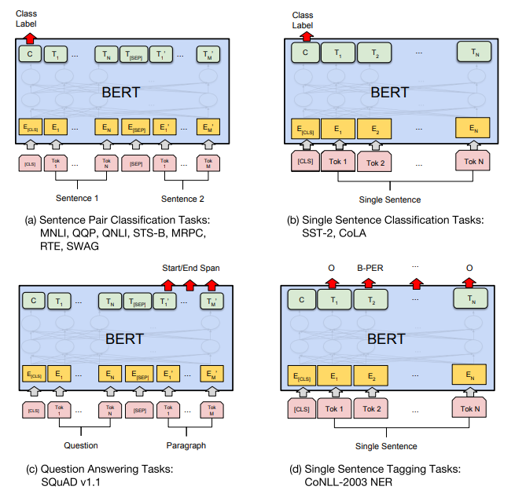
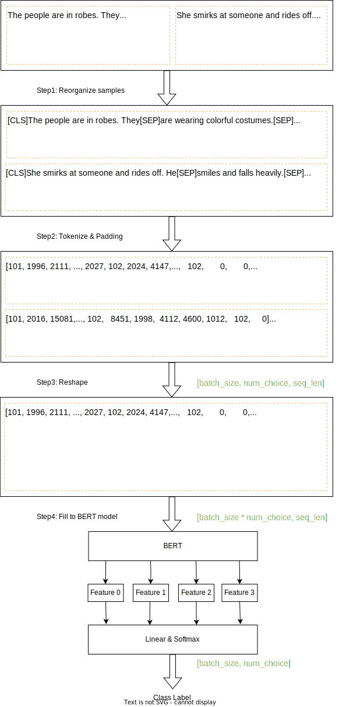
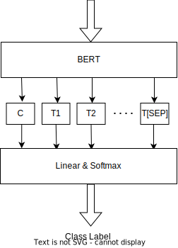
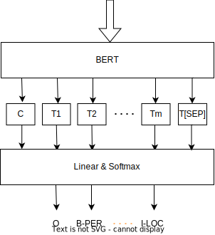
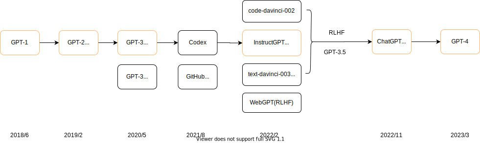
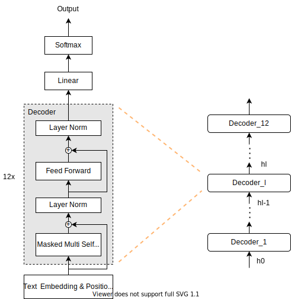
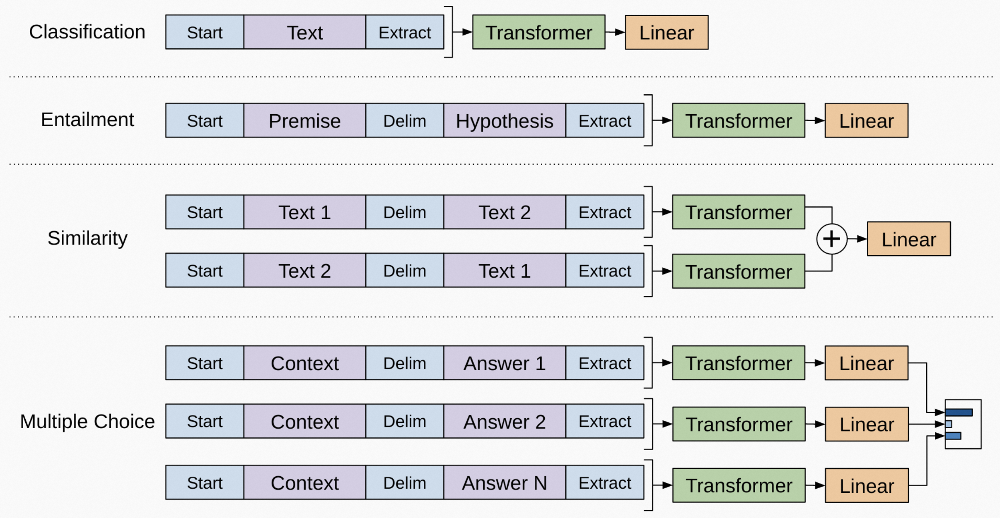
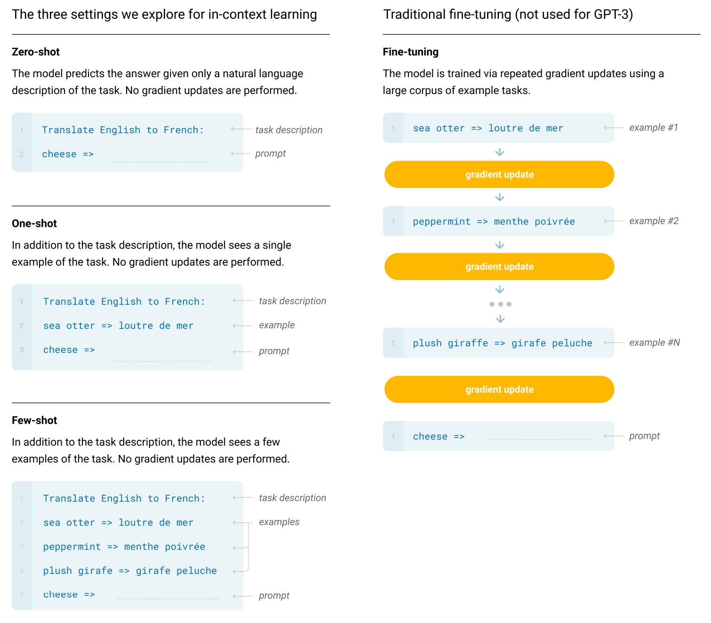
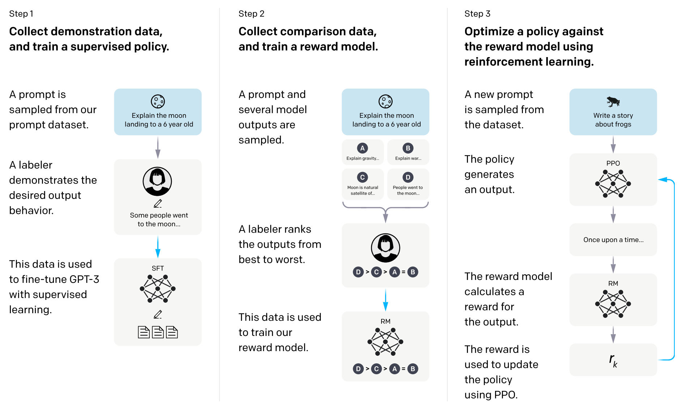

# 大语言模型：通往通用人工智能之路

在开始讲解大语言模型前，我们还需要补充一点基础的机器学习的相关知识。

## 若干重要的机器学习概念

机器学习非常擅长以下三个任务：

* 回归(regression）
* 分类(classification)，也称“二分类”问题
* 聚类(clustering)，也称“多分类”问题

### 回归

简单的说，回归就是处理**连续数据**，如**时间序列数据**时使用的技术。
例子：过去几天的股价数据，如下表所示：

| 日期  | 股价   |
| ----- | ------ |
| 昨天  | ￥1000 |
| 2天前 | ￥1100 |
| 3天前 | ￥1070 |

从这样的数据中学习它的趋势，求出“明天的股价会变成多少？”的方法就是**回归**。

### 分类

检查邮件的内容，然后判断它是不是垃圾邮件，就是一个典型的分类问题。

例子：根据邮件内容，以及这封邮件是否属于垃圾邮件这些数据来进行学习。

| 邮件内容                                   | 是否为垃圾邮件 |
| ------------------------------------------ | -------------- |
| 辛苦啦！下个周日我们去玩吧.....            | No             |
| 加我为好友吧。这里有我的照片哟！http://... | Yes            |
| 恭喜您赢得夏威夷旅游大奖...                | Yes            |

在开始学习之前，我们必须像上述这张表这样，先手动标记邮件是否为垃圾邮件。这样打标签的工作，需要人工介入。

### 聚类

聚类(也称“多分类”)与分类相似，又有不同。
例子：假设在100名学生的学校进行摸底考试，然后根据考试成绩把100名学生分成几组，根据分组结果，我们能得出某组偏重理科、某组偏重文科这样有意义的结论。

| 学生编号 | 英语分数 | 数学分数 | 语文分数 | 物理分数 |
| -------- | -------- | -------- | -------- | -------- |
| A-1      | 100      | 98       | 89       | 96       |
| A-2      | 77       | 98       | 69       | 98       |
| A-3      | 99       | 56       | 99       | 61       |

Tips: 分类（Classification）和聚类（Clustering）的区别

**分类**是一种**监督学习**任务，其目标是预测给定输入数据的标签。在分类任务中，我们有一个标记的训练集，其中每个样本都有一个预定义的类别。我们的目标是训练一个模型，该模型能够根据输入数据的特征预测其类别。例如，我们可能有一个电子邮件数据集，我们的任务是预测每封电子邮件是否为垃圾邮件。

相比之下，**聚类**是一种**无监督学习**任务，其目标是发现输入数据中的自然分组，而无需任何预先定义的标签。在聚类任务中，我们的目标是根据输入数据的相似性将其分组。例如，我们可能有一个博客文章的数据集，我们的任务是将相似的文章分组，以便我们可以更容易地找到相关的内容。

总的来说，分类和聚类的主要区别在于是否有预定义的标签。二分类任务需要预定义的标签，而聚类任务则不需要。

### 重新思考回归和分类问题

在机器学习中，回归问题和分类问题是两种主要的任务类型，它们各自解决不同的问题。回归问题是预测一个连续的输出值，例如预测股价。而分类问题是预测一个离散的输出值，例如判断一封电子邮件是否为垃圾邮件。
Tips: 这里，我们把二分类问题和多分类问题，统称为分类问题。

既然是处理连续和离散的问题，就是一个非常经典的数学问题。如果在丢失一些精度的情况下，连续问题是可以转化为离散的问题来处理的。上世纪70到80年代，轰轰烈烈的模拟电路往数字电路转变，背后的数学原理就是拉普拉斯变换。而我们在处理NLP的时候，用了几乎一样的思路。通常来说，在NLP领域的很多场景中模型最后所做的基本上都是一个分类任务，虽然表面上看起来不是。例如：

* 文本蕴含任务: 其实就是将两个序列拼接在一起，然后预测其所属的类别；
* 基于神经网络的序列生成模型（翻译、文本生成等）本质: 就是预测词表中下一个最有可能出现的词，此时的分类类别就是词表的大小。

> 通常来说，我们把几乎所有问题都最终转变成**分类问题**。即，在NLP邻域的许多场景中模型最后所做的基本上都是一个**分类任务**。

### 机器学习种类

机器学习的种类繁多，有各种维度的分类。本文大致会涉及以下几种，先给出简介。后文还有更详细的讨论。

1. **监督学习**：提供给算法的包含所需解决方案的训练数据，成为标签或标记。
2. **非监督学习**：训练数据都是未经标记的，算法会在没有指导的情况下自动学习。
3. **半监督学习**：有些算法可以处理部分标记的训练数据，通常是大量未标记的数据和少量标记的数据。
4. **自监督学习**：通过输入数据的某种形式自动生成标签，然后使用这些标签进行学习。这使得模型能够从大量的未标记数据中学习，同时也能利用监督学习的优点。它可以被看作是无监督学习和监督学习的结合。
5. **强化学习**：学习系统能够观测环境，做出选择，执行操作并获得回报，或者是以负面回报的形式获得惩罚。

这里比较容易弄混淆的是**半监督学习**和**自监督学习**。两种方法都利用了未标注数据，都可以在一定程度上减轻标注数据的负担，提高模型的泛化能力。两者有以下几个不同点：

* 数据集：半监督学习使用的是标记数据和未标记数据的混合数据集，未标签数据通常需要人工进行部分标注，而自监督学习使用的是只有未标记数据的数据集，未标签数据不需要人工标注。
* 训练目标：半监督学习通常同时利用有标签数据和无标签数据进行训练，而自监督学习通常利用未标签数据进行预训练，然后利用有标签数据进行微调。
* 算法：半监督学习使用的算法通常是基于监督学习的算法，如分类器、回归器等；而自监督学习使用的算法通常是基于生成对抗网络（GAN）、变分自编码器（VAE）等生成模型的算法。

## 通用人工智能

> 计算机科学是应用数学最强的分支。既然是应用类学科，学习起来就是有通用的套路。一言以蔽之，提出问题，然后解决问题。

在《大语言模型：革命前夜》里，我们已经介绍了Transformer模型，而时间节点也来到了2017年。我们站在2017年这个时间节点，看看人工智能解决了哪些问题，又有哪些问题亟待解决。

传统的人工智能在许多领域都取得了显著的成就：

1. **自然语言处理**：在自然语言处理方面取得了显著的进步，包括机器翻译、情感分析、文本生成等。
2. **计算机视觉**：在图像识别、目标检测、人脸识别等领域，传统人工智能已经达到了很高的精度。
3. **推荐系统**：在推荐系统中也发挥了重要作用，如电影推荐、音乐推荐等。
4. **游戏**：在游戏领域也取得了一些重要的成就，如围棋AI AlphaGo击败了世界冠军。

然而，传统人工智能也存在一些问题亟待解决：

1. **泛化能力**：传统人工智能通常只能在特定任务上表现良好，但在面对新的、未知的任务时，其性能可能会大打折扣。
2. **解释性**：许多传统人工智能模型，尤其是深度学习模型，其决策过程往往难以理解和解释。
3. **数据依赖**：传统人工智能通常需要大量的标注数据进行训练，这在许多情况下是不现实的。

总的来说，尽管传统人工智能在许多领域都取得了显著的成就，但它仍然面临着一些重要的挑战。这一阶段的传统人工智能，我们称之为“弱人工智能”（也称“窄人工智能”）。针对遇到的上述问题，大家自然而然地把目标设立在建立一个强人工智能，业界称之为通用人工智能（AGI）。理想的通用人工智能具备以下几个主要优点：

1. **广泛的应用领域**：AGI能够处理各种类型的任务，而不仅仅是特定的、预先定义的任务。这使得AGI可以在各种不同的领域中发挥作用，包括医疗、教育、科研和创意等。
2. **自我学习和适应能力**：AGI具有自我学习和适应新环境的能力。这意味着AGI可以通过经验学习，不断改进自己的性能，并适应各种未知的情况。
3. **独立处理任务**：与弱AI不同，AGI可以独立地处理各种任务。这使得AGI在处理复杂问题时具有更大的灵活性。
4. **创新和发现**：如果AGI能够实现，它可能会带来新的科学发现和技术进步。AGI的能力可能超越人类的知识和经验，从而在各种领域产生创新。
5. **高效和快速**：AGI有可能实现更高效和快速的业务处理，提供更高级别的决策支持。

总的来说，AGI的主要优点在于其广泛的应用领域、自我学习和适应能力、独立处理任务的能力，以及其潜在的创新和发现能力。然而，值得注意的是，尽管AGI具有巨大的潜力，但它仍然是一个正在研究和开发的领域，目前还没有完全实现。站在2023年这个时间节点，大家公认大语言模型（LLM: Large Language Model）是通往AGI之路的利器。

## 再度聚焦NLP

上文提到，传统人工智能在NLP，计算机视觉(CV)，推荐系统，游戏方面取得了很多显著的成就。事实上，NLP相对于其他三个方面，在产品成熟度来说，还存在较大的差距。但是解决NLP的重要性，却是其他方面无法企及的。人类历史有600万年，但是人类文明历史大概就6000年，文明的大发展出现在近2000多年的原因，主要来自3500多年前人类发明了文字。所以，让AI理解并生成文字，这意味着AI可以用人类熟悉的方式（语言文字）与人类高效协作，这必将引爆生产力革命，并深远的影响几乎所有的领域。

### 提出问题

由于NLP领域要面对的问题非常复杂，人类在遇到庞大且复杂问题时，自然而然地会想到把一个大问题分解若干小问题。所以，一开始NLP就有很多细分领域，包括但不限于

* 命名实体识别（Named Entity Recognition，NER）
* 文本蕴含（Text Entailment）
* 常识推理（Common Sense Reasoning）
* 问答（Question Answering）
* 词性标注（POS Tagging）
* 情感分析（Sentiment Analysis，SA）
* 自然语言推理（Natural Language Inference，NLI）
* 总结摘要（Summarization）
  .....

看着一长串的术语，相信你和我一样，一种深深的无力感。从审美的角度看，这些解决方法，很多都是很繁琐的中间任务，不够优雅（Elegence）。有没有更优雅的方式来解决这些问题呢？
针对上面例举的NLP任务，大致上可以分为两大类：

1. 自然语言理解（NLU）：让AI理解人类的语言，即让机器会“听”和“读”人类的语言。
2. 自然语言生成（NLG）：让AI用人类的语言表达，即让计算机会“说”和“写”人类的语言。

笔者所在的软件行业，都是采用软件工程的方法来开发软件的。软件工程有很多方法论，比如现在一般用敏捷(Agile)开发流程，如果你入行有段时间了，你会听过很多方法论，比如RUP，CMM/CMMI等。但无论是谁，一定听过**瀑布模型**这一方法论。瀑布模型几乎影响了所有后续软件工程方法论，导致所有方法论的介绍章节第一章的标题就是“传统瀑布模型的缺点”。而在基于神经网络的机器学习方法论里，和**瀑布模型**同等地位的就是**监督学习**。

Tips: 我没有任何贬低监督学习的意思，相反在我眼里，瀑布模型的地位是崇高的，几乎所有获得巨大成功的软件都出自瀑布模型。我估计我是全网唯一吹瀑布模型的人。

监督学习，特别是在CV邻域，获得了巨大成功的。但是在解决NLP过程中，遇到了下面两个痛点：

* **痛点一：数据标注困难**：NLP的数据标注工作量非常大，相比CV的标注，对数据和人员要求都高一些。
* **痛点二：模型泛化性差**：只能针对特定任务训练，导致训练好的模型只能针对特定任务起作用。

至此，问题提出来了，现在该寻求办法来解决上面这两个痛点了。

### 解决问题

正是应了那句话：

> 天才的设计，来自于剽窃！

针对**痛点一：数据标注困难**问题，大家第一个想到Copy解决CV问题时的思路，做一个通用的标注好了的语言库，类似于ImageNet的东西。ImageNet是包含了超过1400万张手动标注图像、涵盖 2 万多个类别的大型图像数据库，正是由于ImageNet的出现，帮助AI顺利的解决了CV邻域绝大多数的问题。曾经有很多人花费了许多精力朝这个方向努力，可惜的是，直到2023年，虽然产生了一些比较优秀的数据集，但NLP的ImageNet时刻始终没有到来。

既然此路不通，再换条路。能否设计一套免标注的训练方法，或者少量标注训练数据的方法。所幸的是，少标注训练数据这条路走通了，发展出了**自监督学习**。后文会详细讲解，这里先按下不表。

针对**痛点二：模型泛化性差**问题, 我先卖个关子。其实，泛化性差这是一个各个领域通用的问题。再思考一下这句话“天才的设计，来自于剽窃！”。

> 解决问题的思路就转变成：找到相似的问题，然后借鉴该相似问题的解决思路，最后把该解决思路应用于原问题上来。

其实也就是应用科学一个通用的解决问题方法。现实的例子很多，我这里给出一个软件开发过程中一个常见的例子——代码重用。希望你能用这种思维方式来帮助解决你自己在工作学习中遇到的问题。

**初始阶段（Phrase#0）**：程序员张三为项目A开发了一个User service。虽然user svc出色的完成了任务，但该User Svc泛化性差，只能专门服务于项目A。

* **Phrase#1** - 过了一段时间，项目B，有了一个类似的需求需要开发User Service。基于User Service的口碑，项目B的负责人决定复用（reuse）项目A的User Service。
  
  * 步骤1：张三移除了原先User Service专门服务于项目A的代码，加入了拓展机制，使其能满足各个不同项目的需求。
  * 步骤2：项目组B的程序员李四，复用了新的User svc，并基于其拓展机制，实现了项目B的特殊需求，并部署在项目B中。这时，项目A和项目B里面各自都有一个User svc。

Tips: User Service是一份代码（对应步骤1），两份部署（对应步骤2）。

* **Phrase#2** - 又过了一段时间，项目C/D/E/...都有了类似的需求，各个项目基于User svc在项目A/B中的良好的口碑，都想用这个User Svc。
  
  * 张三所在的公司决定把这个User Svc做成一个Common svc，部署在公司统一平台里。这时，全公司就一个User svc，供所有项目统一使用。

Tips：User Service是一份代码，一份部署。

看完例子，我们回到**痛点二：模型泛化性差**问题，我们其实遇到和上面例子中初始阶段（Phrase#0）相似的问题。现在相似的问题找到了，我们研究一下这个问题的解决办法可不可以借鉴。
借鉴Phrase#1中的两步骤的解决方法，机器学习把学习过程分成了两个阶段：

* 第一阶段叫**预训练（Pre-train）**, 解决问题的思路类似Phrase#1中的步骤1
* 第二阶段叫**微调（Fine-tune）**，解决问题的思路类似Phrase#1中的步骤2

这就是鼎鼎大名的两阶段训练法，正式名称叫**语言建模预训练-微调（Pre-train LM and Fine-tune）**。而第一阶段的产物，称之为**预训练模型（PTM, Pre-Train Model）**。笔者会在介绍GPT时，再次对两阶段训练方法进行深入探讨。

借鉴Phrase#2的解决问题的思路，发展出了**上下文学习(ICL，In-Context Learning)**。这是更加牛逼的技术，我们后面还会遇到，届时再详细介绍。

### 迁移学习（Transfer Learning）

回到上面提到的例子，还有一个不起眼的一个动作——复用（Reuse），在机器学习中，对应的概念就是**迁移学习**。在深度学习中，预训练又是迁移学习的主要方法，而迁移学习正是大语言模型诞生的两大基石之一。

我们这里不介绍迁移学习的晦涩的定义。让我们直接以图像识别为例来说明迁移学习。

假设你已经有一个在大量的猫和狗图片上训练过的深度学习模型，这个模型已经学会了识别猫和狗的特征。现在，你想要训练一个新的模型来识别狮子和老虎，但是你只有很少量的狮子和老虎的图片。

在这种情况下，你可以使用迁移学习。你可以将原来识别猫和狗的模型的一部分（通常是前面的层）复制过来，作为新模型的一部分。这样，新模型就可以利用原模型学到的特征，比如边缘、纹理、形状等，来帮助识别狮子和老虎。这样，即使你只有少量的狮子和老虎的图片，也可以训练出一个性能不错的模型。

这个和代码reuse像不像，毕竟太阳底下没有新鲜事。

### 大规模化（Scaling）

既然提到了两大基石之一，我们就介绍一下另一大基石——大规模化。
大规模化需要三个要素：

1. 计算机硬件算力的突飞猛进。过去4年，增加了10倍以上。
2. Transformer模型的诞生。该模型利用硬件的并行性来训练比以前更具表现力的模型。
3. 更多训练数据的可用性

随着这三大要素的日益精进，让大规模化成为了可能。加之，迁移学习相关技术的日益完善，人工智能开启了大语言模型的时代。

## 大语言模型

### 语言模型，自回归语言模型(AR)和自编码语言模型(AE)

语言模型（Language Model，LM）是自然语言处理领域的核心问题，它的任务是预测一个句子在语言中出现的概率。语言模型起源于语音识别，如今已经扩展到机器翻译、信息检索、问答、文摘等众多NLP领域。

简单来说，语言模型是这样一个模型：对于任意的词序列，它能够计算出这个序列是一句话的概率。例如，词序列A：“张三|的|文章|真|水|啊”，这个明显是一句话，一个好的语言模型也会给出很高的概率，再看词序列B：“张三|的|睡觉|啤酒|好快”，这明显不是一句话，如果语言模型训练的好，那么序列B的概率就很小很小。

更为正式的定义是，假设我们要为中文创建一个语言模型，V表示词典，V={猫,狗,机器,学习,语言,模型,...}，$w_ {i} \in V$ 。语言模型就是这样一个模型：给定词典V，能够计算出任意单词序列 $w_ {1},w_ {2},...,w_ {n}$ 是一句话的概率 $p (w_ {1},w_ {2},...,w_ {n})$ ，其中，$p\geq 0$。
语言模型，直白点讲就是判断字符串是人话的概率，用数学公式表示就是：

$$
P(S) = P(w_1,w_2,w_3,...,w_n)\\
其中，S表示一段字符串，w_i表示句子中的第i个字。
$$

这个公式的意思就是表示这一段字符串发生的概率等于每个字（word），即$w_1,w_2,...,w_n$，同时发生的概率。现在，我们做一个数学变形，引入条件概率。上述的公式可以改写为条件概率的积：

$$
P(S)=P(w_1|<s>)*P(w_2|w_1)*P(w_3|w_1,w_2)*...*P(w_n|w_1,w_2,...,w_{n-1})=\prod_{i=1}^{n}P(w_i|w_1,w_2,...,w_{i-1}) \\
其中，<s>表示w_1的上文。
$$

这个公式就非常有用了，如果模型能对任意长度的上文，计算下一个字出现的概率：$P(w_i|w_1w_2...w_{i-1})$ ，那么模型也就能计算整个句子的概率了。

> 自回归语言模型（Autoregressive Language Model）就是要学习出一个模型，它能够对任意的上文，给出下一个字的条件概率。

举个例子，理解一下上面这个结论。想利用AI做自然语言的生成，先要训练一个AI模型。这个过程需要有大量的语料来训练模型。现在，我们以“这句话是人话吗”为例，描述如何利用上面提到的条件概率公式，来训练这个模型：

| Conditional Probality | Data           |
| --------------------- | -------------- |
| P(句\|这)             | 这？           |
| P(话\|这句)           | 这句？         |
| P(是\|这句是)         | 这句话？       |
| P(人\|这句是)         | 这句话是？     |
| P(话\|这句是人)       | 这句话是人？   |
| P(吗\|这句是人话)     | 这句话是人话？ |

通过大量的文本训练，我们得到了这个AI模型，接下来我们就要让这个AI模型能根据上文预测下一个位置出现字典各个字的概率，具备这个能力后模型就可以生成句子了。具体如下：

| Input                                                             | Top 5 Tokens                                                            | Selected Token | Output                                                             |
| ----------------------------------------------------------------- | ----------------------------------------------------------------------- | -------------- | ------------------------------------------------------------------ |
| My name is Carson and my main                                     | goal:10.97%; interest:7.47%;hobby:7.18%;character:5.68%;interests:4.56% | interest       | My name is Carson and my main interest                             |
| My name is Carson and my main interest                            | is:30%; in:12.91%;lies:0.91%; was:0.75%; are:0.43%                      | in             | My name is Carson and my main interest in                          |
| My name is Carson and my main interest in                         | the:9.17%; this:6.06%; photography:6.04%; life:4.50%;c omputers:4.56%   | life           | My name is Carson and my main interest in life                     |
| My name is Carson and my main interest in life                    | is:90.59%; was:1.32%; has:1.22%; ,:0.74%; and:0.71%                     | is             | My name is Carson and my main interest in life is                  |
| ...                                                               | ...                                                                     | ...            |                                                                    |
| My name is Carson and my main interest in life is to be an artist | .:63.40%; and:9.24%; ,:7.97%; .":5.09%; ,":1.64%                        | .              | My name is Carson and my main interest in life is to be an artist. |

上面是一个文本补全的示例，用的是gpt2-xl模型，可以看到补全后的句子很通顺。通过上述步骤可以知道了GPT生成文本的大致过程。同时也可以看到，生成答案需要不断循环执行，因此生成答案是一个很耗时的过程。在上面的示例中，可能有人会有疑问，每一步为何不选择概率最大的单词，主要有两点：

1. 当前概率最大并不代表最终生成句子整体概率最大。
2. 每次都选最大的，对于同样的输入，每次结果是确定的，缺乏多样性。比如，ChatGPT问同一个问题每次结果都不一样。

上文解释了一个自回归语言模型（AR），其实，除了自回归语言模型，还有自编码语言模型（Autoencoding Language Model）这一类别，现在给出两者的解释。

* **自回归语言模型**：是一种统计模型，用于生成文本。它基于序列数据的概率分布，通过建模当前词语与前面已生成词语的条件概率来预测下一个词语。这种模型是自左向右或自右向左的语言模型任务，即根据上文内容预测下一个可能的单词，或者根据下文预测前面的单词。典型的自回归语言模型有GPT和ELMo。从Transformer架构的角度理解的话，AE就是Transformer Encoder模型。
* **自编码语言模型**：使用自编码神经网络进行训练，任务是使输出的句子尽量靠近输入的句子。在自编码语言模型中，一个典型的例子是BERT模型，它通过mask掉输入句子中的部分词语，然后让模型预测这些被mask掉的词语，从而实现对上下文语义的编码。从Transformer架构的角度理解的话，AR就是Transformer Decoder模型。

自编码语言模型（AE）与自回归语言模型（AR）的主要区别在于，自编码语言模型可以同时利用上文和下文的信息进行预测，而自回归语言模型只能利用上文或下文的信息。这使得自编码语言模型在一些任务上，如问答、文本分类等，即NLU方面，可能表现得更好。自回归语言模型在生成类NLP任务，如文本摘要、机器翻译等,即NLG方面，表现出色。

语言模型的发展先后经历了文法规则语言模型、统计语言模型、神经网络语言模型。其中，统计语言模型中最常用的是n-gram model，它引入了马尔可夫假设：当前词的出现概率仅与前 n-1个词有关。神经网络语言模型则基于深度学习架构，如转化器，这有助于它们在各种NLP任务上取得令人印象深刻的表现。

我们先一起来回顾一下人工智能的发展史。

### 人工智能发展史


* 从上世纪50年代到80年代，我们称之为“前深度学习时代”，随着计算机的诞生和发展，人工智能主要利用各类模板或者规则来解决数据处理的问题。
* 80年代，诞生了机器学习。那时候的人工智能主要是基于一定量的数据，处理分类问题（模式识别）。
* 90年代起，AI迎来了飞速的发展。值得一提的是2006年，神经网络技术获得突破，AI/ML成为热门，热度一直延续至今
* 2017年，诞生了Transformer模型，成为至今最好的特征提取器。
* 2018~2023年，业界在使用Transformer模型过程中，沿着三条路径展开了探索，诞生了很多大语言模型。最终ChatGPT发布，并在2023年初成功“破圈”，进入公众视野。迎来“AIGC”时代。

### 2018，Transformer模型线路之争

从人工智能发展史，我们可以看到，业界在2018年，针对Transformer模型，产生了三条不同的发展路径。让我们再度聚焦Transformer模型，看看业界是如何把Transfomer模型玩出花的。


总所周知，在Transformer模型的左边是Encoder，右边是Decoder。发生在2018年的三条线路之争，对应产品就是：

1. Decoder：OpenAI的GPT-1
2. Encoder+Decoder：Google的T5
3. Encoder：Google的BERT

现实发生的故事很精彩，我们讲重点介绍BERT和GPT系列。

## Decoder线路的集大成者：BERT

### BERT简介

BERT（Bidirectional Encoder Representations from Transformers）是一种用于自然语言处理的预训练技术，由Google提出。强调了不再像以往一样采用传统的单向语言模型或者把两个单向语言模型进行浅层拼接的方法进行预训练，而是采用新的masked language model（MLM），以致能生成深度的双向语言表征。BERT模型的预训练可以使用较少的资源和较小的数据集在下游任务上进行微调，以改进在这些任务上的效能。这使得BERT模型的适用性更广，并且不需要做更多重复性的模型训练工作。

BERT 模型可以作为公认的里程碑式的模型，但是它最大的优点不是创新，而是集大成者，具体如下：

* BERT采用两段式训练方法：第一阶段，使用大规模无标签语料，训练出基础模型。第二阶段，使用少量带标签数据微调。
* 参考了ELMO模型的双向编码思想，提出Bidirectional双向编码。
* 借鉴了GPT用Transformer作为特征提取器的思路，采用了Transformer中的Encoder编码器。
* 采用了类似word2vec所使用的CBOW方法，提出MLM。

Tips：本文没有讲解CBOW，请读者自行查阅。思路类似于英语考试题型“完型填空”。

如果你已经学习过Transformer模型，那么学习BERT其实一点不难，就两部分有点改进工作，一个改进在名字里，即Bidirectional，另一个改进在架构图里，即在Input Embedding处。

### 改进一：双向（Bidirectional）语言表征

什么是双向（Bidirectional）语言表征，为什么BERT要用这个方法？老套路，提出问题，然后解决问题。

### 提出问题

上一篇我们介绍了词嵌入（Word Embedding）方法在Transformer模型中的应用。我们来看看在NLP预训练过程中，遇到了什么问题。
处理NLP问题时，第一步就是人类语言用数学表达出来，以便于计算机处理。我们利用词嵌入先把词表示成向量，例子如下：


无论是word2vec 还是GloVe。这些词嵌入（Word Embeddings）方法都是在语料库中词之间的共现（co-occurrence）统计进行预训练的。如果两个不同词在两句话，上下文相似，当我们用向量表示king时，这两个词的距离相近。
Tips：请参考附录关于向量余弦章节。这两个词距离相近，用数学表达，就是余弦夹角小，即余弦值近1。

这种基于词共现统计的方法，在一些上下文相识句子中，会得到一模一样的词向量。在下面这个例子里，king和queen的词向量是一致的。


这个问题，尽管这被GloVe方法考虑更大范围词频共现后一定程度解决了（没有完全解决）。然而，另一个致命问题来了，一词多义。

#### 问题1：如何解决“一词多义”问题

请看下面这两句，用WordEmbedding的方法，两个bank只能表示成一组相同的向量，无法处理“一词多义”这种情况。


解决这个问题的大致思路，我估计大家都能想到，就是把bank表示成多个向量。这样的词表示法有个专门术语：CWRs(Contextual Word Representations), 截止到2023年，这种解决思路是业界主流。

#### 问题2：如何避免“See themselves”问题

在讲解本系列文章的时候，我举得都是相对简单基础的模型。实际上，业界还是涌现出很多改进的模型。比如基于RNN/LSTM的双向模型，而且这些双向模型效果比基础模型要好的。这样在预训练阶段，就带来了“see themselves”的问题，如下图所示：


具体的说，在双向模型中，单词可以“看到自己(see themselves)”的。这是因为双向模型在处理每个单词时，会同时考虑该单词前后的上下文信息。然而，这种方式可能会导致一种情况，即模型在预测某个单词时，实际上已经“看到”了这个单词，从而影响了模型的预测能力。
解决这个问题，大致思路有两个。

1. 从根本上解决：去掉双向模型，改为单向模型。
2. 另一种办法：在预训练阶段，人为用Mask遮住一些词。类似于“Masked MultiHeadsAttention”思路。

方法一，更加自然，符合人类说话的方式；方法二，听起来更像一种Workaround，但是结合上下文，却也算符合人类理解语言的方式，特别是人类阅读时的习惯。所以，上面两种方法孰优孰劣在2017~2018年这个时间节点，还真不好说。

至此，问题提出来了，即解决“一词多义”问题，并同时避免“see themselves”问题。

### 解决问题

解决“一词多义”问题，并同时避免“see themselves”问题，业界还是花了不少精力的。我们一起来考古一下，看看别人是怎么解决这个问题的。

#### 方案1：半监督学习（2015）

第一种解决方案，其实没什么好讲的，叫半监督学习。其实就是在Fine-tune阶段，人为的把这些问题标注出来。人们用这个办法在2015年，是基于LSTM的。
详见Semi-Supervised Sequence Learning, Google, 2015

#### 方案2：ELMo（2018）

这个需要提一下，ELMO是2018年度NAACL最佳论文，解决的办法也很巧妙，可惜的是还是用了LSTM模型，没有用到最新的Transformer模型。
解决一词多义，用的是CWRs。ELMo用了BiLSTM。在预训练阶段，对于任何一个输入文本，用一个”从左到右“的单向LSTM模型和一个”从右到左“的单向LSTM模型，从而避免了“see themselves”问题，如下图所示：


这样每个词的词向量都有了上下文的信息。这样用ELMo得到的文本向量就可以作为其他模型的预训练嵌入（Pre-trained Embeddings）了。具体步骤就不详细展开了，大家专注于理解思路即可。如果大家对ELMo有兴趣，请自行在网上搜索。

#### 方案3：GPT-1 (2018)

这个就是大名鼎鼎的ChatGPT。用的办法是CWRs和单向从左到右的模型。后面会详细讨论GPT，这里就先按下不表了。

#### BERT的解决方案：MLM+NSP

##### 语言掩码模型（MLM，Masked Language Modeling）

前文提到BERT借鉴了Word2Vec的类似于“完型填空”的CBOW思路，提出了MLM。一句话，解释MLM方法：就是随机去掉句子中的部分token（单词），然后模型来预测被去掉的token是什么。这样实际上已经不是传统的神经网络语言模型(类似于生成模型)了，而是单纯作为分类问题。

* 分类问题：根据这个时刻的hidden state来预测这个时刻的token应该是什么。
* 生成模型：预测下一个时刻的词的概率分布了。

BERT具体采用的方法是，随机选择15%的tokens出来（这里和CBOW的100%不一样），但是并非把它们全部都Mask掉。
这样设计MLM训练方法会引入一些弊端：就是在第二阶段（Fine tune阶段），输入的文本中将没有Mask，进而导致产生训练和预测数据偏差导致的性能损失。

为了解决上述弊端，MLM又做了下面这些事情。

* 其中的 80% 被替换为 [MASK]，例如：went to the store -> went to the [MASK]
* 其中的 10% 被替换为一个随机token，例如：went to the store -> went to the runing
  * 这样做，是为了让BERT学会根据上下文信息纠错
* 剩余的 10% 不变，例如：went to the store ->went to the store
  * 这样做，是为了缓解训练和预测数据偏差导致的性能损失

这个80-10-10的组合是怎么定出来的呢？答案是Google团队尝试了不同的组合，结果80-10-10效果最好。

##### 下句预测（NSP，Next Sentence Prediction）

在很多自然语言处理的下游任务中，如问答和自然语言推断，都基于两个句子做逻辑推理，而语言模型并不具备直接捕获句子之间的语义联系的能力，或者可以说成单词预测粒度的训练到不了句子关系这个层级，为了学会捕捉句子之间的语义联系，BERT采用了下句预测（NSP）作为无监督预训练的一部分。

因此BERT想用预训练阶段的NSP任务来解决这个痛点。NSP预训练任务所准备的数据，是从单一语种的语料库中取出两个句子$S_i$和$S_j$，其中50%的情况下B就是实际跟在A后面的句子，50%的情况下B是随机取的。这样语言模型就是在面对一个二元分类问题进行预训练，例如：

```
INPUT: [CLS] the man went to [MASK] store [SEP]
       he bought a gallon [MASK] milk [SEP]
LABEL: IsNext
```

```
INPUT: [CLS] the man [MASK] to the store [SEP]
       penguin [MASK] are flight ##less birds [SEP]
LABEL: NotNext
```

其中，[CLS]表示"classification"，用于类别预测，结果为1，表示输入为连续句对（sentence pair）；结果为0，表示输入为随机句对。
[SEP]表示"separate"，即分隔符，用于断句。这样的预训练任务，让BERT在词维度的语言知识外，也让BERT学习到一些句子维度的语言结构。

Tips: NSP效果一般，后续的BERT改进模型中，都不约而同的弱化或者直接放弃了NSP。

### 改进二：输入表示（Input Representation）

前文提到BERT的另外一项改进可以从架构图里找到，我们一起来看看BERT的架构图。

#### BERT架构图


和标准的Transformer Encoder比较，差别比较大的就是Input这部分。我们一起来讨论一下BERT的Input部分。
Input Embedding部分，引用一下原论文的这张图，如图所示：


和大多数NLP深度学习模型一样，BERT将输入文本中的每一个词（token)送入Token Embeddings层从而将每一个词转换成向量形式。在Transformer模型中，有Positional Embeddings和Token Embeddings。BERT又多了一个嵌入层Segment Embeddings。

#### Inputs Embeddings

1. **Token Embeddings**：Token Embeddings是BERT的一个重要组成部分，它将每个词（token）转换为一个固定维度的向量。在BERT中，每个词会被转换成768维的向量表示。这个过程实际上是建立一个从one-hot编码到768维稠密向量的映射。每个词的词向量最初都是随机生成的，在神经网络训练的过程中，这些词向量会不断优化。
2. **Segment Embeddings**：Segment Embeddings用于帮助BERT区分输入序列中的不同句子。例如，对于一对句子（"I like cats", "I like dogs"），Segment Embeddings层只有两种向量表示。前一个向量是把0赋给第一个句子中的各个token，后一个向量是把1赋给第二个句子中的各个token。如果输入仅仅只有一个句子，那么它的segment embedding就是全0。
3. **Positional Embeddings**：Positional Embeddings用于补充文本输入的时序性信息。BERT能够处理最长512个token的输入序列。论文作者通过让BERT在各个位置上学习一个向量表示来讲序列顺序的信息编码进来。这意味着Position Embeddings实际上就是一个大小为 (512, 768) 的lookup表，表的第一行是代表第一个序列的第一个位置，第二行代表序列的第二个位置，以此类推。

就拿上面这个例子来解释一下上面这3种Embeddings吧。
Input部分为两句话：my dog is cute 和 he likes playing

* NLP在处理语言之前，先做分词(Tokenize)，再建立词表，最后转化为Token ids。BERT的分词用的是开源的Workpieces，词表也是直接用的开源[vocab.txt](https://huggingface.co/bert-base-cased/blob/main/vocab.txt)。
  * Token Embeddings将两个input被表示为11个Token，即[CLS]my dog is cute[SEP]he likes play ##ing[SEP]
* Segment Embeddings把input1赋值为0（对应图中$E_A$）；input2赋值为1（对应图中$E_B$）。
  * 对应Segment Embedding编码为00000011111
* Positional Embeddings直接给这11个token，独一无二的位置编码。

最后把一个把这三种向量相加，形成单一序列。然后经过Layer Norm和Dropout，输出到Encoder Layer。
至此，我们介绍完BERT在Pre-tain阶段的任务了。下一章节，我们来看看如何用BERT来处理第二阶段任务。

### 微调BERT模型

本文开始阶段就提到NLP最终把所有问题都转化成一个分类问题。BERT也是如此，将微调训练的NLP任务分为四类：

1. 句子对分类任务(Sentence Pair Classification)
2. 单句分类任务(Single Sentence Classification)
3. 文本问答任务(Question Answering Tasks）
4. 单句标注任务(Single Sentence Tagging)



上图引自BERT原论文，如图所示，前2类是基于句子级别（sentence level）的任务；后两类基于词级别(token level)的任务。我们先一起来看一下涉及到的数据集，如果想从事NLP相关工作，最好还是熟悉一下这些数据集。

* **MNLI(Multi-Genre Natural Language Inference)** 是一个自然语言推断任务的数据集。MNLI数据集是通过众包方式对句子对进行文本蕴含标注的集合。给定前提语句和假设语句，任务是预测前提语句是否包含假设（entailment）、与假设矛盾(contradiction)或者两者都不(中立，neutral)。前提语句是从数十种不同来源收集的，包括转录的语音、小说和政府报告。
* **QQP (Quora Question Pairs)**: 这是一个包含大约40万对问题的数据集，目标是确定一对问题是否具有相同的意思。这个数据集来自Quora，一个用户可以提出问题并得到其他用户的回答的网站。
* **QNLI (Question Natural Language Inference)**: 这个数据集是从斯坦福问答数据集（SQuAD）派生出来的自然语言推理数据集。任务是确定上下文句子是否包含问题的答案。
* **STS-B (Semantic Textual Similarity Benchmark)**: 这个数据集包含了一对句子，这些句子已经被人工标记为在0（没有语义相似性）到5（语义等价）之间的相似性。
* **MRPC (Microsoft Research Paraphrase Corpus)**: 这个数据集包含了一对句子，目标是确定一对句子是否彼此是释义。
* **RTE (Recognizing Textual Entailment)**: 这个数据集包含了一对句子，目标是确定一个句子是否能从另一个句子中推断出来。
* **SWAG（Situations With Adversarial Generations）** 是一个大规模的数据集，用于进行基于常识的推理任务。给定一个情境（一个问题或一句描述），任务是从给定的四个选项中预测最有可能的一个。
* **SST-2 (Stanford Sentiment Treebank)**: 这个数据集包含了电影评论的句子，已经被标记为正面或负面情感。
* **CoLA (Corpus of Linguistic Acceptability)**: 这个数据集包含了一些句子，已经被标记为语法正确或错误。
* **SQuAD（Stanford Question Answering Dataset）**：是一个由斯坦福大学创建的机器阅读理解数据集。SQuAD包含了一系列的英文阅读理解任务，现在做和英文的阅读理解相关所有任务，都用它。SQuAD有两个版本，SQuAD1.0和SQuAD2.0²。SQuAD1.0的数据集中，所有的答案都可以在文章中找到²。而SQuAD2.0增加了一些没有答案的问题。
* **CoNLL-2003 NER (Named Entity Recognition)**: 这个数据集包含了一些句子，已经被标记为命名实体识别的任务，包括位置（LOC），组织（ORG），人名（PER）和杂项（MISC）。

#### 句子对的分类任务

举个单项选择题的例子，看我们是如何做fine tune的。

本文开头提到NLP问题最终都转成分类问题。四选一的选择题问题就是一个典型的分类任务（四分类问题），而关键的地方就在于如何构建模型的输入和输出。对照上面列出来的数据集，我们也很容易能想到采用SWAG这个数据集。

下面我们展示一下如何准备数据来进行fine tune的具体步骤。
原始数据中有两个样本，需要把多个样本构筑成一个batch，然后交给BERT模型做fine tune。整个过程如下：

```
The people are in robes. They  
 A) are wearing colorful costumes. ## Correct
 B) are doing karate moves on the floor. 
 C) shake hands on their hips. 
 D) do a flip to the bag.
```

```
She smirks at someone and rides off. He
 A) similes and falls heavily.
 B) wears a bashful smile. ## Correct
 C) kneels down behind her.
 D) gives him a playful glance.
```

第一步，我们需要重构这个样本，改为：

```
[CLS]The people are in robes. They[SEP]are wearing colorful costumes.[SEP]
[CLS]The people are in robes. They[SEP]are doing karate moves on the floor.[SEP]
[CLS]The people are in robes. They[SEP]shake hands on their hips.[SEP]
[CLS]The people are in robes. They[SEP]do a flip to the bag.[SEP]
```

```
[CLS]She smirks at someone and rides off. He[SEP]smiles and falls heavily.[SEP]
[CLS]She smirks at someone and rides off. He[SEP]wears a bashful smile.[SEP]
[CLS]She smirks at someone and rides off. He[SEP]kneels down behind her.[SEP]
[CLS]She smirks at someone and rides off. He[SEP]gives him a playful glance.[SEP]
```

第二步，分词(Tokenize)和填充(Padding)

为了让训练更加高效，还需要把样本对齐，即每句话的Token数一样。用的方法也挺简单的，就是在短句后面加padding，用[PAD]表示。在BERT中，还有两种特殊标记，分别是[UNK]表示Unkown，[MASK]表示遮蔽语言模型中的单词。
Tips：实际过程中，先做分词转换得到token id后，再做padding。为了更好的可读性，本文先讲padding。

```
[CLS]The people are in robes. They[SEP]are wearing colorful costumes.[SEP][PAD][PAD][PAD]
[CLS]The people are in robes. They[SEP]are doing karate moves on the floor.[SEP]
[CLS]The people are in robes. They[SEP]shake hands on their hips.[SEP][PAD][PAD]
[CLS]The people are in robes. They[SEP]do a flip to the bag.[SEP][PAD]
```

```
[CLS]She smirks at someone and rides off. He[SEP]smiles and falls heavily.[SEP][PAD]
[CLS]She smirks at someone and rides off. He[SEP]wears a bashful smile.[SEP][PAD]
[CLS]She smirks at someone and rides off. He[SEP]kneels down behind her.[SEP][PAD]
[CLS]She smirks at someone and rides off. He[SEP]gives him a playful glance.[SEP]
```

再结合vocab.txt，把词用Token id表示，结果如下：

```
[101, 1996, 2111,..., 2027, 102, 2024, 4147,...,  102,    0,    0,   0]
[101, 1996, 2111,..., 2027, 102, 2024, 2725,..., 1996, 2723, 1012, 102]
[101, 1996, 2111,..., 2027, 102, 6073, 2398,..., 2006,  102,    0,   0]
[101, 1996, 2111,..., 2027, 102, 2079, 1037,...,  200, 1012,  102,   0]
```

```
[101, 2016, 15081, ..., 102,  8451, 1998,  4112, 4600, 1012,  102,   0]
[101, 2016, 15081, ..., 102,  6181, 4877,  2091, 2369, 1012,  102,   0]
[101, 2016, 15081, ..., 102,  3957, 2032,  1037, 6054, 1012,  102，  0]
[101, 2016, 15081, ..., 102, 11651, 1037, 24234, 3993, 2868, 1012, 102]
```

第二步结束后，我们得到一个[batch_size, num_choice, seq_len]的三维张量([2,4,18])

第三步，合并这2个已经对齐了的样本，变成一个batch。这个过程叫Reshape。此时我们得到一个[batch_size * num_choice, seq_len]二维张量([8,18])

```
[101, 1996, 2111,..., 2027, 102, 2024, 4147,...,  102,    0,    0,   0]
[101, 1996, 2111,..., 2027, 102, 2024, 2725,..., 1996, 2723, 1012, 102]
[101, 1996, 2111,..., 2027, 102, 6073, 2398,..., 2006,  102,    0,   0]
[101, 1996, 2111,..., 2027, 102, 2079, 1037,...,  200, 1012,  102,   0]
[101, 2016, 15081, ..., 102,  8451, 1998,  4112, 4600, 1012,  102,   0]
[101, 2016, 15081, ..., 102,  6181, 4877,  2091, 2369, 1012,  102,   0]
[101, 2016, 15081, ..., 102,  3957, 2032,  1037, 6054, 1012,  102，  0]
[101, 2016, 15081, ..., 102, 11651, 1037, 24234, 3993, 2868, 1012, 102]
```

第四步，输入到BERT模型，进行fune tune。上述四步全过程如下图所示：



#### 单句的分类任务

BERT的单句分类（Single Sentence Classification）是一种监督学习任务，用于确定给定文本的类别。

在单句分类任务中，BERT模型接收一个单独的句子作为输入，然后通过其内部的自注意力机制和Transformer架构，生成该句子的深度表示。然后，这个表示被送入一个顶层分类器（通常是一个全连接层），该分类器根据训练数据将句子分类到预定义的类别中。

例如，单句分类可以用于情感分析（将文本分类为“正面”或“负面”），主题分类（将新闻文章分类为“政治”，“体育”等类别），或者垃圾邮件检测（将电子邮件分类为“垃圾邮件”或“非垃圾邮件”）等任务。基本工作流程示意图如下：



#### 文本回答任务

所谓问题回答指的就是同时给模型输入一个问题和一段描述，最后需要模型从给定的描述中预测出问题答案所在的位置（text span)。我们采用SQuAD这个数据集。

原始数据：

```
描述：苏轼是北宋著名的文学家与政治家，眉州眉山人。 
问题：苏轼是哪里人？ 
标签：眉州眉山人
```

对于这样一个问题问答任务我们应该怎么来构建这个模型呢？
在做这个任务之前首先需要明白的就是：

1. 最终问题的答案一定是在给定的“描述”中；
2. 问题再描述中的答案一定是一段连续的字符，不能有间隔。

例如对于上面的描述内容来说，如果给出的问题是“苏轼生活在什么年代以及他是哪里人？”，那么模型最终并不会给出类似“北宋”和“眉州眉山人”这两个分离的 答案，最好的情况下便是给出“北宋著名的文学家与政治家，眉州眉山人”这一个连续的答案。
在有了这两个限制条件后，对于这类问答任务的本质也就变成了需要让模型预测得到答案在描述中的起始位置（start position）以及它的结束位置（end position）。所以，问题最终又变成了如何在BERT模型的基础上再构建一个分类器来对BERT最后一层输出的每个Token进行分类，判断它们是否属于start position或者是end position。原理，如下图所示：



在重构样本时，我们把问题和描述合成一个句子，也引入了一个问题。如果这个合成的句子超过了BERT模型的最大长度（通常为512个tokens），怎么办？通常有下面这几种处理方法：

1. **截断**：这是最简单的方法，可以选择保留前512个tokens，或者保留后512个tokens，或者保留前N个和后K个tokens，其中N+K<=510。
2. **滑动窗口**：将长文本分割成多个小段，每个小段的长度不超过512，且相邻的小段有重叠部分。
3. **重新初始化Positional Embedding**：BERT模型中的Positional Embedding是一个可学习的参数，我们可以重新初始化一个更大的位置词表，然后将前512个向量用预训练模型中的进行替换，余下的通过在下游任务中微调或语料中训练得到。

推荐用第二种滑动窗口的办法。下面是一个使用滑动窗口处理长文本的例子：

```python
from transformers import BertTokenizer

def sliding_window(text, max_len):
    tokenizer = BertTokenizer.from_pretrained('bert-base-uncased')
    tokens = tokenizer.tokenize(text)
    window_size = max_len - 2  # for [CLS] and [SEP]
    segments = []

    for i in range(0, len(tokens), window_size):
        segment = tokens[i:i+window_size]
        segments.append(segment)

    return segments

text = "Your long text here..."
max_len = 512 
segments = sliding_window(text, max_len)

for segment in segments:
    print(segment)
```

这段代码首先将长文本tokenize成tokens，然后使用滑动窗口将tokens分割成多个小段，每个小段的长度不超过512。这样，我们就可以将每个小段分别输入到BERT模型中进行处理了。

如果输入采用了滑动窗口的方法，那么在推理时，我们需要对每个窗口分别进行推理，并将结果合并。具体的操作步骤如下：

1. **分割输入**：首先，我们需要将输入文本分割成多个小段，每个小段的长度不超过BERT模型的最大长度（通常为512个tokens），且相邻的小段有重叠部分。
2. **对每个窗口进行推理**：然后，我们将每个小段分别输入到BERT模型中进行推理。这一步的操作与之前的推理过程相同，只是输入变成了小段。
3. **合并结果**：最后，我们需要将每个小段的推理结果合并成完整的推理结果。具体的合并方式取决于你的任务。例如，如果你的任务是文本分类，那么你可以对每个小段的分类结果进行投票，选择得票最多的类别作为最终的分类结果。如果你的任务是问答，那么你可以选择得分最高的答案作为最终的答案。

以下是一个使用滑动窗口处理长文本并进行推理的Python代码示例：

```python
from transformers import BertForQuestionAnswering, BertTokenizer
import torch

# Load the fine-tuned BERT-large model
model = BertForQuestionAnswering.from_pretrained('bert-large-uncased-whole-word-masking-finetuned-squad')

# Load the tokenizer
tokenizer = BertTokenizer.from_pretrained('bert-large-uncased-whole-word-masking-finetuned-squad')

# Your question and text
question = "Who was the first president of the United States?"
text = "Your long text here..."

# Package the question and text into the input, and use the sliding window to handle the long text
inputs = [tokenizer(question, segment, add_special_tokens=True, return_tensors="pt") for segment in sliding_window(text, max_len)]

# Perform inference on each window and get the prediction of the start and end
outputs = [model(**input) for input in inputs]
start_scores, end_scores = zip(*[(output.start_logits, output.end_logits) for output in outputs])

# Find the position with the highest score for the start and end
start_index = torch.argmax(torch.cat(start_scores))
end_index = torch.argmax(torch.cat(end_scores)) + 1

# Use the tokenizer to convert the token back to text
answer = tokenizer.convert_tokens_to_string(tokenizer.convert_ids_to_tokens(inputs[start_index // max_len]["input_ids"][0][start_index % max_len:end_index % max_len]))

print(answer)
```

这段代码首先加载了一个已经在SQuAD上fine-tuned的BERT模型和相应的tokenizer。然后，我们定义了一个问题和一段包含答案的文本。我们使用tokenizer将问题和文本打包到一个输入张量中，然后将其输入到模型中。模型返回每个可能的开始和结束位置的分数。我们选择分数最高的位置作为答案的开始和结束位置，然后使用tokenizer将这些位置的token转换回文本，得到我们的答案。这就是在使用滑动窗口处理长文本时，如何进行推理的一个例子。

#### 单句标注任务

让我们通过一个命名实体识别（Named Entity Recognition，NER）的例子来详细说明单句标注（Single Sentence Tagging）。例如，对于句子“苹果公司在加利福尼亚州的库比蒂诺市设有总部”，模型可能会预测出“苹果公司”为“组织”，“加利福尼亚州”和“库比蒂诺市”为“地点”，其余单词为“其他”。具体工作流程，如下图所示：



这种标注方式被称为BIO标注法，广泛应用于各种序列标注任务中。BIO标注法是一种常用于序列标注任务（如命名实体识别）的标注方法。在BIO标注法中，每个标签由两部分组成：一个前缀（B、I或O）和一个类型（如PER、LOC等）。前缀表示当前词在实体中的位置，类型表示实体的类别。具体来说：

* **B（Begin）**：表示实体的开始。例如，在句子“我在**北京**工作”中，“北京”的标签就是B-LOC。
* **I (inside)**: 表示实体的持续。例如，在句子“我在**新疆乌鲁木齐市**工作”中，“新疆乌鲁木齐市”的标签就是B-LOC I-LOC I-LOC。
* **O (Outside)**: 表示这个词不属于任何实体。

除了人名（PER），地名（LOC）和组织名（ORG）之外，命名实体识别（Named Entity Recognition，NER）通常还包括以下类型：

* TIME：时间表达式，如“下周一”、“20世纪90年代”等。
* DATE：日期表达式，如“2024年1月1日”、“上个月”等。
* MONEY：货币表达式，如“五美元”、“100人民币”等。
* PERCENT：百分比表达式，如“百分之五”、“20%”等。

至此，我们讲解完了BERT模型。

### BERT的影响

从纯技术的角度来说，BERT没什么太大的创新，更像是把2018年前NLP领域重大进展放在一个模型里的集大成者。但是，BERT效果非常好，在机器阅读理解顶级水平测试SQuAD1.1中，BERT模型的表现甚至超越了人类（具体数据详见原论文）。对后面的发展产生了重大影响。
在笔者看来，最主要的以下三方面的影响：

1. **夯实预训练和微调的范式**：BERT模型的成功证明了预训练和微调的有效性。在预训练阶段，BERT模型在大规模无标签文本数据上进行训练，学习到丰富的语言表示。在微调阶段，BERT模型在特定任务的标注数据上进行训练，使得模型能够适应各种NLP任务。
2. **推动了Transformer的广泛应用**：BERT模型基于Transformer架构，这种架构能够捕获文本中的长距离依赖关系，并且计算效率高。BERT模型的成功推动了Transformer架构在NLP领域的广泛应用，让Transformer取代RNN，占据主导地位。
3. **促进了NLP领域的创新**：BERT开源并开放各种规格的模型下载成为了2018到几乎ChatGPT出现之前NLP领域研究的核心模型。BERT模型的出现引发了一系列的创新工作，包括对BERT模型的改进，以及模型轻量化技术。

## GPT

2023年初，ChatGPT破圈后，惊醒了很多人，包括笔者本人，没想到大型语言模型效果能这么好；惊醒是我们对LLM的认知及发展理念，距离世界最先进的想法，差得有点远。
技术领先或技术差距这事情，我觉得要动态地以发展的眼光来看。在Bert出现之后的一到两年间，其实国内在这块的技术追赶速度还是很快的，也提出了一些很好的改进模型，差距拉开的分水岭应该是在GPT-3出来之后，也就是2020年年中左右。在当时，其实只有很少的人觉察到：GPT-3它不仅仅是一项具体的技术，其实体现的是LLM应该往何处去的一个发展理念。自此之后，差距拉得越来越远，ChatGPT只是这种发展理念差异的一个自然结果。所以，如果单从技术角度看，差距主要来自于对LLM的认知以及未来应往何处去的发展理念的不同。

2022年至2023年中，国内被国外技术甩得越来越远，这个是事实，不承认也不行。但放眼世界，具备这么超前眼光的也就OpenAI一家。包括Google在内的所有对手，明显都落后OpenAI一个身位。现实是OpenAI表现过于优秀，把所有人都甩开了，不仅仅是国内。当OpenAI推出ChatGPT时，Google重心在强化学习攻克游戏和AI for science（如AlphaFloder项目）。Meta重心也不在LLM上面。国内的语言模型研究重心在走BERT这条路上。所幸的是，2023年，国内追赶OpenAI的脚步猛然加速，差距正在缩小，而美国政府能做的，也仅仅是限制AI算力进入国内而已。

> 为什么是OpenAI作出了ChatGPT，而不是其它机构呢？
> 答案是：AGI

OpenAI是怎么看待LLM的呢？回顾它不断推出的技术，可以看出，它其实从GPT 1.0开始，基本就坚定地把LLM看做是通往AGI的一条必由之路。具体而言，在OpenAI眼中，未来的AGI应该长这个样子：

1. 有一个任务无关的超大型LLM，用来从海量数据中学习各种知识。
2. 这个LLM以生成一切的方式，来解决各种各样的实际问题，而且它应该能听懂人类的命令，以便于人类使用。

其实对LLM发展理念的理解，第1部分，几乎是大家的共识，能体现出OpenAI眼光的其实是第2部分。OpenAI的理念比较超前，对自我定位从一开始就定得比较高，始终坚定不移地探索上述方式是否可以实现AGI。OpenAI之所以能作出ChatGPT，胜在一个是定位比较高，另一个是不受外界干扰，态度上坚定不移。

> 科学的重大进步，从不是通过一种直接的方式，而是一定要设立一个高度挑战性的目标，通过强大的动力促使技术革新，迫使科学家燃烧他们的想象力，使他们尽最大的可能完成他们的目标。

正所谓，昨夜西风凋敝树，独上高楼，望尽天涯路，此第一境界也。

### GPT出现的背景

在介绍GPT（Generative Pre-trained Transformer）之前，我们时钟拨回到2017年底2018年初。在那个时间点，NLP邻域绝大多数的SOTA模型，都是针对特定类型任务进行监督学习训练得到的。显然，针对特定类型任务，就意味着**泛化能力差**；监督学习也意味着**标注成本非常高**。如果想让AI技术解决NLP邻域的问题，就必须解决这“两朵乌云”。

Tips: SOTA是State of the Art的缩写，中文可以解释为“最前沿”。在机器学习中，SOTA通常用于表示当前研究领域中最先进、性能表现最好的模型或方法。它通常是经过大量实验验证和比较后得出的结果，被认为是在特定任务上所能达到的最佳性能。

### GPT演进之路

我们来整体看一下GPT的演进之路，在不到5年的时间里，OpenAI陆续发布了令人惊艳的5个版本，深深的震撼了整个业界。本文也将以这个5个重要版本来介绍GPT。



### GPT-1

2018年1月，Google继提出Transformer模型后，Google在文章《Generating Wikipedia by Summarizing Long Sequences》中提出了一种基于Transformer 改进，但只有 Decoder 架构的模型，也可以用于构建语言模型。Google在《Character-Level Language Modeling with Deeper Self-Attention》论文的工作中验证了用类似架构构建的语言模型可以逐一生成词。
2018年6月，OpenAI发表《Improving Language Understanding with Unsupervised Learning》的文章提出了一种模型，该模型的打造方法包括**生成式预训练（Generative Pre-training）**和**判别式微调（Discriminative Fine-tuning)** 两个关键阶段。后来，大家把2018年6月的这个版本叫做GPT-1。在该论文中证明，通过对未标记文本的不同语料库进行语言模型的生成性预训练，然后对每个特定任务进行判别式微调，可以实现这些任务上的巨大收益。和之前方法不同，GPT在微调期间使用任务感知输入转换，以实现有效的传输，同时对模型架构的更改最小。

> 在NLU领域，GPT-1模型的核心手段就是把无监督预训练+有监督的微调结合形成了一种**自监督方法**。

Tips:GPT-1在时间点上要早于BERT发布的。本文为了知识的连贯性，把GPT的相关内容放在了一起，也就是先介绍BERT然后再写GPT-1.
综上所述，在笔者看来，GPT-1最值得学习也就是这两点，即基于Transformer的Decoder架构和两阶段训练法。接下来，我们详细讨论这两部分。

#### GPT-1的架构


具体参数如下：

* 12层Transformer Decoder；12个Attention Heads；Token向量维度为768；位置编码是3072维。
* 最大Token序列长度：512。

#### GPT-1的两阶段训练

1. 第一阶段：无监督预训练（Unsupervised Pre-training）

前面章节，我们已经介绍了两阶段训练的基础概念。在这一章里，我们将从数学的角度，深入理解为什么两阶段训练是可行的。
我们先回顾一下语言模型的词序列条件概率的公式：

$$
P(S)=P(w_1|<s>)*P(w_2|w_1)*P(w_3|w_1,w_2)*...*P(w_n|w_1,w_2,...,w_{n-1})=\prod_{i=1}^{n}P(w_i|w_1,w_2,...,w_{i-1}) \\
其中，<s>表示w_1的上文。
$$

在现实世界中，上述公式中的n是有界的，不可能是无穷大。打个比方，当我们人类说一句话的时候，这个总字数是有字数限制的。这里，我们就根据实际情况，引入了一个概念，叫做上下文窗口(Context Windows)。如果这个值大小为$k$的话，上述的公式可近似转化为：

$$
P(S)=\prod_{i=1}P(w_i|w_{i-k},...,w_{i-1})
$$

在实际工程应用中，上面这个公式还是不够简单，需要继续简化。首先，我们要处理的就是连乘这个符号。数学上，碰到这个问题，统一的处理方式就是方程两边取“对数”。第二个问题，也是工程上经常碰到处理方式。用近似值代替精确的值，来简化运算，数学上有个专门的称呼，似然函数。现在，我们用提到的两个办法来处理上述方程：

$$
L(S)=LogP(S)=\sum_{i}logP(w_i|w_{i-k},...,w_{i-1})
$$

这样，我们的目标就转化为让$L(S)$最大即可，即找到数学上的极大似然值。因为，我们在找这个目标函数极大似然值的过程中，需要考虑模型的参数，记为$\theta$。因为我们要突出第一阶段是无监督训练的。我们用U（Unsupervised）来代替S（String），表示无监督。用$L_1$来表示第一阶段。改写公式，如下：

$$
L_1(U)=\sum_{i}logP(u_i|u_{i-k},...,u_{i-1},\theta)\\
其中，k是滑动窗口的大小；\\
U=\{u_{i-k}, ..., u_{i-1}\}表示无标注token集合。
$$

至此，我们明确了目标函数，现在结合GPT-1的架构，来理解GPT-1第一阶段预训练的工作原理。

$U=\{u_{i-k}, ..., u_{i-1}\}$是考虑了上下文的输入词向量矩阵，$W_e$是词嵌入矩阵，$W_p$是位置编码（或叫位置嵌入）矩阵。所有隐藏层都是 transformer_block,也就是Decoder模型，第一个隐藏层的输入是 $h_0$，每$i$个隐藏层的输出是$h_i$。那么 GPT-1 预训练模型, 用数学公式可以表示为：

$$
\begin{aligned}
h_0 &  =UW_e+W_p \\
h_l & =Decoder(h_{l-1}) \quad \forall l \in [1, n]\\
P(u) &  =Softmax(h_nW_e^T)
\end{aligned}
$$

上面的公式，结合架构图表示如下:


这样，在GPT-1模型里，$U$经过 $W_e$处理后每一行就得到了特征（特征抽取）。文本的有序性决定了"位置"本身就是有信息量的，因此叠加$W_p$则保留了位置相关（position-wise）信息。以最大化 $L_1$为目标，经过这样学习大量文本语料后，就得到了一个预训练模型。

2. 第二阶段：监督微调（Supervised Fine-Tuning，SFT)

现在我们已经有了一个预训练好的模型了，这一步就是要fine-tune它的参数，来适应下游的监督学习任务。下图是GPT-1的示意图，介绍了GPT-1是如何处理分类，蕴含，相似性和多项选择问题的。


现在我们从数学上理解SFT过程，我们先要标注一个训练用的数据集，记为$C$，组成它的每个样本都包括

* 输入：一个文本序列$x=x^1,...,x^m$
* 输出：一个标签$y$。

而我们微调要做的工作，就是基于预训练模型，再一次训练这个模型的参数，使得输入$x$经过这个模型的最后一个Decoder后，期望输出的结果为$y$。用数学表示，就是$P(y|x)$越大越好。因为模型最终要进行一个线性变换和Softmax回归，数学公式表示出来就是：

$$
P(y|x^1,x^2,...,x^m)=Softmax(yW_y)
$$

和第一阶段的思路一样，第二阶段微调（SFT）的目标，就是最大化这个对数似然函数，公式如下：

$$
L_2(C) = \sum_{(x,y)} logP(y|x^1,x^2,...,x^m)
$$

这样，我们分别用数学公式表示出二阶段的目标函数，即$L_1(U)$和$L_2(C)$。数学上，讲究优雅，现在我们用一条公式来表示两阶段训练的两条公式。用最简单的线性方程：

$$
L_3(C)=L_2(C)+\lambda * L_1(C)
$$

GPT-1训练的目标函数就是最大化上面的$L_3(C)$组合（引入一个$\lambda$超参数控制无监督预训练权重）。GPT-1的整个架构与方法，为后来GPT的发展确定了基本的模式。
在2018年，那个时间点学界与业界觉得 GPT-1 规模不小，但现在回头看它的各维度都还不算暴力。预训练数据量为 4.6GB，模型参数量为0.117B。

### GPT-2

在GPT-1发表后，并没有一炮走红。而是在4个月后，BERT出现并赚足了眼球。据闻BERT的作者可能正是受到了GPT-1的启发，花了1～2个月的时间做出了这个模型，大获成功。我们知道，GPT-1使用的是transformer decoder，而BERT使用的是transformer encoder，当时BERT在公开数据集上的效果也是明显优于GPT。但是OpenAI不服，于是乎GPT-1的作者在BERT发表的4个月后，又发表了GPT-2，Transformer的Decoder线路和Encoder线路之争正式拉开序幕。

这个章节，我们来详细介绍一下GPT-2。笔者在前文中提到，解决自然学科的问题有一个通用方法论——提出问题，解决问题。我们整理一下思路，看看GPT-1有哪些坑，GPT-2是如何把这些坑填上的。
首先，GPT-1通过使用两阶段训练。通过大型数据集和监督学习的组合，虽然训练出来的模型表现出色，然而这些系统较为脆弱，对数据分布和任务规范的轻微变化非常敏感。因此，GPT-1表现更像狭义专家，而非通才。其次，就在于第二阶段的有监督微调，这部分训练数据高度依赖人工标注，费时费力。
至此，我们的问题就提出来了，无需为每个任务手动创建和标注数据集，使得模型可以执行许多不同的任务。转向更通用的人工智能系统，即，更像一个通才而非专才。

我们一起来看看GPT-2是如何解决上述问题的。其实，GPT-2的论文《Language Models are Unsupervised Multitask Learners》的标题就给出了答案。两个关键字，一个是Unsupervised；一个是Multitask。我们学习GPT-2，只要紧紧抓住这两个关键字，就学到GPT-2的精髓了。

#### 深入探讨监督学习和无监督学习

这里我们需要深入探讨一下无监督学习的数学模型，我们先回到语言模型的概率公式：

$$
P(S)=P(w_1|<s>)*P(w_2|w_1)*P(w_3|w_1,w_2)*...*P(w_n|w_1,w_2,...,w_{n-1})=\prod_{i=1}^{n}P(w_i|w_1,w_2,...,w_{i-1}) \\
其中，<s>表示w_1的上文。
$$

我们来感性理解一下这条公式。$P(w_3|w_1,w_2)$表示，word1和word2同时发生的前提下，word3发生的概率。稍微推导一下，假设一句话的最后一个字为$w_n$,那么这句话生成的概率等于第一个字$w_1$产生的概率一直连乘到最后一个字$w_n$的概率，即：

$$
P(S)=\prod_{i=1}^{n}P(w_i|w_1,...,w_{i-1})
$$

基于上述的感性理解，我们思考一下生成这句话的过程中，发生的事情。

当要生成第$k$个字时，此时该字的概率为$P(w_k|w_1,w_2,...,w_{n-k-1})$。如果要把这句话生成完毕，即生成从$w_{n-k},...,w_n$序列。概率为：

$$
P(w_{n-k},...,w_n|w_1,w_2,...,w_{n-k-1})
$$

这个公式就很有意思了。我们可以把$w_1,w_2,...,w_{n-k-1}$理解为输入（input），把 $w_{n-k},...,w_n$为输出(output)。上述公式就是，在已知输入的条件下，预估输出的条件概率分布：$P(output|input)$。

对于下游不同task的有监督任务来说，它可以建模成：$P(output|input,task)$。例如：

* 翻译训练样本可以写成：
  * Output:translate to french
  * Input: English text
  * Task: French text
* 阅读理解训练样本可以写成：
  * Output: answer the question
  * Input: document, question
  * Task: answer

Tips: 最好再结合一下前文BERT的实际例子，回顾和理解。

这其实就是Prompting方法。GPT-2的作者认为，监督目标与无监督目标相同，因此无监督目标的全局最小值也是有监督目标的全局最小值。换言之，任意监督任务均是无监督语言模型的子集，只要语言模型的容量足够大，训练集足够丰富，仅仅依赖语言模型的学习，便可以同时完成其他有监督任务的学习。GPT-2的称之为**无监督多目标学习**（Unsupervised Multitask Learners）。

这个方法的核心思想非常厉害，直接放弃了微调这个操作，全部用无监督学习代替了监督微调，这样为后来的大语言模型的军备竞争奠定了理论基础。也就是说，训练一个通用的预训练模型，使下游任务无需手动生成或标记训练数据集，更无需更改预训练模型的参数或结构。至此，OpenAI找到了大力出奇迹这条技术路线。

Tips：在学习GPT-2时，经常会碰到Zero-shot这个概念，也经常和One-shot，Few-shot一起出现。我们先把这三个概念放一下，等到介绍GPT-3时，一起来系统的介绍。当前，你只需要理解GPT-2用的就是Zero-shot。

#### GPT-2架构的改进

相比GPT-2在训练方式上的突破，其在架构上的改进就不值一提了。不作为重点内容，仅仅简单的介绍一下：

* **增加了网络参数**：GPT-2显著增加了模型参数量，通过增加Transformer堆叠的层数（$n_{layers}$，也称**模型深度**）达到48层和词向量的维度（$d_{model}$，也称**模型宽度**）为1600，模型参数量（$n_{params}$）达到了惊人的1.5B，这使得模型能够更好地捕获语言的复杂性和丰富性。
* **调整了Transformer**：GPT-2对Transformer结构进行了调整，将Layer Normalization移动到每个Sub-block之前，并在最后一个Self-attention之后增加了一个额外的Layer Normalization。这种调整有助于提高模型的稳定性和性能。
* **扩大了词汇表**：GPT-2将词汇表的数量增加到50257个，这使得模型能够处理更多的词汇和短语。
* **提高了上下文大小**：GPT-2的最大上下文大小从GPT-1的512提高到了1024 tokens，这使得模型能够更好地理解和生成长句子和段落。
* **增加了Batch Size**：GPT-2的Batch Size增加到512，这有助于加速模型的训练过程并提高训练效果。

#### 开启LLM军备竞赛

文章介绍的这里，按常规应该写一个GPT-2的小结，总结一下优缺点之类，然后开始介绍下一个章节GPT-3。但是，在2019年，GPT-2一经发布，OpenAI立刻做了两个事情，第一件事情，闭源（深恶痛绝！业界调侃他们为CloseAI）。第二件事情，就是立马开启了大语言模型的军备竞赛。一切朝向，堆数据训练的方向发展。模型架构的调整，一切架构的调整只是为了能够支撑巨量参数的训练。
从效果来看，GPT-2对比GPT-1和BERT来说，确实有提高，但是于BERT的该进模型比，没有特别突出之处。回首2019年，业界普遍认为AE（完形填空）的线路要由于AG（文字接龙）的线路。而这段时间，也是OpenAI最为难熬的时刻。但是，OpenAI的理想是做AGI，而不是简单的NLU。于是乎，沿AG这一条路走到底，也正是对AGI宗教般的信仰，才打开了当今AI欣欣向荣的局面。

### GPT-3

GPT-3的论文是《Language Models are Few-Shot Learners》，一看标题就知道，Few-Shot就是关键字，需要围绕这这个关键字去读论文。
这里，先跑一下题。为什么论文的题目如此重要？本文不止一次的提到学习研究在自然学科邻域的问题，有个统一的方法论，即提出问题，解决问题。而论文的格式，实际上就是按照这个思路来的。我们一般把提出问题这个环节，写成背景（Background）或者问题描述（Problem Statement）。解决问题这个环节，写成三部分，即

1. 别人是怎么解决问题的；
2. 你是如何解决的问题的；
3. 列举实验对比数据，说明你的解决方案有什么优点。

这样一篇论文的主体就完成了。然后在开头加上标题（Title），即用一句话说明该论文的内容。加上摘要（Abstract），用150~250个字总结你的论文内容。最后，在文章的结尾附上你参考文献（Reference）。这样一篇论文就完成。然后评价一篇论文好坏的指标一般有两个，一个是影响因子（越牛逼的期刊，比如CNS，这个值越高）。另一个就是引用次数。正是由于这样的评估体系的存在，使得论文作者对文章题目和摘要非常重视。所以，我们读经典论文，只需要简简单单的看标题和摘要能把握住论文的最主要内容。

现在，我们来聊聊**无样本学习**（Zero-Shot Learning），**单样本学习**（One-Shot Learning），**少量样本学习**（Few-Shot Learning）和In-Context Learning。

#### Zero-Shot Learning（零样本学习）

Zero-Shot Learning的目标是让模型能够对其从未见过的类别进行分类。这通常是通过利用类别的描述（如文本描述或属性向量）来建立训练集和测试集之间的联系，从而使得模型能够对新的类别进行分类。Zero-Shot Learning的一个关键挑战是如何有效地利用这些类别的描述来建立模型。
举个例子，爸爸带着小明来到了动物园，看到了马，然后爸爸告诉他，这就是马；之后，又看到了老虎，告诉孩子：“看，这种身上有条纹的动物就是老虎。”；最后，又带小明去看了熊猫，说：“你看这熊猫是黑白色的。”然后，爸爸给小明安排了一个任务，让他在动物园里找一种他从没见过的动物，叫斑马，并告诉了小暗有关于斑马的信息：“斑马有着马的轮廓，身上有像老虎一样的条纹，而且它像熊猫一样是黑白色的。”最后，小明根据爸爸的提示，在动物园里找到了斑马。
上述例子中包含了一个人类的典型推理过程，就是利用过去的知识（马，老虎，熊猫和斑马的描述），在脑海中推理出新对象的具体形态，从而能对新对象进行辨认。Zero-Shot Learning就是希望能够模仿人类的这个推理过程，使得计算机具有识别新事物的能力。

##### One-Shot Learning（单样本学习）

One-Shot Learning是Few-Shot Learning的一种特殊情况，它只需要一个样本来识别一个新类别。这通常是通过学习一个从样本到类别的映射来实现的。由于只有一个样本，因此如何有效地利用这个样本来进行学习和识别是One-Shot Learning的关键。
举个例子，我们经常在好莱坞特工片中看到这样的场景，一个FBI高级军官，拿出一张黑帮头目的照片给到特工（主角），让主角去逮捕这个黑帮头目。
这就是一个典型的例子，通过一个样本（一张照片）来识别对象（黑帮头目）。

##### Few-Shot Learning（少量样本学习）

Few-Shot Learning的目标是让模型只需要少量样本就能快速学习新的类别。这通常是通过元学习（Meta-Learning）或迁移学习（Transfer Learning）等技术来实现的。元学习的目的是让模型学会如何学习，从而在新的任务上快速适应；而迁移学习则是利用在其他任务上学到的知识来帮助新任务的学习。
其实，One-Shot Learning是Few-Shot Learning的一个特例，即只提供一个样本。在Few-Shot Learning中（也称为In-Context Learning），一般会提供10～100个示例供模型学习。

#### In-Context Learning VS Fine Tuning

网上很多文章介绍ICL时，直接等同于Few-Shot Learning。大方向上看，这种论点也是可以接受的,但是这个概念却让我在学习过程，产生了一些不必要的困惑。翻看了GPT-3原论文后，笔者认为ICL应该更加像Zero-Shot Prompt，One-Shot Prompt和Few-Shot Prompt三者的集合。为了避免概念混淆，行文时，笔者把模型训练阶段时用Few-Shot Learning来表述，在模型推理阶段用Few-Shot Prompt来表述。我们抛开概念上的咬文嚼字，真正需要学习的是，ICL和传统二阶段训练中的微调（Fine tuning）的区别。

下图是GPT-3原论文的一张图，很好地解释了ICL与传统Fine-tuning方法的区别。Fine-tuning通过训练针对下游特定任务的有监督数据集合，对预训练模型进行梯度下降和权重更新。而其他三种方法是不涉及任何梯度和权重更新的。



* Zero-Shot在推理过程中，不会给模型任何演示，只会提供对任务的自然语言描述。这个方法非常便利、鲁棒性强、避免了预训练-微调的虚假相关性，但着实是一个极具挑战的任务。在不给任何例子的情况下，人类可能都很难理解某些任务的形式，更何况模型。结合上图，我们在提示词（Prompt）里，直接让模型给出cheese，对应的法文单词。
* One-Shot在推理过程中，只会给模型一个演示，其余同Few-Shot相同。结合上图，我们先给出了一个例子（example），即sea otter => loutre de mer。然后，让模型给出chesse对应的法文。
* Few-Shot指的是在推理过程中，给模型一些任务演示。比如在英译法的任务中，会给出K个上下文和补全的示例，期待模型在给出类似的上下文时，对结果进行补全。Few-shot的最主要优点就是大大减少了对特定任务数据的需求，降低了从大且窄的微调数据集中学习到一个过窄分布的可能性。缺点就是，这个方法仍然落后于目前最先进的fine-tune模型。结合上图，我们先给出了3个例子（examples）。然后，让模型给出cheese对应的法文。从最终结果来看，用Few-Shot方法得到的答案要明显优于Zero-Shot和One-Shot。在易用方面也远远强于fine-tuning，还催生了Promt Engineering这一行业。

细心的读者，可能记得笔者在前面章节举了一个例子，如何把一个普通项目级别的User svc变成一个强大的平台级别的通用User Svc的做法。现在我们再一次回到这个例子，体会一下ICL和Fine-tuning的区别。

* **Phrase#0**：程序员张三为项目A开发了一个User service。虽然user svc出色的完成了任务，但该User Svc泛化性差，只能专门服务于项目A。
* **Phrase#1** - 过了一段时间，项目B，有了一个类似的需求需要开发User Service。基于User Service的口碑，项目B的负责人决定复用（reuse）项目A的User Service。
  
  * 步骤1：张三移除了原先User Service专门服务于项目A的代码，加入了拓展机制，使其能满足各个不同项目的需求。
  * 步骤2：项目组B的程序员李四，复用了新的User svc，并基于其拓展机制，实现了项目B的特殊需求，并部署在项目B中。这时，项目A和项目B里面各自都有一个User svc。

Tips: User Service是一份代码（对应步骤1），两份部署（对应步骤2）。

* **Phrase#2** - 又过了一段时间，项目C/D/E/...都有了类似的需求，各个项目基于User svc在项目A/B中的良好的口碑，都想用这个User Svc。
  
  * 张三所在的公司决定把这个User Svc做成一个Common svc，部署在公司统一平台里。这时，全公司就一个User svc，供所有项目统一使用。

Tips：User Service是一份代码，一份部署。

如果在实际项目中使用Phrase#2中的User Svc，我们经常会发现不能用一个API/Endpoint，搞定一个业务功能。需要使用调用User svc多个API来组合使用，来解决业务需求。举个例子，App里有个页面要显示用户信息（User Profile），包含用户基本信息，头像，收件地址等。以为User svc是给全公司用的，需要设计时考虑通用性。一般说，这种功能就需要调用3个API来完成。这个过程，就类似于Few-Shot。User svc没有任何改动，通过使用者的调用不同API来完成期望的结果。使用者调用不同API的行为，其实类似于提示词工程（Prompt Engineering）。
如果，你想一个API搞定这个功能。那么，你只能自己开发一个符合你项目需求的user svc，并部署在你的项目里了。这样做，在中小项目中，实际效果也要优于使用公用的User svc。缺点就是工程代价要大，并且后期维护成本大，特别是加入新功能或者项目变得越来越大的时候。
而自己开发一个User svc，这个步骤，就类似于Fine-tuning。对比ICL，优缺点也是一样的，即工程代价大，且当模型越大越力不从心。

#### GPT-3 小结

GPT-3在模型架构上，没有太大变化。绝大部分的创新都集中在训练方式上。最终的结果非常好，达到了业界最高水平。至此，Transformer的道路之争，初见分晓。
GPT-3相比于GPT-2，在多个方面进行了重要的改进和提升：

* GPT-3的模型规模显著增大，参数数量从GPT-2的1.5亿增加到了惊人的1750亿，这使得GPT-3在理解自然语言文本和生成更准确、更自然的文本方面有了显著提升。这种模型规模的扩大也增强了GPT-3的泛化能力，使其能够更好地适应各种NLP任务。
* GPT-3采用了Few-Shot Learning，这是与GPT-2的一个主要区别。GPT-2的泛化能力在某些方面仍有不足，尤其是在处理一些特定任务时。而GPT-3通过小样本学习的方式，仅仅使用极少数样本就可以掌握某一个任务，从而大大提高了模型的性能。这种学习模式使GPT-3能够更快速地适应新的任务，并在处理不同任务时表现出色。
* GPT-3使用的训练数据集也比GPT-2更大、更广泛，包括从互联网上抓取的更多的文本数据。这使得GPT-3在处理不同类型的任务时表现更好，能够更全面地理解文本信息。
* GPT-3的架构也更加灵活，能够解决更复杂的NLP任务，如文本生成、文本分类、翻译等。这种灵活性使得GPT-3在多个领域都有广泛的应用前景。

总的来说，GPT-3在模型规模、学习模式、训练数据和架构等方面都进行了显著的改进和提升，这使得它在自然语言处理领域具有更强的性能和更广泛的应用能力。GPT-3虽然强大，但并非完美无缺，也存在一些明显的缺点：

1. GPT-3的模型规模巨大，导致训练和运行成本高昂，需要大量的硬件和电力资源。这在一定程度上限制了其在实际应用中的普及和使用。
2. GPT-3在某些情况下难以解释和控制，因为其庞大的规模和复杂的层数使得其行为和决策过程变得难以理解和预测。这可能导致在某些特定任务上表现不佳或产生不可预测的结果。

对于第一个缺点，在AI军备竞赛的情况下，优先级被放低了。在当前2024年初这个时间点，是个热点问题，也催生了很多技术，比如量化，知识蒸馏等。对于第二个缺点，问题就大了，GPT-3会胡编乱造的给出答案和建议。说一堆正确的废话还能接受，但是产生一些三观不正的回答，就让人无法接受了。所以，2020年GPT-3发布后，OpenAI就开始着手解决这个问题了。

### InstructGPT和ChatGPT

上文提到GPT-3会生成一些带有偏见的、不真实的、有害的、甚至具有负面社会影响的信息，且多数时候，GPT-3并不会按照人们的意图去生成信息（不遵循用户指令）。OpenAI提出了“Align”的概念，即让模型的输出与人类的价值观“对齐”，符合人类的偏好。我们一起来看一下InstructGPT的原始论文：[training language models to follow instructions with human feedback](https://arxiv.org/abs/2203.02155)。从论文题目上看，得知InstructGPT的主要工作是在训练语言模型上，用的方法是让LM遵循人类的指令（follow instructions），而这些指令是基于人工反馈的（human feedback）。在展开介绍InstructGPT技术前，我们先简单的看介绍一下人类是如何对LM定义“价值观”的，即“3H”原则：

1. Helpful （有帮助的）
2. Honest （诚实的）
3. Harmless（无害的）

InstructGPT是如何实现上述目标的呢？主要是使用来自人类反馈的强化学习（RLHF），即利用人类的偏好作为奖励信号，对GPT-3进行微调。原论文里的配图很好的说明整个过程。



具体实现步骤如下：

**​第一步：收集示范数据，训练有监督策略。​**雇用40个外包人员标注数据；根据prompts（提示），人类会撰写一系列demonstrations（演示）作为模型的期望输出（主要是英文）；**使用这部分数据集对预训练的GPT-3进行监督微调（监督学习基线）。**

**​第二步：收集比较数据，训练奖励模型。​**上述模型会产生一系列输出，标注者（labelers）会对这些输出进行比较和排序（由好到坏）。基于这个数据集，**训练一个奖励模型（RM），以预测标注者更喜欢哪个输出。**

**​第三步：使用PPO针对奖励模型优化策略。​**使用第二步的RM作为奖励函数，微调第一步的监督学习baseline，使用PPO算法最大化奖励。

步骤2和步骤3可以连续迭代。在当前最佳策略上，收集更多的比较数据，用来训练RM模型和新策略。在实践中，大多数比较数据源于监督策略，部分来自于PPO策略。这些步骤会将GPT-3的行为与一部分特定人群（主要是labelers和researchers）的偏好进行align，仅代表了这群人的偏好，并不代表“人类”偏好。这就是InstructGPT模型。

Tip: 第一步涉及ICT的相关知识，现成发展出Prompt Engineering（提示词工程）；第二和第三步，涉及强化学习（Reinforcement Learning）中的PPO（Proximal Policy Optimization）算法知识。如果读者不明白，先跳过，笔者在后续章节中，单独开章节详细讲。

方法论有了，我们开始着手解决工程问题。我们IT从业者知道，在大项目中引入一项新的技术并且对原来架构有一定冲击的，要慎重。常见的方法就是：先做PoC（Proof of Concept）+评估/改进，然后小规模实践+评估/改进，最后做大规模推广。从GPT-3到InstructGPT，再到ChatGPT的过程就是遵循这个经典的工程学实践。

* 这也就解释了，为什么对比GPT-3(175B参数），相同模型结构的InstructGPT(1.3B参数）要小的多。正式对应上述方法论中的前两步骤，从PoC到小规模实践。
* 其实，ChatGPT和InstructGPT是一对孪生兄弟，它们在模型结构和训练方式上都完全一致，核心思想在于使用指示学习（Instruction Learning）和人工反馈的强化学习（Reinforcement Learning from Human Feedback，RLHF）来指导模型的训练。​ChatGPT沿用了InstructGPT，数据量大了好几个量级。对应于上述方法论的最后一步，即大规模推广。

思考良久，决定先结束这一系列《从零开始学习LLM》文章。笔者发现自己很难在一个非常有限的篇幅里要讲明白RLFH，我计划单独开一个篇文章讲一下强化学习。

## 后记

学习本身就是一种修行，先恭喜各位，能坚持看到这里，我们先给自己鼓鼓掌。笔者可能要有一段较长的时间断更了，一来知识储备不够了，二来工作非常忙，AI邻域太卷了，每个人都是全力付出，作为其中的一份子，我也需要竭尽全力。等手头各个项目有阶段性成果后，我会继续后续的章节，会把前期留下的坑都填上。

最后，送上一段文字与君共勉：科学的重大进步，从不是通过一种直接的方式，而是一定要设立一个高度挑战性的目标，通过强大的动力促使技术革新，迫使科学家燃烧他们的想象力，使他们尽最大的可能完成他们的目标，这就是为什么我们说，一定要把路脚放的更远一点。

## Reference

[BERT: Pre-training of Deep Bidirectional Transformers for Language Understanding](https://arxiv.org/abs/1810.04805)
[COS 597G: Understanding Large Language Models](https://www.cs.princeton.edu/courses/archive/fall22/cos597G/lectures/lec02.pdf)
[BERT: Pre-training of Deep Bidirectional Transformers for Language Understanding](https://nlp.stanford.edu/seminar/details/jdevlin.pdf)
[人工智能LLM革命破晓：一文读懂当下超大语言模型发展现状](https://www.mikecaptain.com/2023/03/06/captain-aigc-2-llm/)
[ChatGPT研究框架（2023）](http://www.evinchina.com/uploadfile/file/20230315/2023031509402407539.pdf)
[通向AGI之路：大型语言模型（LLM）技术精要](https://zhuanlan.zhihu.com/p/597586623)
[Generating Wikipedia by Summarizing Long Sequences](https://arxiv.org/abs/1801.10198)
[Character-Level Language Modeling with Deeper Self-Attention](https://arxiv.org/abs/1808.04444)
[Improving language understanding with unsupervised learning](https://openai.com/blog/language-unsupervised/)
[ChatGPT原理详解](https://zhuanlan.zhihu.com/p/613735101)
[[万字长文]ChatGPT系列论文精读——大模型经典论文GPT1、GPT2、GPT3](https://zhuanlan.zhihu.com/p/626494749)
[Language Models are Few-Shot Learners](https://arxiv.org/abs/2005.14165)
[training language models to follow instructions with human feedback](https://arxiv.org/abs/2203.02155)
[InstructGPT论文精读——ChatGPT前身，从人类反馈中学习](https://zhuanlan.zhihu.com/p/627312306)

