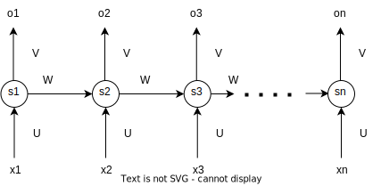
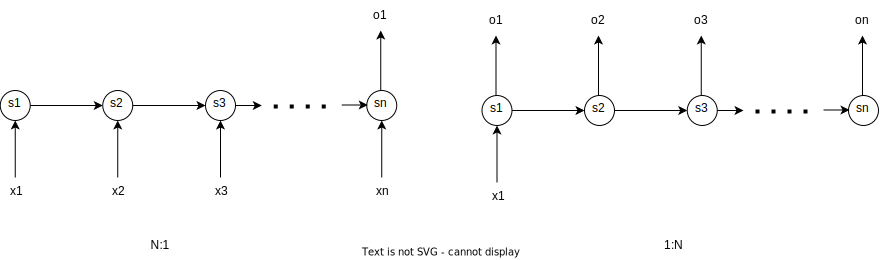
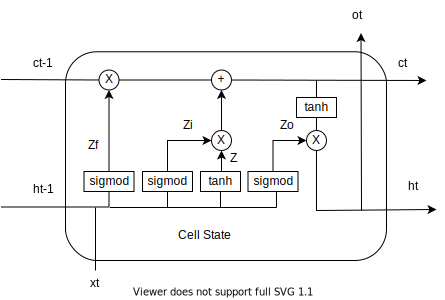
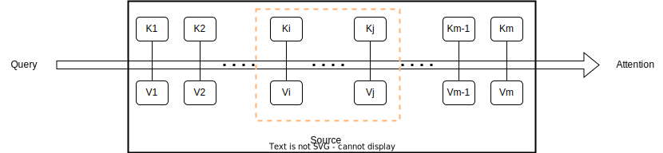
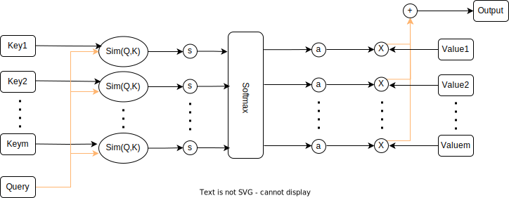
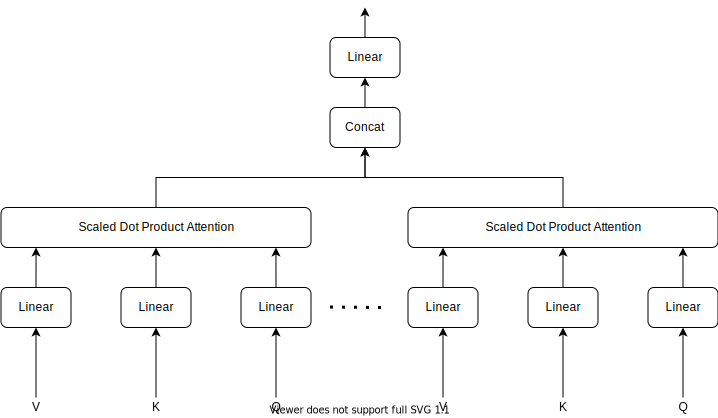
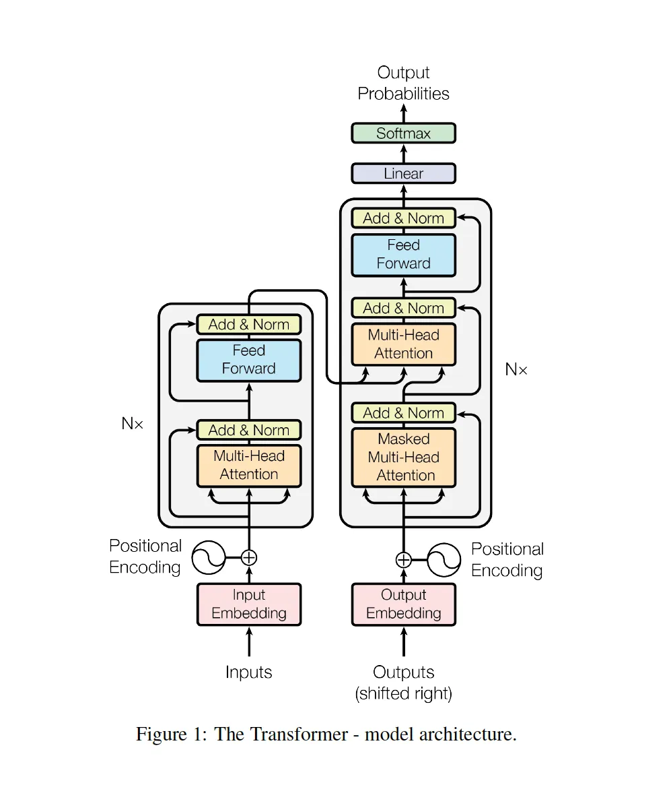

# LLM革命前夜

## 机器学习分岔路

当我们拥有了神经网络后，自然而然地就想让计算机拥有人类的能力。由此，发展出两大方向

* 计算机视觉（CV，Computer Vision）, 像人一样，看世界。
* 自然语言处理（NLP，Nature Language Process），像人一样，理解语言，并用语言交流。

我们的目标是学习大语言模型（LLM），所以更加关注NLP的方向。

## 聚焦NLP

自然语言处理（NLP）是计算机科学、人工智能和语言学的交叉领域，主要研究如何让计算机能够理解、处理和生成人类语言。

### NLP的核心任务

1. 序列标注任务：在序列标注中，我们想对一个序列的每一个元素标注一个标签。一般来说，一个序列指的是一个句子，而一个元素指的是句子中的一个词。比如信息提取问题可以认为是一个序列标注问题，如提取出会议时间、地点等。分词/POS Tag/NER/语义标注等
2. 分类任务：例如文本分类、情感分类等
3. 句子关系判断：例如句法分析、蕴含关系判断（entailment）,自然语言推理等。
4. 生成式任务：这类任务一般直接面向普通用户，提供自然语言处理产品服务的系统级任务，会用到多个层面的自然语言处理技术。例如机器翻译、文本摘要、总结、阅读理解、语音识别、对话系统、问答系统、自动文章分级等

第1，2点，我们也称为自然语言理解(NLU, Nature Language Understanding)，即理解人类语言。第3，4点，称为自然语言生成(NLG, Nature Language Generation)，用来处理和生成人类的语言。

### NLP的难点

1. 对标注数据的高度依赖：NLP技术对标注数据依赖性较高，难以在标注数据稀缺的任务、语言或领域内发挥作用
2. 语言的多样性：语言是没有规律的，或者说规律是错综复杂的
3. 语言的歧义性：语言是可以自由组合的，可以组合复杂的语言表达
4. 语言的鲁棒性：语言是一个开放集合，我们可以任意的发明创造一些新的表达方式
5. 语言的知识依赖：语言需要联系到实践知识，有一定的知识依赖
6. 语言的上下文：语言的使用要基于环境和上下文

在深入学习NLP前，我们需要先做一些技术准备。NLP 的技术基础方面，我认为主要是这两部分：

1. 词表示法（Word Representation）
2. 语言模型（Language Model）

我会单独写一个章节来介绍词表示法，特别是其中的Word Embedding，从事NLP相关工作的工程师，建议弄清楚。
关于词表示方法，其实就是把人类语言（Nature Language）表示成计算机认识的语言（数学）。这里，我们先记住一个结论。在2023年，文字都是表示为向量。而这一章节的重心，将放在讲解语言模型这部分内容。我们在介绍Transformer模型的时候，也有对这部分内容再做进一步的探讨。

## Transformer之前的网络模型

上一篇文章，我们介绍了感知机和MLP。我们先做一点扩展阅读。

### 多层感知网络（MLP）

### 卷积神经网络（CNN）

卷积神经网络（CNN）是为了解决前馈神经网络在处理图像或其他网格型数据（如二维的图像或三维的视频数据）时的缺点而发明的。

前馈神经网络的一个主要限制是它们对输入数据的空间结构没有直观的理解。例如，当处理图像数据时，前馈神经网络会将图像展平成一个长向量，从而丢失了图像的空间结构信息（即像素之间的相对位置信息）。这使得前馈神经网络在处理图像等网格型数据时效率低下，因为它们无法有效地利用这些数据的局部性质。

相比之下，CNN通过使用卷积层来处理输入数据，可以保留并利用数据的空间结构信息。卷积层通过在输入数据上滑动小的窗口（或称为“卷积核”或“滤波器”）来工作，这使得CNN能够捕捉到局部的空间特征。此外，CNN还使用了池化层（pooling layers）来降低数据的空间维度，从而减少计算量并提高模型的泛化能力。

因此，CNN在处理图像识别、物体检测、语义分割等任务时表现出了优越的性能，这些任务都需要对输入数据的空间结构进行理解。

### 循环神经网络（RNN）

循环神经网络（RNN）是为了解决前馈神经网络在处理序列数据时的缺点而发明的。

前馈神经网络的一个主要限制是它们假设输入数据是独立的，这意味着它们不能处理输入数据之间的时间或空间关系。例如，当处理一段文本或一段音频时，前馈神经网络无法理解单词或音符之间的顺序。

相比之下，RNN通过在网络中添加循环连接，可以记住过去的信息，从而能够处理序列数据。这使得RNN能够理解文本、音频、时间序列数据等的顺序信息，因此在许多任务中，如语音识别、自然语言处理、时间序列预测等，RNN都表现出了优越的性能。

如何理解RNN呢？我们先把上面那个MLP图，做一下简化和旋转90度的变形，如下图所示：

为了表示时序性，我们需要把多个这样的结构串联起来，即用激活函数(比如tanh函数）和权重把每个单元的连接，如下图所示：

看到这个图，大家有没有觉得眼熟？像不像数据结构里的链表？它也有单链表的麻烦，第一个节点S1和其他节点不一样。我们也沿用对于链表的加入首结点的思路来处理。我们给S1加入一个虚拟输入并令权重为0，这样我们把RNN图优雅的表示成一个循环图，如下图所示：

接下来我们用数学公式把RNN表示出来，先把RNN图展开。

由MLP的相关知识，我们可以把$S_t$ 和 $O_t$表示为：

$$
O_t = g(V \cdot s_t + b_2) \\
S_t = f(U \cdot x_t + W \cdot s_{t-1} + b_1)
$$

通过两个式子循环推到，很容易得到：

$$
\begin{aligned}
O_t & = g(V \cdot s_t + b_2) \\
& = g(V \cdot f(U \cdot x_t + W \cdot s_{t-1} + b_1) \\
& = g(V \cdot f(U \cdot x_t + W \cdot f(U \cdot x_{t-1} + W \cdot S_{t-2} + b_1) + b_2) \\
& = g(V \cdot f(U \cdot x_t + W \cdot f(U \cdot x_{t-1} + W \cdot f(U \cdot x_{t-2} + ...) + b_1) + b_2)  \\
\end{aligned}
$$

可以看到，当前时刻的输出包含了历史信息，这说明循环神经网络对历史信息进行了保存。
这里有几点需要注意：

* 你可以将隐藏的状态$s_t$看作网络的记忆，它捕获有关所有先前时间步骤中发生的事件的信息。步骤输出$o_t$根据时间t的记忆计算。正如上面简要提到的，它在实践中有点复杂，因为$s_t$通常无法从太多时间步骤中捕获信息。
* 与在每层使用不同参数的传统深度神经网络不同，RNN共享相同的参数（所有步骤的$U,V,W$）。这反映了我们在每个步骤执行相同任务的事实，只是使用不同的输入，这大大减少了我们需要学习的参数总数。

上图在每个时间步都有输出，这种输入和输出数据项数一致的 RNN，一般叫做 N：N 的 RNN。但根据任务，这可能不是必需的。例如，在预测句子的情绪时，我们可能只关心最终的输出，而不是每个单词之后的情绪。同样，我们可能不需要在每个时间步骤输入。所以，RNN结构可以是不同的组合，下图是N：1型和1:N型的RNN。N:M型的，我们放在后续章节再讨论。

### 长短时记忆网络（LSTM）

我们回顾一下RNN的特点——可以有效的处理序列数据。RNN把每个时刻都会把隐藏层的值存下来，到下一时刻的时候再拿出来用，这样就保证了，每一时刻含有上一时刻的信息。换句话说，我们用RNN模拟出了人脑的记忆功能。问题来了，RNN把所有信息，包括无用的信息，都等权重的保存下来了。显然，这种模拟比起人脑来，显得很是初级。

我们先看一下人类大脑是如何工作的吧。记忆的存储涉及到大脑的多个部分，主要包括海马体和新皮质。以下是记忆存储的一些关键步骤：

1. 短期记忆：当我们接触到新的信息或体验时，这些信息首先被存储在短期记忆中。短期记忆的容量有限，通常只能存储7±2个信息项，而且如果不通过重复或其他方式进行巩固，这些信息很快就会被遗忘。
2. 记忆巩固：记忆巩固是一个将短期记忆转化为长期记忆的过程。这个过程通常在睡眠中进行，因为睡眠可以帮助大脑加强新的记忆，并将它们与已有的记忆联系起来。
3. 长期记忆：经过巩固的记忆会被存储在长期记忆中。长期记忆的容量几乎是无限的，可以存储大量的信息，并且可以存储很长时间，甚至是一生。

在机器学习中，循环神经网络（RNN）的主要特点是具有“记忆”功能，能够利用历史信息来影响后续的输出。然而，传统的RNN主要处理短期依赖，对于长期信息的处理并不擅长。为了解决这个问题，长短期记忆网络（LSTM, Long Short-Term Memory）被提出。LSTM是RNN的一种变体，它通过引入了一个称为单元状态(Cell State)的机制，可以在更长的时间跨度上保存信息。这使得LSTM能够更好地处理长期依赖问题。所以，简单来说，传统的RNN更多地处理短期记忆，而LSTM则能够处理长期记忆。
如下图所示，对比于RNN，LSTM多了一个输入$c_{t-1}$和输出$c_t$。

LSTM的设计者用三个门控，即遗忘门，输入门和输出门，来处理长短期记忆。如下图所示：

我们来看一下LSTM中，Cell State的结构图。

LSTM内部主要有三个阶段：

1. 遗忘阶段。这个阶段主要是对上一个节点传进来的输入进行选择性遗忘。简单来说就是会 “遗忘不重要的，记住重要的”。具体来说是通过计算得到的 $Z_f$ （f表示forget）来作为遗忘门控，来控制上一个状态的 $c_{t-1}$ 哪些需要留哪些需要忘。
2. 选择记忆阶段。这个阶段将这个阶段的输入有选择性地进行“记忆”。主要是会对输入 $x_t$ 进行选择记忆。哪些重要则着重记录下来，哪些不重要，则少记一些。当前的输入内容由前面计算得到的$Z$ 表示。而选择的门控信号则是由 $Z_i$ （i代表input）来进行控制。
3. 输出阶段。这个阶段将决定哪些将会被当成当前状态的输出。主要是通过 $Z_o$(o代表output) 来进行控制的。并且还对上一阶段得到的 $c_t$ 进行了放缩（通过一个tanh激活函数进行变化）。与普通RNN类似，输出$o_t$往往最终也是通过$h_t$变化得到。

现在我们用数学把这个过程表示出来，详细计算步骤如下:

1. [遗忘阶段]计算遗忘门$Z_f$
   $$
   Z_f = \sigma(W_f[h_{t-1}, x_t]) = \sigma(W_{fh} \cdot h_{t-1} + W_{fx} \cdot x_{t} + b_f)
   $$
2. [选择记忆阶段]计算输入门$Z_i$

$$
Z_i = \sigma(W_i[h_{t-1}, x_t]) = \sigma(W_{ih} \cdot h_{t-1} + W_{ix} \cdot x_{t} + b_i)
$$

3. [选择记忆阶段]计算$Z$

$$
Z = tanh(W_z[h_{t-1}, x_t]) = tanh(W_{hz} \cdot h_{t-1} + W_{xz} \cdot x_t + b_z)
$$

4. [选择记忆阶段]计算输出$c_t$
   
   $$
   c_t = Z_f \odot c_{t-1} + Z_i \odot Z
   $$
   
   Tips: $\odot$ 表示Hadamard Product，也就是操作矩阵中对应的元素相乘，因此要求两个相乘矩阵是同型的。
5. [输出阶段]计算输出门$Z_o$
   
   $$
   Z_o = \sigma(W_o[h_{t-1}, x_t]) = \sigma(W_{oh} \cdot h_{t-1} + W_{ox} \cdot x_{t} + b_o)
   $$
6. [输出阶段]计算输出$h_t$
   
   $$
   h_t = o_t \odot tanh(c_t)
   $$
7. [输出阶段]计算输出$o_t$
   
   $$
   o_t = \sigma(W_o[h_t])
   $$

LSTM通过门控状态来控制传输状态，记住需要长时间记忆的，忘记不重要的信息；而不像普通的RNN那样只能够“呆萌”地仅有一种记忆叠加方式。对很多需要“长期记忆”的任务来说，尤其好用。但也因为引入了很多内容，导致参数变多，也使得训练难度加大了很多。因此很多时候我们往往会使用效果和LSTM相当但参数更少的GRU来构建大训练量的模型。我们的目标是学习LLM，这里对GRU不做深入探讨，请有兴趣的读者，自行学习一下GRU。

### Encoder-Decoder模型 （N:M型RNN）

对于输入序列长度N和输出序列长度M不一样的RNN模型结构，也可以叫做Encoder-Decoder模型，也可以叫Seq2Seq模型。首先接收输入序列的Encoder先将输入序列转成一个隐藏态的上下文表示$C$。$C$可以只与最后一个隐藏层有关，甚至可以是最后一个隐藏层生成的隐藏态直接设置为$C$，$C$还可以与所有隐藏层有关。有了这个$C$之后，再用Decoder进行解码，也就是从把$C$作为输入状态开始，生成输出序列。

数学表达式如下：

$$
C = Encoder(X) \\
O = Decoder(C)
$$

其中，

$$
\begin{aligned}
& e_t = Encoder_{LSTM/GRU}(x_t, e_{t-1}) \\
& C = f_1(e_n) \\
& d_t = f_2(d_{t-1}, C) \\
& y_t = Decoder_{LSTM/GRU}(y_{t-1}, d_{t-1}, C)
\end{aligned}
$$

这种的应用就非常广了，因为大多数时候输入序列与输出序列的长度都是不同的，比如最常见的应用「翻译」，从一个语言翻译成另一个语言；再比如 AI 的一个领域「语音识别」，将语音序列输入后生成所识别的文本内容；还有比如 ChatGPT 这种问答应用等等。

Encoder-Decoder模型非常出色，一直到2018年之前NLP领域里该模型已成为主流。但是它有很显著的问题：

* 信息压缩：编码器需要将整个输入序列的信息压缩到一个固定长度的向量中，然后解码器再从这个向量中恢复出原始信息。这种方法在处理长序列时会遇到困难，因为随着序列长度的增加，需要压缩的信息量也在增加。
* 并行效果差：每个时刻的结果依赖前一时刻。这个是RNN及其变种模型的通病，使得训练过程非常耗时。

注意力机制是为了解决这个问题而提出的。它允许模型在生成输出序列的每一步时，都能够查看输入序列的所有部分，并根据需要决定关注哪些部分。这样，模型就不再需要将所有信息压缩到一个固定长度的向量中，而是可以根据需要从输入序列中提取信息。这使得模型能够更好地处理长序列，并提高了其性能。

例如，"Attention Is All You Need"这篇论文中提出的Transformer模型，就是完全基于注意力机制的。这种模型摒弃了循环和卷积，仅使用注意力机制来处理序列数据。实验证明，这种模型在质量上优于其他模型，同时具有更好的并行性，训练时间大大缩短。

## 注意力（Attention）机制

从注意力模型的命名方式看，很明显其借鉴了人类的注意力机制。因此，我们以人类视觉的选择性注意力机制为例，介绍一下注意力机制。

### 人类的视觉注意力

视觉注意力机制是人类视觉所特有的大脑信号处理机制。人类视觉通过快速扫描全局图像，获得需要重点关注的目标区域，也就是一般所说的注意力焦点，而后对这一区域投入更多注意力资源，以获取更多所需要关注目标的细节信息，而抑制其他无用信息。

这是人类利用有限的注意力资源从大量信息中快速筛选出高价值信息的手段，是人类在长期进化中形成的一种生存机制，人类视觉注意力机制极大地提高了视觉信息处理的效率与准确性。

上图形象化展示了人类在看到一副图像时是如何高效分配有限的注意力资源的，其中红色区域表明视觉系统更关注的目标，很明显对于图1所示的场景，人们会把注意力更多投入到人的脸部，文本的标题以及文章首句等位置。

深度学习中的注意力机制从本质上讲和人类的选择性视觉注意力机制类似，核心目标也是从众多信息中选择出对当前任务目标更关键的信息。

### 用计算机模拟注意力机制

在计算机中，数据是以Key-Value形式储存的。现在，我们模拟人脑快速筛选高价值的信息，比如$V_i$到$V_j$这一组值，如下图所示。

该如何实现呢？其实，我们只要简单的借助一下数学工具就可以了。
首先我们将Query变成向量化，即$\vec Q=[0,0,...,w_i,...,w_j,...,0,0]^\top$
接着，让$\vec Q \cdot \vec K$相乘，这样我们就快速的筛选出高价值的信息了。这就是计算注意力值的基本思路。

直接找到Key，取出对应的Value这个过程叫硬选址（Hard Addressing）。计算Attention，我们采用软寻址（Soft Addressing）的办法，通过计算Key和Query的相似度来进行寻址，这种方法不只是获得一个Key地址的Value值，而是获取所有的存储器中Value值的加权和。至于每个Value的权重（即重要程度），则是通过计算Key和Query相似度得到。最终的输出是所有Value值和其权重的加权和。

结合上面的图，我们将这段文字描述用数学公式来表示：

$$
Attention(\vec Q,\vec K,\vec V) = \sum_{i=1}^{m}Similarity(\vec Q, \vec K) \cdot \vec V \\
$$

我们用评分函数（Scoring Function）: $s(Q,K)$来表示$Similarity(\vec Q, \vec K)$, 常用的有2种，分别是：

1. 加性注意力（additive attention）
   将查询和键连结起来后输入到一个多层感知机（MLP）中， 感知机包含一个隐藏层，其隐藏单元数是一个超参数$m$。 通过使用tanh作为激活函数，并且禁用偏置项，加性注意力评分函数为：
   $$
   s(Q,K) = w_v^\top tanh(W_qQ+W_kK) \\
   其中，w_v \in \mathbb R^m; W_q \in \mathbb R^{m \times q}; W_k \in \mathbb R^{m \times k}
   $$
2. 缩放点积注意力（scaling dot-production attention）
   使用点积可以得到计算效率更高的评分函数， 但是点积操作要求查询和键具有相同的长度$d$。 假设查询和键的所有元素都是独立的随机变量，并且都满足零均值和单位方差，那么两个向量的点积的均值为0，方差为$d$。为确保无论向量长度如何，点积的方差在不考虑向量长度的情况下仍然是1，我们再将点积除以$\sqrt d$，则缩放点积注意力评分函数为：
   $$
   s(Q,K) = \frac {QK^\top}{\sqrt d}
   $$

Tips: 这里用到比较深的数学技巧，我会在附录里详细讨论这个公式。

### 详解计算注意力过程

第一步，通过注意力评分函数，算出Score的值： 即$s(Q,K)$的值
假定我们采用缩放点积注意力评分函数。

$$
s(Q,K) = \frac {QK^\top}{\sqrt d}
$$

第二步，通过归一化Softmax函数，算出$a(Q,K)$的值。

$$
a(Q,K) = Softmax(s(Q,K))  = \frac {exp(s(Q,K))}{\sum_{i = 1}^m exp(s(Q,K)} = Softmax(\frac {QK^\top}{\sqrt d})
$$

第三步，和Value做点积，求和后得到输出值

$$
Output = \sum_{j=1}^mSoftmax(\frac {QK^\top}{\sqrt d})V
$$

Tips: 我们经常用一个数学公式来表达注意力机制，公式如下：

$$
Attention(Q,K,V)=Softmax(\frac {QK^\top}{\sqrt d})V
$$

### 多头注意力机制（Multi-Head Attention）

理解了注意力机制，学习多头注意力就比较容易了。只需要把多个Attention连起来就行了。
我们拓展一下上面Attention的例子，多头注意力机制如下图表示：

### 自注意力机制（Self-Attention）

自注意力机制和注意力机制的区别就在于，注意力机制的查询和键是不同来源的，例如，在Encoder-Decoder模型中，键是Encoder中的元素，而查询是Decoder中的元素。在中译英模型中，查询是中文单词特征，而键则是英文单词特征。而自注意力机制的查询和键则都是来自于同一组的元素，例如，在Encoder-Decoder模型中，查询和键都是Encoder中的元素，即查询和键都是中文特征，相互之间做注意力汇聚。形象的比喻就是Self-Attention在做“完形填空”。

以Deep Learning这个词组为例，我们给出了一个单头的自注意力机制的原理示意图。

* 向量$a$是Deep单词经过全连接层$W_a$得到的，向量$b$是Deep单词经过全连接层$W_b$得到的.
* 向量$q_1, q_2$分别是向量$a,b$经过全连接层$W_q$得到的。同理可得向量$k_1,k_2,v_1,v_2$。
* 向量$a’,b’$分别是向量$a,b$经过注意力汇聚后的结果。

### 多头自注意力机制

我们还是以Deep Learing这个词组为例，给出了多头注意力机制的原理示意图。

Tips：如果对Input/Output Embedding有疑问，建议先跳过。我们在下一章节Transformer模型中有进一步的深入探讨

## Transformer 模型

这一章节，我们一起来读一读里程碑式的论文 Attention Is All You Need。理解了Transformer，就等同于拿到学习大语言模型（LLM）最重要的那把钥匙。

### 解决了什么问题

该文的贡献主要在于提出了名为transformer的模型架构，并拓展了注意力机制的使用方法。具体来说：

1. 提出了transformer架构，其中包含有多层堆叠的编码器(encoder)和解码器(decoder)。其中编码/解码器包含了多头注意力机制(multi-head attention)，层级归一(layer norm)和残差结构(residual)。
2. 创新性地发展了注意力机制并提出了多头注意力机制，并以此取代了Encoder-Decoder结构中常用的递归层。传统的RNN对序列建模有一个无法避开的问题就是难以并行。为了捕捉长距离的序列依赖关系必须凭借上文处理后的信息从隐层逐级传递过来(也就是当前时序的结果 $O_t$ 取决于 $h_{t-1}$ 和 $x_t$ )，这样的结果就是上一个时序没有处理完下一个时序就无法处理。但是多头注意力机制可以直接捕捉全文信息，既建模了长距离的依赖关系，又方便并行运算的展开。
3. 将长距离的依赖关系的操作复杂度(number of operations required)从线性关系(比如递归网络)或对数复杂度(卷积操作)降至了常数级别(通过固定的注意力机制)。这部分，我们就不具体讲了，有兴趣的同学请读一下原论文。

### Transformer模型架构图

再次看到这张图，内心百感交集。3个月前，打算开始学习LLM，我就是从这篇论文和这张图开始的。论文作者说，Transformer是一种“简单的神经网络架构”。整整学了一个周末，具体的说，在图书馆认真学了17个小时后，似懂非懂，太复杂了！然后，我决定从头开始学习，也就有了这一系列的文章。
图的左边部分是Encoder，右边部分是Decoder；底部是输入，顶部是输出（以概率方式输出）。我们讲分成以下4部分，逐步讲解Transformer模型。

1. Input Embedding 和 Positional Encoding 部分
2. Attention 和 Add&Norm 部分
3. Feed Forward 部分
4. Decoder和Output 部分

### Inputs

Inputs是Transformers的开端。如果是处理NLP的问题，那么输入就是文本。当然也可以是文本，图像，声音等信息。那么问题来了，如何让计算机理解并接受这些信息呢？我们需要用数学来统一表达这些信息。

#### Word Embedding

在自然语言处理（NLP）中，词嵌入（Word Embedding）是一种重要的技术，它将词语映射为数值向量，使之包含更丰富的语义信息和抽象特征。以下是实现词嵌入的一些主要步骤：

1. **数据预处理**​：首先，你需要有一个文本数据集。这个数据集可以是任何形式的文本，比如新闻文章、书籍、网页等。你需要对这些文本进行预处理，包括分词、去除停用词、词干提取等。
2. ​**构建词汇表**​：根据预处理后的文本，构建一个词汇表，每个词在词汇表中都有一个唯一的索引。
3. **选择词嵌入模型**​：有许多不同的词嵌入模型可以选择，如One-Hot、Bag of Words、N-gram、Word2Vec、GloVe、FastText、ELMo和BERT等。你需要根据你的任务需求和数据特性来选择合适的模型。
4. **训练词嵌入模型**​：使用你的文本数据和选择的词嵌入模型来训练词嵌入。这个过程通常需要大量的计算资源和时间。
5. **得到词向量**​：训练完成后，每个词都会有一个对应的向量表示。这个向量就是词的嵌入，它捕捉了词的语义信息和在文本中的上下文关系。

分词（Tokenizer）是将语料库（所有文本）转化为机器可以更好利用的较小部分的过程。​**假设我们有一个包含 10,000 篇维基百科文章的数据集，我们对每个字符进行处理（分词）。对文本进行分词的方法有很多，让我们看看 OpenAI 的分词器[3]是如何处理以下文本的：

> “Many words map to one token, but some don’t: indivisible.
> Unicode characters like emojis may be split into many tokens containing the underlying bytes:
> Sequences of characters commonly found next to each other may be grouped together: 1234567890"

https://platform.openai.com/tokenizer
https://zhuanlan.zhihu.com/p/662851270

#### Positional Encoding

### Attention

### Add&Norm

#### ResNet

#### Norm

### Decoder

### Output

## 小结

记忆的检索过程是大脑从存储的信息中搜索并提取信息的过程。以下是一种可能的解释：

1. **触发**：记忆的检索通常开始于某种触发，这可能是一个问题、一个物体、一个场景，或者任何其他能够引发记忆的事物。
2. **搜索**：大脑开始在存储的信息中搜索相关的记忆。这个过程可能涉及到大脑的多个区域，包括前额叶和海马体。
3. **激活**：一旦找到了相关的记忆，大脑会激活这些记忆，使其进入我们的意识。这可能涉及到将记忆从长期存储转移到工作记忆，以便我们可以在意识中处理这些信息。
4. **重建**：记忆的检索并不总是完全准确的。有时，我们可能会重建或修改记忆，以适应当前的情境或需求。这就是为什么人们有时会记住事情的方式与实际发生的情况不同。

接下来，我们想办法用计算机来模拟上述过程。

#### 另一种解释

对上述过程，我们还有一种理解方式。引起注意力的方式有两种，**自主提示**和**非自主提示**。如果考虑自主提示的话，我们就需要设计一种通过Query，Key和Value来实现注意力机制的方法。

* Query指的是自主提示，即主观意识的特征向量。
* Key指的是非自主提示，即物体的突出特征信息向量。
* Value则是代表物体本省的特征向量。

举个更加生活化的例子，当你走进图书馆阅览室，目光自然而然的扫了一下在座的同学们（Query），一个“肤白貌美大长腿”的女生映入眼帘（Key），原来是校花小美啊（Value）！

## Reference

https://www.baeldung.com/cs/nlp-encoder-decoder-models
https://arxiv.org/abs/1706.03762

