# 大语言模型：革命前夜

当我们拥有了神经网络后，自然而然地就想让计算机拥有人类的能力。由此，发展出两大方向：

* 计算机视觉（CV，Computer Vision）, 像人一样，看世界。
* 自然语言处理（NLP，Nature Language Process），像人一样，理解语言，并用语言交流。

我们的目标是学习大语言模型（LLM），所以更加关注NLP的方向。

## 聚焦NLP

自然语言处理（NLP）是计算机科学、人工智能和语言学的交叉领域，主要研究如何让计算机能够理解、处理和生成人类语言。

### NLP的核心任务

1. **序列标注任务**：在序列标注中，我们想对一个序列的每一个元素标注一个标签。一般来说，一个序列指的是一个句子，而一个元素指的是句子中的一个词。比如信息提取问题可以认为是一个序列标注问题，如提取出会议时间、地点等。分词/POS Tag/NER/语义标注等。
2. **分类任务**：例如文本分类、情感分类等。
3. **句子关系判断**：例如句法分析、蕴含关系判断（entailment）,自然语言推理等。
4. **生成式任务**：这类任务一般直接面向普通用户，提供自然语言处理产品服务的系统级任务，会用到多个层面的自然语言处理技术。例如机器翻译、文本摘要、总结、阅读理解、语音识别、对话系统、问答系统、自动文章分级等。

第1，2，3点，我们也称为自然语言理解(NLU, Nature Language Understanding)，即理解人类语言。第4点，称为自然语言生成(NLG, Nature Language Generation)，用来处理和生成人类的语言。

### NLP的难点

1. 对标注数据的高度依赖：NLP技术对标注数据依赖性较高，难以在标注数据稀缺的任务、语言或领域内发挥作用
2. 语言的多样性：语言是没有规律的，或者说规律是错综复杂的
3. 语言的歧义性：语言是可以自由组合的，可以组合复杂的语言表达
4. 语言的鲁棒性：语言是一个开放集合，我们可以任意的发明创造一些新的表达方式
5. 语言的知识依赖：语言需要联系到实践知识，有一定的知识依赖
6. 语言的上下文：语言的使用要基于环境和上下文

在深入学习NLP前，我们需要学习NLP相关技术的基础知识，我认为最重要的是这两部分：

1. **词表示法（Word Representation）**
2. **语言模型（Language Model）**

关于词表示方法，其实就是把人类语言（Nature Language）表示成计算机认识的语言（数学）。我会单独写一个章节来介绍词表示法，会详细讨论其中的Word Embedding，从事NLP相关工作的工程师，建议把这个问题弄清楚。这里，为了便于理解本章节内容，我们先记住一个结论。

> 在2023年，词都是表示为向量。

这一章节的重心，将放在讲解语言模型这部分内容。我们在介绍Transformer模型的时候，也会对这部分内容再做进一步的探讨。

## Transformer之前的网络模型

上一篇文章，我们介绍了感知机和MLP。这一章，我们将做扩展阅读，介绍更多的模型。

### 多层感知网络（MLP）

先复习一下MLP，下图为一个简单的MLP网络，这个例子我们后续章节会用到。


### 卷积神经网络（CNN）

略过，不详细讲解。
卷积神经网络（CNN）是为了解决前馈神经网络在处理图像或其他网格型数据（如二维的图像或三维的视频数据）时的缺点而发明的。CNN很重要，但是我们聚焦在大语言模型的学习，这部分就不详细讨论了。

Tips：直接写上我觉得学习CNN最有用的心得。想深入的话，请自行查找资料深入了解。

> CNN就是特征提取器，就是CBAPD。

CBAPD，就是CNN网络5个重要步骤：

1. C - Convolutional
2. B - Batch Normalization
3. A - Activation
4. P - Pooling
5. D - Dropout

参考代码

```python
model = tf.keras.models.Sequential([
    Conv2D(filters=6, kernel\_size=(5,5), padding='same'),
    BatchNormalization(),
    Activation('relu'),
    MaxPool2D(pool\_size=(2,2), strides=2, padding='same'),
    Dropout(0.2),
])
```

### 循环神经网络（RNN）

循环神经网络（RNN）是为了解决前馈神经网络在处理序列数据时的缺点而发明的。

前馈神经网络的一个主要限制是它们假设输入数据是独立的，这意味着它们不能处理输入数据之间的时间或空间关系。例如，当处理一段文本或一段音频时，前馈神经网络无法理解单词或音符之间的顺序。

相比之下，RNN通过在网络中添加循环连接，可以记住过去的信息，从而能够处理序列数据。这使得RNN能够理解文本、音频、时间序列数据等的顺序信息，因此在许多任务中，如语音识别、自然语言处理、时间序列预测等，RNN都表现出了优越的性能。

如何理解RNN呢？我们先把上面那个MLP图，做一下简化和逆时针旋转90度的变形，如下图所示：


为了表示时序性，我们需要把多个这样的结构串联起来，即用激活函数(比如tanh函数）和权重把每个单元的连接，如下图所示：


看到这个图，大家有没有觉得眼熟？像不像数据结构里的链表？它也有单链表的麻烦，第一个节点S1和其他节点不一样。我们也沿用对于链表的加入首结点的思路来处理。我们给S1加入一个虚拟输入并令权重为0，这样我们把RNN图优雅的表示成一个循环图，如下图所示：
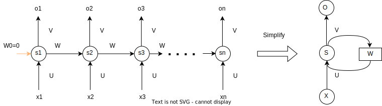

接下来我们用数学公式把RNN表示出来，先把RNN图展开。

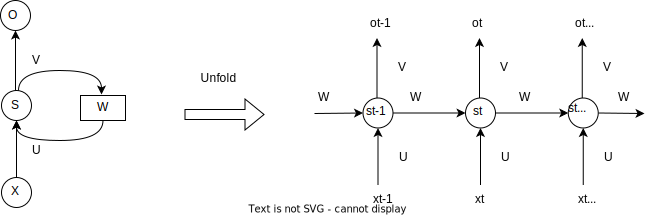
参考MLP的做法，我们可以把$s_t$ 和 $o_t$表示为：

$$
\begin{aligned}
o_t & = g(V \cdot s_t + b_2) \\
s_t & = f(U \cdot x_t + W \cdot s_{t-1} + b_1)
\end{aligned}
$$

通过两个式子循环推到，很容易得到：

$$
\begin{aligned}
o_t & = g(V \cdot s_t + b_2) \\
& = g(V \cdot f(U \cdot x_t + W \cdot s_{t-1} + b_1) + b_2)\\
& = g(V \cdot f(U \cdot x_t + W \cdot f(U \cdot x_{t-1} + W \cdot S_{t-2} + b_1) + b_2) \\
& = g(V \cdot f(U \cdot x_t + W \cdot f(U \cdot x_{t-1} + W \cdot f(U \cdot x_{t-2} + ...) + b_1) + b_2)  \\
\end{aligned}
$$

可以看到，当前时刻的输出包含了历史信息，这说明循环神经网络对历史信息进行了保存。
这里有几点需要注意：

* 你可以将隐藏的状态$s_t$看作网络的记忆，它捕获有关所有先前时间步骤中发生的事件的信息。步骤输出$o_t$根据时间t的记忆计算。正如上面简要提到的，它在实践中有点复杂，因为$s_t$通常无法从太多时间步骤中捕获信息。
* 与在每层使用不同参数的传统深度神经网络不同，RNN共享相同的参数（所有步骤的$U,V,W$）。这反映了我们在每个步骤执行相同任务的事实，只是使用不同的输入，这大大减少了我们需要学习的参数总数。

上图在每个时间步都有输出，这种输入和输出数据项数一致的RNN，一般叫做N：N的RNN。但根据任务，这可能不是必需的。所以，RNN结构可以是不同的组合，下图是N：1型和1:N型的RNN。N:M型的，我们放在后续章节再讨论。


### 长短时记忆网络（LSTM）

我们回顾一下RNN的特点——可以有效的处理序列数据。RNN把每个时刻都会把隐藏层的值存下来，到下一时刻的时候再拿出来用，这样就保证了，每一时刻含有上一时刻的信息。换句话说，我们用RNN模拟出了人脑的记忆功能。问题来了，RNN把所有信息，包括无用的信息，都等权重的保存下来了。显然，这种模拟比起人脑来，显得很是初级。

我们先看一下人类大脑是如何工作的吧。记忆的存储涉及到大脑的多个部分，主要包括海马体和新皮质。以下是记忆存储的一些关键步骤：

1. **短期记忆**：当我们接触到新的信息或体验时，这些信息首先被存储在短期记忆中。短期记忆的容量有限，通常只能存储7±2个信息项，而且如果不通过重复或其他方式进行巩固，这些信息很快就会被遗忘。
2. **记忆巩固**：记忆巩固是一个将短期记忆转化为长期记忆的过程。这个过程通常在睡眠中进行，因为睡眠可以帮助大脑加强新的记忆，并将它们与已有的记忆联系起来。
3. **长期记忆**：经过巩固的记忆会被存储在长期记忆中。长期记忆的容量几乎是无限的，可以存储大量的信息，并且可以存储很长时间，甚至是一生。

在机器学习中，循环神经网络（RNN）的主要特点是具有“记忆”功能，能够利用历史信息来影响后续的输出。然而，传统的RNN主要处理短期依赖，对于长期信息的处理并不擅长。为了解决这个问题，长短期记忆网络（LSTM, Long Short-Term Memory）被提出。LSTM是RNN的一种变体，它通过引入了一个称为单元状态(Cell State)的机制，可以在更长的时间跨度上保存信息。这使得LSTM能够更好地处理长期依赖问题。所以，简单来说，传统的RNN更多地处理短期记忆，而LSTM则能够处理长期记忆。
如下图所示，对比于RNN，LSTM多了一个输入$c_{t-1}$和输出$c_t$。

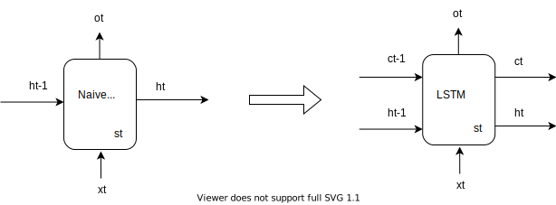

LSTM的设计者用三个门控，即遗忘门，输入门和输出门，来处理长短期记忆。如下图所示：
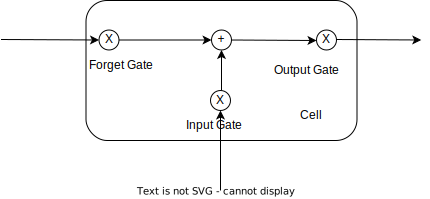

我们来看一下LSTM中，Cell State的结构图。


LSTM内部主要有三个阶段：

1. **遗忘阶段**: 这个阶段主要是对上一个节点传进来的输入进行选择性遗忘。简单来说就是会 “遗忘不重要的，记住重要的”。具体来说是通过计算得到的$Z_f$（f表示forget）来作为遗忘门控，来控制上一个状态的$c_{t-1}$哪些需要留哪些需要忘。
2. **选择记忆阶段**: 这个阶段将这个阶段的输入有选择性地进行“记忆”。主要是会对输入$x_t$进行选择记忆。哪些重要则着重记录下来，哪些不重要，则少记一些。当前的输入内容由前面计算得到的$Z$表示。而选择的门控信号则是由$Z_i$（i代表input）来进行控制。
3. **输出阶段**: 这个阶段将决定哪些将会被当成当前状态的输出。主要是通过$Z_o$(o代表output) 来进行控制的。并且还对上一阶段得到的$c_t$进行了放缩（通过一个tanh激活函数进行变化）。与普通RNN类似，输出$o_t$往往最终也是通过$h_t$变化得到。

现在我们用数学把这个过程表示出来，详细计算步骤如下:

1. **遗忘阶段**: 计算遗忘门$Z_f$
   $$
   Z_f = \sigma(W_f[h_{t-1}, x_t]) = \sigma(W_{fh} \cdot h_{t-1} + W_{fx} \cdot x_{t} + b_f)
   $$
2. **选择记忆阶段**: 计算输入门$Z_i$

$$
Z_i = \sigma(W_i[h_{t-1}, x_t]) = \sigma(W_{ih} \cdot h_{t-1} + W_{ix} \cdot x_{t} + b_i)
$$

3. **选择记忆阶段**: 计算$Z$

$$
Z = tanh(W_z[h_{t-1}, x_t]) = tanh(W_{hz} \cdot h_{t-1} + W_{xz} \cdot x_t + b_z)
$$

4. **选择记忆阶段**: 计算输出$c_t$
   
   $$
   c_t = Z_f \odot c_{t-1} + Z_i \odot Z
   $$
   
   Tips: $\odot$ 表示Hadamard Product，也就是操作矩阵中对应的元素相乘，因此要求两个相乘矩阵是同型的。
5. [输出阶段]计算输出门$Z_o$
   
   $$
   Z_o = \sigma(W_o[h_{t-1}, x_t]) = \sigma(W_{oh} \cdot h_{t-1} + W_{ox} \cdot x_{t} + b_o)
   $$
6. **输出阶段**: 计算输出$h_t$
   
   $$
   h_t = o_t \odot tanh(c_t)
   $$
7. **输出阶段**: 计算输出$o_t$
   
   $$
   o_t = \sigma(W_o[h_t])
   $$

LSTM通过门控状态来控制传输状态，记住需要长时间记忆的，忘记不重要的信息；而不像普通的RNN那样只能够“呆萌”地仅有一种记忆叠加方式。对很多需要“长期记忆”的任务来说，尤其好用。但也因为引入了很多内容，导致参数变多，也使得训练难度加大了很多。因此很多时候我们往往会使用效果和LSTM相当但参数更少的GRU来构建大训练量的模型。我们的目标是学习LLM，这里对GRU不做深入探讨，请有兴趣的读者，请自行学习一下GRU。

### Encoder-Decoder模型 （N:M型RNN）

对于输入序列长度N和输出序列长度M不一样的RNN模型结构，也可以叫做Encoder-Decoder模型，也可以叫Seq2Seq模型。首先接收输入序列的Encoder先将输入序列转成一个隐藏态的上下文表示$C$。$C$可以只与最后一个隐藏层有关，甚至可以是最后一个隐藏层生成的隐藏态直接设置为$C$，$C$还可以与所有隐藏层有关。有了这个$C$之后，再用Decoder进行解码，也就是从把$C$作为输入状态开始，生成输出序列。

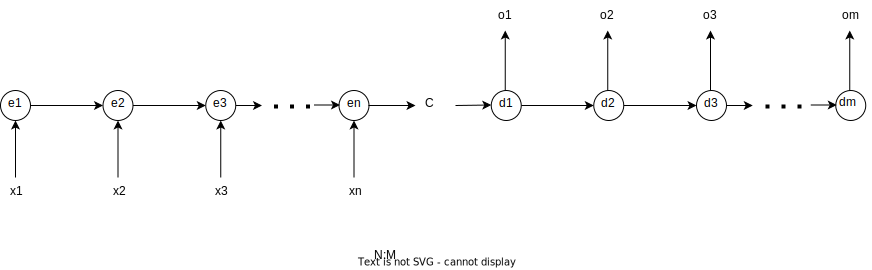

数学表达式如下：

$$
C = Encoder(X) \\
O = Decoder(C)
$$

其中，

$$
\begin{aligned}
& e_t = Encoder_{LSTM/GRU}(x_t, e_{t-1}) \\
& C = f_1(e_n) \\
& d_t = f_2(d_{t-1}, C) \\
& o_t = Decoder_{LSTM/GRU}(o_{t-1}, d_{t-1}, C)
\end{aligned}
$$

这种的应用就非常广了，因为大多数时候输入序列与输出序列的长度都是不同的，比如最常见的应用"翻译"，从一个语言翻译成另一个语言；再比如AI的一个领域"语音识别"，将语音序列输入后生成所识别的文本内容；还有比如ChatGPT这种问答应用等等。

Encoder-Decoder模型非常出色，一直到2018年之前NLP领域里该模型已成为主流。但是它有很显著的问题：

* 信息压缩：编码器需要将整个输入序列的信息压缩到一个固定长度的向量中，然后解码器再从这个向量中恢复出原始信息。这种方法在处理长序列时会遇到困难，因为随着序列长度的增加，需要压缩的信息量也在增加。
* 并行效果差：每个时刻的结果依赖前一时刻。这个是RNN及其变种模型的通病，使得训练过程非常耗时。

注意力机制是为了解决这个问题而提出的。它允许模型在生成输出序列的每一步时，都能够查看输入序列的所有部分，并根据需要决定关注哪些部分。这样，模型就不再需要将所有信息压缩到一个固定长度的向量中，而是可以根据需要从输入序列中提取信息。这使得模型能够更好地处理长序列，并提高了其性能。

例如，"Attention Is All You Need"这篇论文中提出的Transformer模型，就是完全基于注意力机制的。这种模型摒弃了循环和卷积，仅使用注意力机制来处理序列数据。实验证明，这种模型在质量上优于其他模型，同时具有更好的并行性，训练时间大大缩短。

## 注意力（Attention）机制

从注意力模型的命名方式看，很明显其借鉴了人类的注意力机制。因此，我们以人类视觉的选择性注意力机制为例，介绍一下注意力机制。

### 人类的视觉注意力

视觉注意力机制是人类视觉所特有的大脑信号处理机制。人类视觉通过快速扫描全局图像，获得需要重点关注的目标区域，也就是一般所说的注意力焦点，而后对这一区域投入更多注意力资源，以获取更多所需要关注目标的细节信息，而抑制其他无用信息。

这是人类利用有限的注意力资源从大量信息中快速筛选出高价值信息的手段，是人类在长期进化中形成的一种生存机制，人类视觉注意力机制极大地提高了视觉信息处理的效率与准确性。


上图形象化展示了人类在看到一副图像时是如何高效分配有限的注意力资源的，其中红色区域表明视觉系统更关注的目标，很明显对于上图所示的场景，人们会把注意力更多投入到人的脸部，文本的标题以及文章首句等位置。

深度学习中的注意力机制从本质上讲和人类的选择性视觉注意力机制类似，核心目标也是从众多信息中选择出对当前任务目标更关键的信息。

### 用计算机模拟注意力机制

在计算机中，数据是以Key-Value形式储存的。现在，我们模拟人脑快速筛选高价值的信息，比如$V_i$到$V_j$这一组值，如下图所示。


该如何实现呢？其实，我们只要简单的借助一下数学工具就可以了。
首先我们将Query变成向量化，即$\vec Q=[0,0,...,w_i,...,w_j,...,0,0]^\top$
接着，让$\vec Q \cdot \vec K$相乘，这样我们就快速的筛选出高价值的信息了。这就是计算注意力值的基本思路。

直接找到Key，取出对应的Value这个过程叫硬选址（Hard Addressing）。计算Attention，我们采用软寻址（Soft Addressing）的办法，通过计算Key和Query的相似度来进行寻址，这种方法不只是获得一个Key地址的Value值，而是获取所有的存储器中Value值的加权和。至于每个Value的权重（即重要程度），则是通过计算Key和Query相似度得到。最终的输出是所有Value值和其权重的加权和。

结合上面的图，我们将这段文字描述用数学公式来表示：

$$
Attention(\vec Q,\vec K,\vec V) = \sum_{i=1}^{m}Similarity(\vec Q, \vec K) \cdot \vec V \\
$$

我们用评分函数（Scoring Function）: $s(Q,K)$来表示$Similarity(\vec Q, \vec K)$, 常用的有2种，分别是：

1. 加性注意力（additive attention）
   将查询和键连结起来后输入到一个多层感知机（MLP）中， 感知机包含一个隐藏层，其隐藏单元数是一个超参数$m$。 通过使用tanh作为激活函数，并且禁用偏置项，加性注意力评分函数为：
   $$
   s(Q,K) = w_v^\top tanh(W_qQ+W_kK) \\
   其中，w_v \in \mathbb R^m; W_q \in \mathbb R^{m \times q}; W_k \in \mathbb R^{m \times k}
   $$
2. 缩放点积注意力（scaling dot-production attention）
   使用点积可以得到计算效率更高的评分函数， 但是点积操作要求查询和键具有相同的长度$d$。 假设查询和键的所有元素都是独立的随机变量，并且都满足零均值和单位方差，那么两个向量的点积的均值为0，方差为$d$。为确保无论向量长度如何，点积的方差在不考虑向量长度的情况下仍然是1，我们再将点积除以$\sqrt d$，则缩放点积注意力评分函数为：
   $$
   s(Q,K) = \frac {QK^\top}{\sqrt d}
   $$

Tips: 这里用到比较深的数学技巧，我会在附录里详细讨论这个公式。

### 详解计算注意力过程


第一步，通过注意力评分函数，算出Score的值： 即$s(Q,K)$的值
假定我们采用缩放点积注意力评分函数。

$$
s(Q,K) = \frac {QK^\top}{\sqrt d}
$$

第二步，通过Softmax函数，算出$a(Q,K)$的值。

$$
a(Q,K) = Softmax(s(Q,K))  = \frac {exp(s(Q,K))}{\sum_{i = 1}^m exp(s(Q,K)} = Softmax(\frac {QK^\top}{\sqrt d})
$$

第三步，和Value做点积，求和后得到输出值

$$
Output = \sum_{j=1}^mSoftmax(\frac {QK^\top}{\sqrt d})V
$$

Tips: 我们经常用一个数学公式来表达注意力机制，公式如下：

$$
Attention(Q,K,V)=Softmax(\frac {QK^\top}{\sqrt d})V
$$

### 多头注意力机制（Multi-Head Attention）

理解了注意力机制，学习多头注意力就比较容易了。只需要把多个Attention连起来就行了。
我们拓展一下上面Attention的例子，多头注意力机制如下图表示：


### 自注意力机制（Self-Attention）

自注意力机制和注意力机制的区别就在于，注意力机制的查询和键是不同来源的，例如，在Encoder-Decoder模型中，键是Encoder中的元素，而查询是Decoder中的元素。在中译英模型中，查询是中文单词特征，而键则是英文单词特征。而自注意力机制的查询和键则都是来自于同一组的元素，例如，在Encoder-Decoder模型中，查询和键都是Encoder中的元素，即查询和键都是中文特征，相互之间做注意力汇聚。形象的比喻就是Self-Attention在做“完形填空”。

以Deep Learning这个词组为例，我们给出了一个单头的自注意力机制的原理示意图。


* $a$是Deep单词经过全连接层$W_a$得到的，$b$是Deep单词经过全连接层$W_b$得到的.
* 向量$q_1, q_2$分别是$a,b$经过全连接层$W_q$得到的。同理可得向量$k_1,k_2,v_1,v_2$。
* $a’,b’$分别是$a,b$经过注意力汇聚后的结果。

### 多头自注意力机制

我们还是以Deep Learing这个词组为例，给出了多头注意力机制的原理示意图。


Tips：如果对Input/Output Embedding有疑问，建议先跳过。我们在下一章节Transformer模型中有进一步的深入探讨

## Transformer 模型

这一章节，我们一起来读一读里程碑式的论文Attention Is All You Need。理解了Transformer，就等同于拿到学习大语言模型（LLM）最重要的那把钥匙。

### 解决了什么问题

该文的贡献主要在于提出了名为transformer的模型架构，并拓展了注意力机制的使用方法。具体来说：

1. 提出了transformer架构，其中包含有多层堆叠的编码器(Encoder)和解码器(Decoder)。其中编码/解码器包含了多头注意力机制(Multi-Head attention)，层级归一化(Layer Norm)和残差结构(Residual)。
2. 创新性地发展了注意力机制并提出了多头注意力机制，并以此取代了Encoder-Decoder结构中常用的递归层。传统的RNN对序列建模有一个无法避开的问题就是难以并行。为了捕捉长距离的序列依赖关系必须凭借上文处理后的信息从隐层逐级传递过来(也就是当前时序的结果$O_t$取决于$h_{t-1}$和$x_t$)，这样的结果就是上一个时序没有处理完下一个时序就无法处理。但是多头注意力机制可以直接捕捉全文信息，既建模了长距离的依赖关系，又方便并行运算的展开。
3. 将长距离的依赖关系的操作复杂度(number of operations required)从线性关系(比如递归网络)或对数复杂度(卷积操作)降至了常数级别(通过固定的注意力机制)。这部分，我们就不具体讲了，有兴趣的同学请读一下原论文。

### Transformer模型架构图


再次看到这张图，内心百感交集。3个月前，打算开始学习LLM，我就是从这篇论文和这张图开始的。论文作者说，Transformer是一种“简单的神经网络架构”。整整学了一个周末，具体的说，在图书馆认真学了17个小时后，似懂非懂，太复杂了！然后，我决定从头开始学习，也就有了这一系列的文章。
图的左边部分是Encoder，右边部分是Decoder；底部是输入，顶部是输出（以概率方式输出）。我们将分成以下4部分，逐步讲解Transformer模型。

1. Input Embedding 和 Positional Encoding 部分
2. Attention 和 Add&Norm 部分
3. Feed Forward 部分
4. Decoder和Output 部分

### Inputs

Inputs是Transformers的开端。如果是处理NLP的问题，那么输入就是文本。当然也可以是图像，声音等信息。那么问题来了，如何让计算机理解并接受这些信息呢？我们需要把文本用数学来统一表达，以便计算机能理解这些信息。

#### Word Embedding

我们先讨论一下Inputs Embedding部分，如图所示：


在自然语言处理（NLP）中，词嵌入（Word Embedding）是一种重要的技术，它将词语映射为数值向量，使之包含更丰富的语义信息和抽象特征。以下是实现词嵌入的一些主要步骤：

1. **数据预处理**：首先，你需要有一个文本数据集。这个数据集可以是任何形式的文本，比如新闻文章、书籍、网页等。你需要对这些文本进行预处理，包括分词、去除停用词、词干提取等。
2. **构建词汇表**：根据预处理后的文本，构建一个词汇表，每个词在词汇表中都有一个唯一的索引。
3. **选择词嵌入模型**：有许多不同的词嵌入模型可以选择，如One-Hot、Bag of Words、N-gram、Word2Vec、GloVe、FastText、ELMo和BERT等。你需要根据你的任务需求和数据特性来选择合适的模型。
4. **训练词嵌入模型**：使用你的文本数据和选择的词嵌入模型来训练词嵌入。这个过程通常需要大量的计算资源和时间。
5. **得到词向量**：训练完成后，每个词都会有一个对应的向量表示。这个向量就是词的嵌入，它捕捉了词的语义信息和在文本中的上下文关系。

我们来看一下第一步的数据预处理，这里提到了一个重要的概念分词(Tokenizer)。如果你还记得大学里《编译原理》或者看过Webkit之类框架源码，你可以在脑子里简单把这个概念划个等号，然后跳过下面讲解分词部分的内容。

分词（Tokenizer）是将语料库（所有文本）转化为机器可以更好利用的较小部分的过程。对文本进行分词的开源的库有很多，让我们看看OpenAI的分词器是如何处理以下文本的：

在网站(https://platform.openai.com/tokenizer)里输入，你想要分词的句子。

> “My name is Carson. I would like to try GPT-4 Tokenizer.
> 
> 我的名字叫Carson。让我们来试试GPT-4 Tokenizer吧。"

这就是分词后的结果。

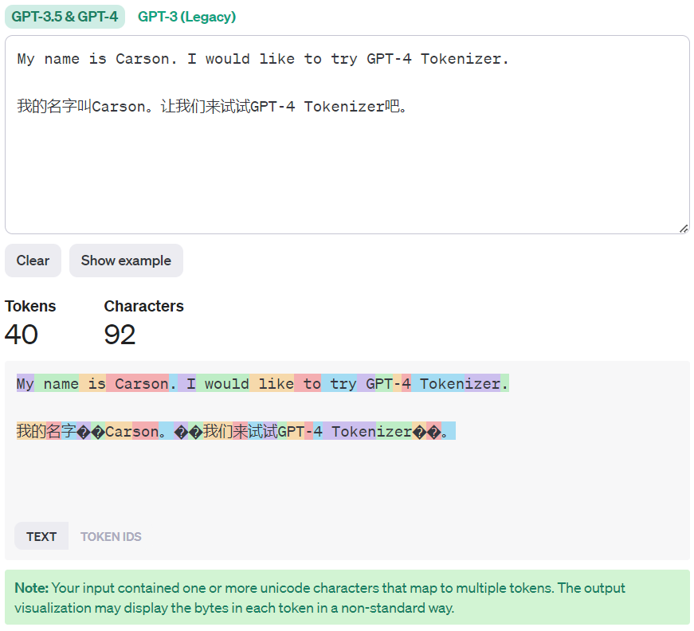

如图，有大约92个字符，生成了64个词元（Token）。有时词元是整个单词，如“My name is Carson”，有时是单词的一部分，如汉字“叫”对应的Unicode。Token有助于模型进行学习，因为文本就是我们的数据，Token就是数据的特征。到了这里，数据预处理就结束了。
第二步，我们要把预处理完毕的文本，来构建词汇表（Lookup dictionary）,使得每个Token在词汇表中都有一个唯一索引。其实，你点击一下GPT分词器里TokenID就能看到这个索引值，如图所示：

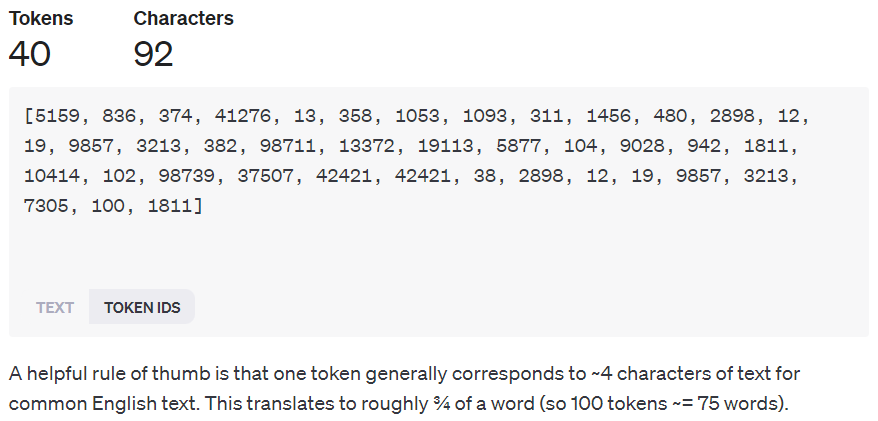

处理完这一步，我们就把提取好的Token表示为数字了。人类语言中，各个词（word）在语境里彼此是有关联的。接下来我们就想办法在这些不同的Token之间建立联系，即根据这些词元（tokens）生成数值形式的语义表征（numeric, semantic representations）。

第三步，我们选用Word2Vec模型，其主要思想是，采用数字向量（可以简单想象为一个普通的数组），这个向量的大小可以任意设置（比如，768），而这个向量应当代表一个词的语义含义。这样，我们就把一个词表示为一个向量/数组[-3.123456, 2.409875,...,-0.565768]。而这个数组实际上代表了这个单词的语义。

第四步和第五步，我们通过大量的训练数据（语料）来训练这个模型，即调整这些数组的值。这些数组有个专业术语叫嵌入（Embeddings）。
Tips:如果你更好的理解这部分内容，最好看一下附录中的余弦定理，补充一下相应的数学知识。

Word Embedding这个话题还是比较大的，这里我们是为了介绍Transformer，简单的介绍一下。后续，我会单独写一章，结合代码来讲这个话题。

#### Positional Encoding

首先，什么是位置编码，为什么我们需要它？

在Transformer模型中，Positional Encoding解决了序列顺序信息的问题。

在自然语言处理中，词语的位置和顺序对句子的意思表达至关重要。例如，考虑以下两个句子：

1. 我喜欢吃草莓，因为它们不含过多的糖分。
2. 我不喜欢吃草莓，因为它们含过多的糖分。

这两个句子的情感取向完全相反，仅仅因为"不"字的位置不同。如果不考虑位置信息，这两句话经过分词后，得到的句子表征是完全一致的。显然不符合句子意思，可见单词的位置对句子含义很重要。
业界大致有两种解决思路：

* **递归**：RNNs本质上考虑了单词的顺序；它们以顺序方式逐词解析句子。这将把单词的顺序整合到RNNs的主干中。换句话说，RNNs用递归保留位置信息。而恰恰因为递归，引入了两个问题。
  * 模型的训练无法做到并行。
  * 长期依赖的问题。类似于编写代码时，用递归方法会产生“调用栈溢出”的错误。
* **位置编码**：Transformer架构放弃了递归机制，转而采用多头自注意力机制。避免RNNs的递归方法将大大加快训练时间。理论上，它可以捕获句子中更长的依赖关系。而要付出的代价就是需要在Encoder前，Inputs要保留位置信息。

简言之，Transformer模型中的自注意力机制（Self-Attention）处理输入序列时，并不考虑词语的顺序。也就是说，如果我们交换输入序列中的词语位置，模型的输出不会改变。这就是为什么我们需要Positional Encoding的原因。

Positional Encoding的作用是为每个位置的词语提供一个独一无二的编码。这样，即使所有词语同时进入网络进行处理，我们也能通过Positional Encoding保留词语的位置信息。具体来说，Positional Encoding是一个向量，它的每一维度都是由不同频率的正弦函数或余弦函数的值组成。这样做的好处是，不同位置的同一维度的位置向量之间，含有相对位置信息，而相对位置信息可以通过函数的周期性实现。总的来说，Positional Encoding解决了Transformer模型中的序列顺序信息问题，使得模型能够理解词语的位置和顺序。

由于句子中的每个单词同时流经Transformer的编码器/解码器堆栈，模型本身对每个单词的位置/顺序没有任何感觉。因此，我们仍然需要一种方式将单词的顺序纳入我们的模型。

给模型一些顺序感的一种可能的解决方案是向每个单词添加一些关于其在句子中的位置的信息。我们称这个“信息片段”为位置编码。自然而然的，我们就想到了下面两个办法：

1. 首先可能想到的一个想法是在[0, 1]范围内为每个时间步分配一个数字，其中0表示第一个单词，1表示最后一个时间步。你能想象出这会导致什么问题吗？它将引入的一个问题是，你无法确定在特定范围内有多少个单词。换句话说，时间步的增量在不同的句子中没有一致的含义。
2. 另一个想法是线性地为每个时间步分配一个数字。也就是说，第一个单词被赋予“1”，第二个单词被赋予“2”，依此类推。这种方法的问题是，不仅值可能会变得非常大，而且我们的模型可能会面临比训练中的句子更长的句子。此外，我们的模型可能没有看到任何具有特定长度的样本，这将损害我们模型的泛化能力。

针对上述这两个想法的改进，应满足以下几个条件：

* **唯一性**：它应该为每个时间步（句子中单词的位置）输出一个唯一的编码
* **步长一致**：任何两个时间步之间的距离应在不同长度的句子中保持一致
* **泛化能力强**：我们的模型应该能够毫不费力地推广到更长的句子。值应该有界
* **确定性**：必须是确定的

在这篇论文中，作者提出的编码是一种简单而巧妙的技术，满足了上述的这些条件。首先，它不是一个单一的数字。相反，它是一个$d$维向量，包含了关于句子中特定位置的信息。其次，这种编码并没有集成到模型本身。相反，这个向量被用来为每个单词配备关于其在句子中的位置的信息。换句话说，我们增强了模型的输入，以注入单词的顺序（体会一下，有没有Spring框架中DI的感觉？）。

公式：

$$
\begin{aligned}
PE_{(pos,2i)} & = \sin(\frac{pos}{10000^{\frac{2i}{d_{model}}}})  \\
\\
PE_{(pos,2i+1)} &  = \cos(\frac{pos}{10000^{\frac{2i}{d_{model}}}})
\end{aligned}
$$

其中，$i$表示词在句子中的位置，$PE$表示该词对应的位置编码，$d_{model}$表示编码的维度。

从公式可以看出，其实一个词语的位置编码是由不同频率的正余弦函数组成的，从低位到高位，正余弦函数对应的频率由 1 降低到了$\frac{1}{10000}$ ，按照论文中的说法，也就是，波长从$2\pi$增加到了$10000 \cdot 2\pi$。

你可能会想，这种正弦和余弦的组合如何能够表示位置/顺序呢？其实很简单，假设你想用二进制格式表示一个数字，那会是怎样的呢？举个例子，如何用8421码来表示位置信息。
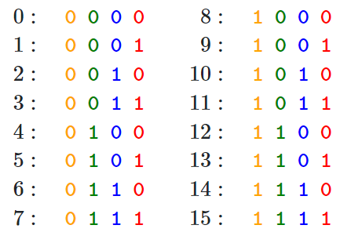

你可以看到不同位之间的变化率。最低有效位（LSB）在每个数字上都在交替，次低位在每两个数字上旋转，依此类推。以红色为例，每个位置数字都在交替。绿色和橙色分别4轮和8轮交替一次。

但是在浮点数的世界中，使用二进制值会浪费空间。所以，我们可以使用它们的浮点连续对应物 - 正余弦函数。事实上，它们等同于交替的位。此外，通过降低它们的频率，我们可以从红色位转变为橙色位。

现在，我们把位置信息（Positional Encoding）和语义表达（Input Embedding）结合起来（用求和表达），如图所示：
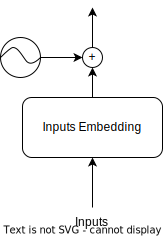

### Attention

Transformer模型中Attention部分，如图所示：


Transformer模型中的Multi-Head Attention，其实就是我们前文讲解的多头自注意力机制，用的也是Scalable Dot Production方法，上文解释的比较详细，这里就不重复介绍了。

### Add&Norm

在这个章节，我们来讨论一下Add&Norm部分，如图所示：
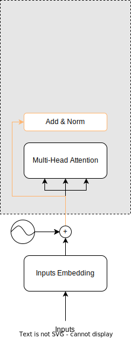

在Transformer模型中，"Add"和"Norm"是两个重要的操作：

"Add"指的是残差连接（Residual Connection）。在Transformer的结构中，每个子层（如自注意力层和前馈神经网络层）的输出会与其输入相加，形成一个残差连接.
"Norm"指的是归一化（Normalization）。在Transformer模型中，使用的是层归一化（Layer Normalization）。归一化操作可以使网络中每一层的输入都具有相同的尺度，从而有助于模型的训练。

这两个操作共同构成了Transformer中的"Add & Norm"层，它们在每个编码器和解码器的子层之后都会出现。这种设计使得Transformer模型能够有效地处理长序列，并捕获序列中的依赖关系。

#### 残差连接（Residual Connection）

残差连接是深度学习中的一种技术，主要用于解决深度神经网络训练过程中的梯度消失和梯度爆炸问题。

在一个深度神经网络中，每一层的输出通常会作为下一层的输入。然而，当网络的深度增加时，网络的前面几层的梯度在反向传播过程中可能会变得非常小（这就是所谓的梯度消失问题），这使得网络的前面几层很难更新和学习。

残差连接的提出就是为了解决这个问题。在残差连接中，我们不仅将一层的输出作为下一层的输入，而且还将其添加到下一层的输出中。这样，即使在反向传播过程中梯度变小，由于这个直接连接，前面几层也能接收到一部分梯度，从而进行学习。

具体来说，如果我们有一个深度神经网络，其中$L$表示一个网络层，$x$表示该层的输入，那么在没有残差连接的情况下，下一层的输入是$L(x)$。但是在有残差连接的情况下，下一层的输入是$x+L(x)$，其中$x$就是残差连接。残差连接的这种设计使得深度神经网络能够更好地训练和学习，特别是在网络非常深的情况下。

#### 归一化（Normalization）

什么是归一化？举个例子，大家先体会一下归一化思想。

读大学的时候，有一门课叫高等数学（微积分/数值分析），期末考试结束后，寝室里大家一片悲嚎——

```
“太难了，大题都不会！”
“50分（满分为100分）都没有!"
……
"要挂科了！"
```

没过多久，卷面分数出来，全班100人，满分1人，80分以上3人，60分以上20人，30分以下4人…… 如果按照60分为及格线，意味着大部分人都不及格。任课老师决定把卷面成绩处理一下，希望大部分人的分数都能上60分，且成绩排名保持不变。于是乎，“著名”的归一化公式出现了：

$$
Score_{new} = \sqrt{Score_{old}} \times 10
$$

在这个公式下，卷面成绩36分的人，就算及格了。同时，每个人的考试成绩间的差距变小了，换句话说，样本间的方差变小了。

现在我们给出较正式的定义。归一化是一种常用的数据预处理技术，主要用于消除数据特征之间的量纲和数值范围差异，使得不同特征具有相同的尺度。说人话就是，和残差连接的作用类似，使得损失函数形状变平滑。归一化的基本思想是将原始数据按比例缩放，使之落入一个小的特定区间。换句话说，这样做可以使梯度的方差变小，使得模型训练更加稳定，收敛更快，同时可以防止模型在训练过程中产生过大或过小的数值。
因为Transformer模型用到了Layer Normalization，我们只介绍这个归一化。如果读者有兴趣了解其他的归一化方法，附录里有详细的归一化章节。

**层归一化**（Layer Normalization）与Batch Normalization不同，Layer Normalization是在特征维度上进行标准化的，而不是在数据批次维度上。具体的计算过程如下：

* 计算均值和方差。
  
  * 均值公式：
    $$
    \mu = \frac{1}{D}\sum_{i=1}^Dx_i
    $$
  * 方差公式：
  
  $$
  \sigma = \sqrt{\frac{1}{D}\sum_{i=1}^D(x_i - \mu)^2}
  $$
* 进行归一化：通过均值和方差，可以得到归一化后的值, 公式：
  
  $$
  \hat x = \frac{x - \mu}{\sqrt{\sigma^2 + \varepsilon}}
  $$

其中，$\varepsilon$是一个很小的数，用于防止分母为0这种情况。

* 线性变换：在Layer Normalization中，我们还需要一组参数来保证归一化操作不会破坏之前的信息。这组参数叫做增益（gain）$g$和偏置（bias）$b$ （等同于Batch Normalization中的$\gamma$和$\beta$）。
  输出公式：
  $$
  h = f(\frac{g}{\sqrt{\sigma^2+\varepsilon}} \odot(x-\mu)+b)
  $$

其中$f$是激活函数，$\odot$ 表示Hadamard Product，也就是操作矩阵中对应的元素相乘，因此要求两个相乘矩阵是同型的。

### Feed Forward

在这个章节，我们来讨论一下Feed Forward部分，如图所示：
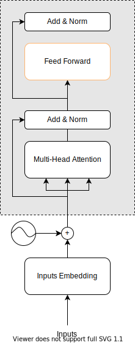

在Transformer模型中，前馈神经网络（Feed-Forward Network，简称FFN）起着重要的作用。以下是对FFN的简要描述：

* **基本结构**：FFN本质上是一个两层的多层感知机（MLP）。它由两个线性转换层组成，中间有一个非线性激活函数。
* **独立操作**：FFN是一个非线性层，独立地应用于序列中的每个位置。
* **映射与转换**：第一层会将输入的向量升维，第二层将向量重新降维。这样可以学习到更加抽象的特征。
* **处理与转换信息**：FFN在Transformer模型中的作用是处理和转换自注意力机制中编码的信息。
* **记忆功能**：FFN在Transformer中承担了记忆的功能。它与Key-Value Memory有对应关系。在神经网络中添加记忆模块并不是一个新的想法。早在2015年的End-To-End Memory Networks中，就提出了key-value memory的结构：将需要存储的信息分别映射为key向量与value向量，query向量与memory交互即为与key, value进行attention操作.
* **增强模型容量**：FFN可以增加网络的容量。这里的容量指的是模型的复杂度或者说模型可以学习的信息的多少。

总的来说，FFN在Transformer模型中起着捕捉输入序列中的复杂模式和关系的作用，并且通过增加模型的容量来提高模型的性能。在原论文中的架构图中，前馈线性层只做了四件事情：

1. 对文本中的每个位置(用向量表示)，进行逐位置的线性计算。
2. 对线性运算的输出应用ReLU函数。
3. 对上一步骤ReLU运算的输出进行再一次线性运算。
4. 最后，将其添加到第 3 层的输出中。

MLP大家已经很熟悉了，FFN只有两层，我们直接用数学公式表示：

$$
FFN(x) = ReLU(W_1x_1 + b1)W_2+b2
$$

至此，我们已经讲解了Encoder各个模块，在原论文中，不论是Encoder还是Decoder，都有堆叠的6组，即Transformer架构图里的N的数目为6，如图所示：
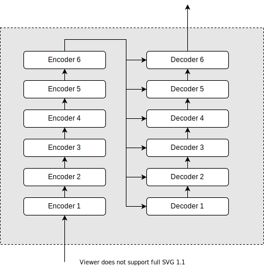

### Decoder和Output

在这个章节，我们来讨论一下Decoder和Output部分，如图所示：
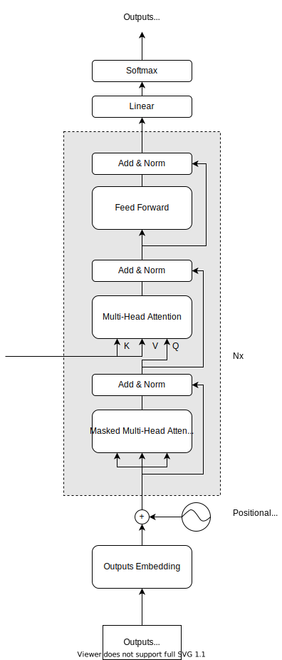
在Transformer模型中，Encoder传给Decoder的是K和V，这是因为在Decoder中有两个注意力模块：

* 一个是自注意力模块，其Q、K、V的输入都来自Decoder上一层的输出。
* 另一个是Encoder-Decoder注意力模块，其K、V的输入来自Encoder的输出。

这样设计的原因是，当Decoder生成目标语言时，我们需要使用源语言的信息和Decoder到此刻之前的信息。在Decoder的每个位置，我们希望得到一个当前位置的有用的隐藏状态，这个隐藏状态除了考虑之前位置的Decoder隐藏状态之外（即Decoder的自注意力模块），还希望考虑到Encoder所有位置的信息（即Decoder的Encoder-Decoder注意力模块）。

具体来说，当前位置的Decoder原隐藏状态$Q$会去询问Encoder每一个位置的隐藏状态$K$：“你是我生命中最重要的那个词吗？很重要是多重要？”每个$k$给出一个重要度，得到回答后，用Encoder的每个位置的隐藏状态$V$加权乘上其对该解码位置的重要度，得到当前位置的新隐藏状态。这样一来，当前位置的Decoder的隐藏状态表示，就集合了Encoder中所有位置的信息了。

这种设计使得在Decoder的每个位置上，都能获得全局所有的信息。这也模仿了序列到序列模型中的典型Encoder-Decoder注意力机制。

我们再来看一下Decoder的输入部分，有两个，一个比较好理解，就是Encoder的Output：$K,V$，另外一个是Outputs(shifted right)。这个理解起来有点费劲，我们一起来分析一下Outputs(shifted right)相关联的模块,如下图所示。
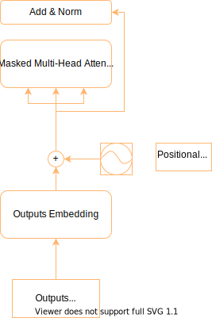
Outputs Embedding和上文我们介绍Encoder的Inputs Embedding是一样的。Positional Encoding也和Encoder的Positional Encoding是一样的。最大的不同是Masked Multi-Head Attention部分。

#### Masked Multi-Head Attention

为什么要使用Mask掩码呢？

我们举个例子吧，我们用Transformer翻译“Machine learning is fun.”成中文。
具体预测时（非训练时）的工作流程，如图所示：

分析：

* 在Round#2，我们只传入了“机”, 使用了Attention机制后，“机”的编码为[0.11, 0.22, ...]
* 在Round#3，如果我们不使用Mask，“机”的编码会改变！这样就会让网络产生问题。

我们从数学角度来解释，“机”的编码会改变原因，以及如何进行Mask掩码。
我们先来复习一下Attention公式

$$
Attention(Q,K,V)=Softmax(\frac {QK^\top}{\sqrt d})V
$$

我们再把维度信息加上，上面的公式改写为：

$$
O_{n \times d_v} = Attention(Q_{n \times d_k},K_{n \times d_k},V_{n \times d_v})=Softmax(\frac {Q_{n \times d_k}K_{d_k \times n}^\top}{\sqrt d_k})V_{n \times d_k} = A'_{n \times n}V_{n \times d_k}
$$

其中，

$$
O_{n \times d_v}=\left[\begin{matrix}o_1\\o_2\\ \vdots \\o_n \end{matrix}\right], A'_{n \times n}=\left[\begin{matrix}a'_{1,1}, a'_{2,1}, \cdots, a'_{n,1}\\ a'_{1,2}, a'_{2,2}, \cdots, a'_{n,2}\\ \vdots \\a'_{1,n}, a'_{2,n}, \cdots, a'_{n,n} \end{matrix}\right], V_{n \times d_v}=\left[\begin{matrix}v_1\\v_2\\ \vdots \\v_n \end{matrix}\right]
$$

再结合上面这个例子，我们先忽略\<bos>, 直接从Round#2开始。

1. 第一次（对应Round#2图），我们只有$v_1$一个变量（对应“机”的注意力），所以输出为：

$$
\left[\begin{matrix}o_1 \end{matrix}\right] = \left[\begin{matrix}a'_{1,1} \end{matrix}\right] \cdot \left[\begin{matrix}v_1 \end{matrix}\right]
$$

此时，对应“机”的输出值：$o_1 = a'_{1,1} \times v_1$

2. 第二次（对应Round#3图），我们有$v_1，v_2$二个变量（对应“机“”器”的注意力），所以输出为：

$$
\left[\begin{matrix}o_1\\o_2 \end{matrix}\right] = \left[\begin{matrix}a'_{1,1}\quad a'_{2,1} \\ a'_{1,2}\quad a'_{2,2} \end{matrix}\right] \cdot \left[\begin{matrix}v_1 \\ v_2 \end{matrix}\right]
$$

此时，对应“机”的输出值：$o_1 = a'_{1,1} \times v_1 + a'_{2,1} \times v_2$。当且仅当$a'_{2,1} = 0$这种情况，$o_1$才能保持不变。这也解释了为什么不使用掩码就无法保持原有输出的一致性。
我们现在对第二次这种情况加掩码，输出为：

$$
\left[\begin{matrix}o_1\\o_2 \end{matrix}\right] = \left[\begin{matrix}a'_{1,1} \quad\quad 0\\ a'_{1,2}\quad a'_{2,2} \end{matrix}\right] \cdot \left[\begin{matrix}v_1 \\ v_2 \end{matrix}\right]
$$

推广为n维后，我们就得到了掩码矩阵。

$$
\left[\begin{matrix}o_1\\o_2\\ \vdots \\ o_n \end{matrix}\right] = \left[\begin{matrix}a'_{1,1} \quad\quad 0 \cdots 0 \\ a'_{1,2}\quad a'_{2,2} \cdots 0 \\ \vdots \\ a'_{1,2}\quad a'_{2,2} \cdots a'_{n,n} \end{matrix}\right] \cdot \left[\begin{matrix}v_1 \\ v_2 \\ \vdots \\ v_n \end{matrix}\right]
$$

在Transformer实际应用中，Mask不是0，而是负无穷(-1e9)。因为Decoder输出的时候，有个Softmax函数，看一下这个函数图像就明白了，这个函数符合正态分布。只有当自变量x趋向于无穷时，函数值y才接近0。至此，我们介绍完了Masked Multi-Head Attention。

现在我们来到最后一步。堆叠的解码器层（stack of decoders）中的最后一个（即第6个）解码器将其输出传递给一个线性层（linear layer）。通过线性层，我们可以生成任意数量的数字表征。在语言模型中，我们希望表征的数量与模型的词汇量相匹配。如果模型的全部词汇量（它所见过的所有单词）是 1000 个，那么就需要 1000 个数字来表示词汇表中的每个单词。我们需要对每个位置上的每个单词都这样做。如果最终的输出内容拥有10个单词，我们要为其中的每一个单词计算512个向量。然后，我们将其传递给一个Softmax层，该层会给出每个单词的概率，最高概率的单词就是我们要使用的单词。Softmax会返回给我们一个索引，比如3。模型就会输出词汇表中索引为3的单词。如果我们的词汇表是['机', ‘器‘, ‘学‘, ‘习‘, ‘真‘，‘好’，‘完’，...]，那么输出的单词将是'习'。

至此，我们就学习完了大语言模型的两大基石之一的Transformer模型。

## 结尾

写到这里，算是完成了本章节，在写本篇文章的过程，部分文案直接借用了Copilot生成的文字，如果你的观点或文字出现在本章内容中，却没有出现在引用列表里，麻烦请告知，笔者核实后将第一时间修订引用列表。

最后，用Copilot生成的文案，结束这一章。
Transformer模型在自然语言处理中有许多优点：

1. **并行计算能力**：Transformer突破了RNN模型不能并行计算的限制，因此处理速度更快。
2. **处理长距离依赖性问题**：Transformer可以理解距离很远的序列元素之间的关系。
3. **对序列中的所有元素给予同样的关注**：这就有了后面的transformer+attention。
4. **更具可解释性的模型**：我们可以从模型中检查注意力分布。
5. **通用性强**：Transformer几乎可以处理任何序列数据。
6. **可扩展性强**：有了Transformer，为单词之间的关系建模变得比以往任何时候都容易。
7. **自注意力机制**：各个注意头 (attention head)可以学会执行不同的任务。
8. **位置编码**：由于self-attention没有循环结构，Transformer需要一种方式来表示序列中元素的相对或绝对位置关系。Position Embedding (PE)就是该文提出的方案。

最后，说句老掉牙的话，Enjoy it~~

#### 注意力机制的另一种解释（backup）

对上述过程，我们还有一种理解方式。引起注意力的方式有两种，**自主提示**和**非自主提示**。如果考虑自主提示的话，我们就需要设计一种通过Query，Key和Value来实现注意力机制的方法。

* Query指的是自主提示，即主观意识的特征向量。
* Key指的是非自主提示，即物体的突出特征信息向量。
* Value则是代表物体本身的特征向量。

举个更加生活化的例子，当你走进图书馆阅览室，目光自然而然的扫了一下在座的同学们（Query），一个“肤白貌美大长腿”的女生映入眼帘（Key），原来是校花小美啊（Value）！

## Reference

https://www.baeldung.com/cs/nlp-encoder-decoder-models
https://arxiv.org/abs/1706.03762
https://kazemnejad.com/blog/transformer_architecture_positional_encoding/
https://nlp.seas.harvard.edu/2018/04/03/attention.html#positional-encoding
https://towardsdatascience.com/transformers-part-1-2a2755a2af0e
https://towardsdatascience.com/transformers-part-2-input-2a8c3a141c7d
https://towardsdatascience.com/transformers-part-3-attention-7b95881714df
https://towardsdatascience.com/simplifying-transformers-state-of-the-art-nlp-using-words-you-understand-part-4-feed-foward-264bfee06d9
https://towardsdatascience.com/simplifying-transformers-state-of-the-art-nlp-using-words-you-understand-part-5-decoder-and-cd2810c6ad40
https://blog.csdn.net/zhaohongfei_358/article/details/125858248
https://www.mikecaptain.com/2023/01/22/captain-aigc-1-transformer/

