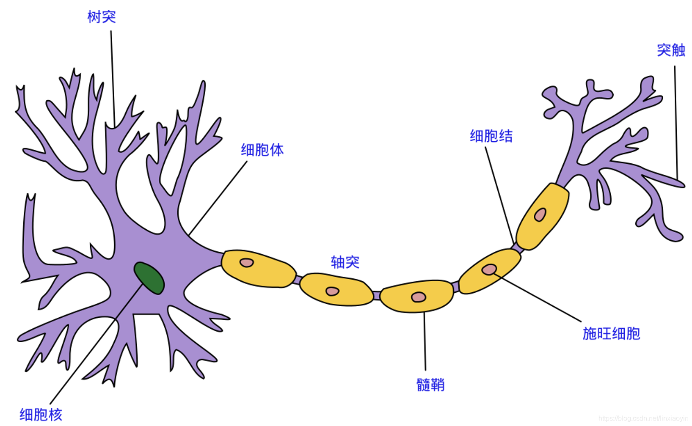
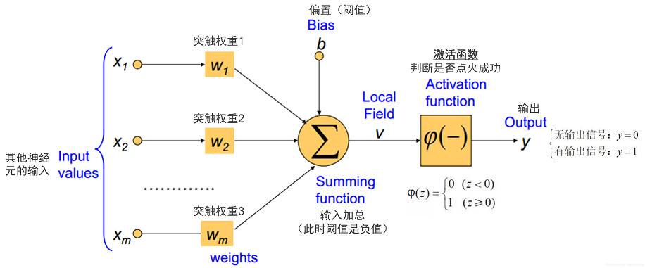

# 如何让计算机模拟人脑工作

在开始写《从零开始学大语言模型LLM》前，我构思了很久如何动笔。回顾这2个月的学习历程，感觉有三次不经意的对话，却让我受益匪浅。于是乎，决定从三次对话开始写。

> 来自2023年8月的一次对话
> 
> > Carson：最近看了几篇AIGC的相关论文，也大致也明白这些算法是如何工作的。但是我有一个疑惑，就是这些人是怎么想到这些方法的？
> > 阿甘：现代AI算法都是在模拟人脑，发现模拟的越来越像，效果越好。

## 算法，数据结构和人脑神经网络结构

为了对比计算机和人脑解决问题，我们先把算法（Algorithm）赋予更抽象的概念。

> **算法**：指解决问题的完整描述，由一系列准确可执行的步骤组成，其代表着解决问题的策略。

我们先来回顾一下计算机程序是如何工作的？

* 算法由程序描述，程序被转化成指令，指令被硬件（逻辑门结构）执行，这就实现了数据的**逻辑运算**。
* 算法本身却由人脑（也称人类智能）创造的，并通过算法控制计算机完成**逻辑推理**。

在此我们会发现，人脑可以构造算法，但计算机却不行，而算法才是逻辑推理的关键，那么这其中的奥秘是什么呢？

答案————**结构**

事实上，计算机的存储结构、传输结构与计算结构是独立分离的，但人脑神经网络结构，三者是合为一体的。因此，**数据+算法**，会存在于同一个**脑结构**之中。

如前所述，能够创造出算法是智能的关键所在，而在编程领域，著名程序员、开源软件运动的思想家、黑客文化的理论家————埃里克·雷蒙德（Eric Raymond），在《Unix编程艺术》中，有这样一个实践性的洞见————**算法**和**数据结构**有一个关系，即：

> 数据结构越复杂（如哈希表），算法就可以越简单，数据结构越简单（如数组），那么算法就需要越复杂。

例如，编程语言越是动态化（如Python、JavaScript），就越容易构建复杂结构，用其编写算法也就越容易，相反编程语言越是静态化（如C、C++、Java），就越难以构建复杂结构，用其编写算法就困难，而编程语言的演化是越来越动态化（如C#）。
为什么算法和数据结构有这样一个关系呢？其原理就在于，

* **算法**是逻辑关系的“计算映射”，即动态地进行逻辑关系的转化；
* **数据结构**是逻辑关系的“固化映射”，即将已经计算好的逻辑关系，存储在了结构之中。

可见，**算法**比**数据结构**多出了计算的过程——前者需要先计算后读写，后者仅需要根据结构的逻辑关系直接读写。所以，用**数据结构**进行逻辑关系的转化，会更加高效。
再来看一下人脑，人脑可以从环境信息中，提取**数据结构**并习得**算法**，最终将两者存储到**脑结构**之中。

这样我们得到一个结论，

> **神经结构、数据结构、算法**三者之间可以互相转化，或说互相表征。

换言之，如果数据结构足够强大，它就可以充当复杂算法的功能，甚至可以替代复杂的神经结构。

因此，计算机智能拟人（即模拟人脑）的一个途径，就是通过强化数据结构来模拟神经结构，以及弱化人类智能所提供的代码实现的算法，转而使用数据结构去生成算法，而这就是目前人工智能的发展方向。

至此，我得出了学习人工智能/机器学习最重要的两大关键。

1. 网络结构
2. 模拟人类

## 神经元的工作原理

### 神经元结构

我们从最简单的开始，先弄明白人体的神经元 ，先看一下人体神经元的结构图。

**神经元**（Neuron），是组成神经系统结构和执行神经功能活动的一大类高度分化细胞，由胞体和胞突（树突和轴突）组成，属神经组织的基本结构和功能单位。神经元大致分为三类：感觉（传入）神经元，运动（传出）神经元，联络（中间）神经元。不论是何种神经元，皆可分成：

1. 接收区（receptive zone）
2. 触发区（trigger zone）
3. 传导区（conducting zone）
4. 输出区（output zone）

### 神经元工作过程

工作过程：其他神经元的信号（输入信号）通过树突传递到细胞体，细胞体把其他多个神经元传递过来的输入信号进行合并加工，然后通过轴突（输出信号）传递给别的神经元。

​来自Wikipedia的解释，该过程专业术语叫**动作电位**​（action potential），指的是静止膜电位状态的细胞膜受到适当刺激而产生的，短暂而有特殊波形的跨膜电位搏动。细胞产生动作电位的能力被称为兴奋性，有这种能力的细胞如神经细胞和肌细胞。动作电位是实现神经传导和肌肉收缩的生理基础。
一个初始刺激，只要达到了**阈电位**（threshold potential），不论超过了多少，也就是全有全无律，就能引起一系列离子通道的开放和关闭，而形成离子的流动，改变跨膜电位。

综上所示，整个过程有5个重要的概念

1. 输入
2. 对输入信号的处理
3. 阈值
4. 激活（超过阈值，引起通道的开发和关闭）
5. 输出

现在，我们画一个模拟图，来模拟神经元工作过程。

## 用数学来模拟神经元工作流程

现在我们将上述5个概念用数学表示出来。

参考我们熟悉的一次函数，我们用$x_i$表示输入；用Y表示输出。因为有多路输入，所以我们还要引入权重（Weight）这个概念。对于输入的处理，就对应数学里的函数$f(x)$，我们一般用线性方程，比如求和$\sum$表示。阈值，我们用一个常量bias表示，简写为$b$。激活，也对应于数学中的函数，我们称之为激活函数（Activation Function），一般是非线性函数，比如ReLU，Sigmod等函数。

那么，我们就得到了下图。其实就是McCulloch和Pitts在1943年提出来的**M-P神经元模型**。而这个从输入到输出的过程，在机器学习里的专业术语叫**前向传播**（FFN, Forward Forecast Network）

### Bias与Activation Function的区别

在我学习Machine Learning的时候，对这两个概念有一定的困惑。如果你遇到和我一样的问题，就请问问ChatGPT吧。

> Carson: 在计算机神经网络中，如何区分bias和activation function

> ChatGPT: 在计算机神经网络中，bias和activation function是两个非常重要的概念，它们对神经网络的性能和准确性有很大的影响，但是它们的作用是不同的。
> Bias是神经网络中的一种参数，也被称为偏置，它与权重一样，在神经网络的训练过程中会被优化。Bias通常表示为一个浮点数或向量，它的作用是为神经网络的每个神经元提供一个常数偏移量，帮助神经元更好地学习输入数据的模式。每个神经元都有自己的bias，作为输入信号的一部分被传递给神经元的激活函数。 在数学上，bias可以看作是一种向输入信号添加常数偏移量的方法，使神经元更容易地学习输入数据中具有偏差的模式。
> Activation function（激活函数）是神经网络中的一个函数，它的作用是为神经元提供输出，并将输入信号转换为输出。在神经网络中，神经元的激活函数通常是一种非线性函数，例如sigmoid函数、tanh函数或ReLU函数等。这些函数的作用是将神经元的输出限制在特定范围内，使得神经元能够学习和表示更加复杂的函数关系。Activation function将输入与与bias相加后的结果进行变换，将结果转换为输出。
> 因此，Bias和Activation function在计算机神经网络中虽然有些相似的用途，但是它们的作用是不同的。Bias是用来帮助神经元更好地学习输入数据，而激活函数是用来限制神经元的输出并实现非线性变换的。

至此，我们已经用计算机构建出最简单的神经元了。有了单个神经元，就能将多个神经元练成神经网络，这样我们就用计算机模拟出了人脑结构。下一个章节，我们来谈谈学习这个事情。

---

顺便一提的是，在现实中，一个东西的**结构**越复杂，它的**功能**就越丰富，可以说**结构**决定了**功能**，更或者说**结构**就是**功能**，而**功能**来自于**算法**的执行——所以，**结构**转化为**功能**，就意味着**结构**蕴含了**算法**。

那么，问题就回到了，人工智能的**数据结构**从何而来呢？

显然，**“人工”**二字已经说明，依然由**人类智能**来提供，只不过这不是一个针对具体问题的**数据结构**，而是一个模拟人脑神经网络的通用**数据结构**——它是对人脑结构的**简化抽象**，并由程序语言编程实现的**数学模型**（以矩阵为基础，想象黑客帝国的母体）**，**可称之为**“类脑数据结构”**，更形象的描述是**“类脑神经网络”**。

接下来，**人类智能**继续提供一种算法——**机器学习算法**（如深度学习、强化学习等等，每种又有不同的具体实现），这种算法可以通过**拟合**与**计算**，试图在海量的**大数据**中找到各种各样的**算法**——从而把特定的**输入问题**与**输出结果**对应起来——这相当于实现了一种可以**创造算法**的**“算法”**。

> **大数据**——是指拥有多维度信息的大量数据，也就是说，不仅数据量大，信息量也大，而“大量数据”，仅仅是数据量大，信息量却不大，甚至可能很少。概括来看，大数据有4个明显的特征，即：数据量大、多维度、完备性、和实时性。
> 
> **薄数据**——是大数据中，那些可量化、可测量，但未必重要的数据。
> **厚数据**——是大数据中，那些不可量化、不可测量，但重要的数据。

而将**类脑数据结构**与**机器学习算法**结合起来，就可以动态地自组织**类脑数据结构**（通过结构连接关系的权重），以存储算法创造的算法——于是**人工智能**就表现出了**自主学习**与**自主推理**。

有趣的是，有一种**机器学习算法**（强化学习，Reinforcement Learning）与人脑**多巴胺强化学习**的机制是相一致的，即：

**概率来自权重**（即历史权重决定了算法的概率计算）**，权重来自奖励，奖励来自行为，行为来自决策，决策来自奖励，奖励来自概率**（即现实概率决定了奖励的最终获取）——这说明机器可以使用人脑相同的**学习机制**进行“自我学习”。

那么，这里算法习得的**权重**（也称权值），其实就相当于**人脑神经元**之间的**连接强度**，通过数据反复地训练与调整，无论是机器还是人脑，最终都可以把**输出结果**逼近**正确答案**。

而这个过程，可以完全用数学描述，就如图灵奖得主、卷积神经网络之父——杨立昆（Yann LeCun），在**《科学之路》**中，所说：

“所谓的机器学习，就是机器进行尝试、犯错和自我调整的操作。学习就是逐步减少**系统误差**的过程。训练机器的过程就是调整参数的过程。……基于**成本函数**最小化的学习，是人工智能运作的关键要素。通过调整**系统参数**来降低**成本函数**，也就是降低**实际输出**与**期望输出之**间的**平均误差**。实际上，最小化**成本函数**和**训练系统**是一回事。”

> **成本函数**（Cost Function）——也称为“代价函数”或**“损失函数”**（Loss Function），那么显然令“成本、代价、损失”的函数最小化，就是学习的过程，也是学习的目的所在。

换言之，杨立昆指出：

“（人工智能）神经网络的连接体系结构，即各层神经元的组织、以及神经元之间的连接，是确定的。但是**权重**，即加权和的参数是不确定的，它们可以通过**学习**来确定。”

而从行为心理学大师——丹尼尔·卡尼曼（Daniel Kahneman），在**《思考，快与慢》**中所说的——**节能系统1**与**耗能系统2**——的角度来看：

* 无意识推理——属于**节能系统1**，类似**自动驾驶模式**，也就是**本能预测**，或称**“自下而上”**的预测，也可称**“热认知”**。
* 有意识推理——属于**耗能系统2**，类似**手动驾驶模式**，也就是**智能预测**，或称**“自上而下”**的预测，也可称**“冷认知”**。

而搜索记忆的关键，就在于根据**“输入信息”**去寻找**“连接信息”**，而这个过程可能会**“新建连接”**——想法的连接即是创新创造，**“短连接”**支持了演绎与归纳，**“长连接”**支持了类比与溯因，洞见则一定是**“难连接”**，即很难连接的连接（不然很多人都会想到）。

### 那在大脑中，**输入信息**是如何去寻找**连接信息**的？

从**生物硬件**的角度来说，是**神经电脉冲**在神经网络结构中“运动”的传递——这其实是**带电离子**的浓度差，形成**电化学驱动力**（即扩散力与电动力的合力）驱动离子流动，从而产生**电位变化**的传递。

例如，一个环境信息激活了一些神经元，其电脉冲会沿着**神经连接**扩散传递（即同步放电），并会根据**激活强度**持续地传递一段时间（即幂律衰减），期间一系列的电化学反应（即电信息与化学信息）所形成的路径，就是信息的连接。

那么，**输入信息**既可以来自**环境信息**，也可以来自**颅内信息**，而一旦被注意力捕获，就会**“幂律连接”**其它信息，这些被**“点亮”**的信息，可以被注意力继续捕获，接着继续传递，然后再被捕获再传递。

通过这种方式，注意力可以不断**“链式搜索”**整个记忆空间，而期间会产生各种**连接信息**，如果某些**连接信息**符合逻辑，就可以停止搜索，并将所有的已有信息，进行**“抽象、拆分、连接”**的操作，以得出**推理结果**。

可以说，**控制注意力**，在记忆空间搜索的能力，是推理的基石，也是智能重要的组成。

大脑在最初只安装了**硬编码**的本能，而**软编码**的智能，则需要后天**环境信息**的训练——这即是对**大脑结构**的塑造。

而**大脑结构**与**环境信息**的关系，就如同——**河流与河床**，即：河床引导河流，河流塑造河床，河床是**大脑结构**（神经连接），河流是**环境信息**（神经电流）。

抽象来看，就是——**信息塑造结构，结构引导信息。**

但这并不是说，**人类智能**完全就取决于后天环境，而无关先天禀赋——因为**先天结构**，决定了环境信息的**处理效率**，这是无关**环境信息**是什么有多少的。

例如，如果**抽象效率**高，就可以更快地从**环境信息**中发现关系、获取逻辑、快速推理、建立连接，进而形成**大脑结构**的优势。

例如，如果**存储效率**高，则可以更快地形成**大脑结构**的优势，而**大脑结构**的优势，会正反馈地增强自身，最终形成压倒性的**智能优势**。

所以说，大脑结构（人类智能） = 先天结构（神经运作） + 后天结构（环境信息），即：

* 先天结构（神经运作）——决定了**流体智力，**取决于基因，如记忆力和算力，随衰老减退；
* 后天结构（环境信息）——决定了**晶体智力，**取决于学习，如技能和技艺，不受衰老影响；
* 大脑结构（人类智能）——决定了**流体智力**与**晶体智力**，取决于基因和学习，如推理力和理解力，受衰老和积累共同影响。

换言之，**流体智力**依赖**神经运作**——只会不断变弱，如：感知力和反应力；**晶体智力**依赖**环境信息**——可以不断变强，如：联想力和判断力；而想象力、创造力、直觉力、洞察力等——则是**流体智力**与**晶体智力**（按照某个比例）的混合。

另外，**注意力**与**专注力**比较特别：它们受环境信息的影响（如引导与干扰），也通过环境信息的**积累和训练**而变强（如学识成长和正念冥想），既在底层支撑了**人类智能**（包括流体智力与晶体智力），也会随着**人类智能**的增长而增长（即流体智力决定基础，晶体智力决定增长）——可以说，它们就是**人类智能**的重要基石。

而它们的区别在于：动物也有注意力，但只有人类才有专注力，因为专注力是**意识**对注意力**主动强力**的控制。

